# Technical Specifications

# 1. Introduction

#### Executive Summary

The OpenCut + KijkoCut merger represents a strategic consolidation of two complementary video editing platforms to create a unified, AI-enhanced video production ecosystem. This project addresses the growing demand for accessible, privacy-first video editing tools that combine professional-grade functionality with intelligent automation.

OpenCut is a free, open-source video editor that prioritizes privacy and user freedom. Unlike CapCut, OpenCut doesn't add watermarks, doesn't collect user data, and is completely free without limitations. Meanwhile, KijkoCut provides AI-driven editing assistance through conversational interfaces. The merger will create a comprehensive platform that serves both manual editing workflows and AI-assisted content creation.

**Core Business Problem:** Content creators face a fragmented landscape where they must choose between privacy-respecting tools with limited AI capabilities or feature-rich platforms that compromise user data and impose subscription barriers. Compared to CapCut, which has been moving more features to its paid tier, OpenCut's "free forever" model is a major selling point.

**Key Stakeholders:**
- **Primary Users:** Content creators, video editors, social media managers, educators
- **Secondary Users:** Marketing teams, small businesses, independent filmmakers
- **Technical Stakeholders:** Open-source community, AI/ML developers, privacy advocates

**Expected Business Impact:**
- Capture market share from proprietary video editors through privacy-first positioning
- Enable advanced AI workflows through ComfyUI integration for professional users
- Establish foundation for enterprise video production automation
- Create sustainable open-source ecosystem with community-driven development

#### System Overview

#### Project Context

The video editing market is experiencing rapid transformation driven by AI capabilities and privacy concerns. In a digital landscape where video content is king, the tools used to create that content are more important than ever. While platforms like CapCut have risen to prominence for their ease of use and powerful features, their user are also looking for free alternatives.

**Current System Limitations:**
- OpenCut: Limited AI capabilities, basic workflow automation
- KijkoCut: Lacks comprehensive timeline editing, limited to AI chat interface
- Market Gap: No unified platform combining privacy-first editing with advanced AI workflows

**Integration with Existing Landscape:**
- Replaces fragmented toolchain of separate editing and AI platforms
- Integrates with ComfyUI ecosystem for advanced video generation workflows
- Maintains compatibility with standard video formats and export pipelines

#### High-Level Description

The merged platform will provide a comprehensive video editing environment featuring:

**Primary System Capabilities:**
- **Professional Timeline Editor:** Timeline-based editing - Professional multi-track timeline Multi-track support - Audio, video, and overlay tracks Real-time preview
- **AI-Powered Assistance:** Conversational editing guidance, automated workflow suggestions, intelligent content generation
- **Advanced Video Generation:** Integration with ComfyUI workflows for text-to-video, image-to-video, and video enhancement
- **Privacy-First Architecture:** OpenCut processes all videos locally on your device. We don't upload your content to cloud servers, don't track your usage, and don't collect personal data.

**Major System Components:**

| Component | Technology | Purpose |
|-----------|------------|---------|
| **Timeline Editor** | React + Canvas API | Multi-track video editing interface |
| **AI Chat Interface** | Gemini API + LangChain | Conversational editing assistance |
| **Workflow Engine** | ComfyUI + LangGraph | AI video generation and automation |
| **Storage Layer** | IndexedDB + OPFS | Client-side media and project storage |

**Core Technical Approach:**
- **Monorepo Architecture:** Turborepo-managed codebase with shared packages
- **Hybrid AI Integration:** Combine conversational AI (Gemini) with workflow-based generation (ComfyUI)
- **Progressive Enhancement:** Maintain core editing functionality while adding AI capabilities
- **Agent Orchestration:** LangGraph-powered multi-agent workflows for complex video production tasks

#### Success Criteria

**Measurable Objectives:**

| Metric | Target | Timeline |
|--------|--------|----------|
| **Functional Parity** | 100% OpenCut features preserved | Phase 2 (Day 7) |
| **AI Integration** | Gemini chat + ComfyUI workflows operational | Phase 3 (Day 14) |
| **Performance** | Timeline handles 100+ elements without lag | Phase 5 (Day 21) |
| **User Adoption** | 25% increase in active users within 3 months | Post-launch |

**Critical Success Factors:**
- Seamless migration of existing OpenCut user workflows
- Intuitive AI feature discovery without overwhelming manual editing users
- Reliable ComfyUI workflow execution with clear status feedback
- Maintained privacy guarantees throughout AI integration

**Key Performance Indicators (KPIs):**
- **Technical KPIs:** Build success rate >95%, test coverage >80%, performance benchmarks met
- **User Experience KPIs:** Feature adoption rate, workflow completion rate, user retention
- **Business KPIs:** Community growth, contribution rate, enterprise inquiry volume

#### Scope

#### In-Scope

#### Core Features and Functionalities

**Timeline Editing Capabilities:**
- Multi-track timeline with video, audio, and overlay tracks
- Use the intuitive timeline interface to cut, split, and arrange your clips.
- Real-time preview with scrubbing and playback controls
- Enhance your videos with built-in effects, filters, transitions, and text overlays.

**AI-Enhanced Workflows:**
- Conversational editing assistance through Gemini AI integration
- ComfyUI workflow library with text-to-video, image-to-video, and enhancement capabilities
- Mochi excels turning text into video (text2video) with high quality motion and prompt adherence.
- Intelligent workflow suggestions based on project context and user intent

**Production Agent Workflows:**
- Pre-production agents: VRD (Video Requirements Document), ScriptSmith, ShotMaster, Budget Solver
- Production agents: MoodMaker, BoardBuilder, BreakdownBot, RFQ Forge
- Post-production agents: Assembler, QC Sentinel, Color Grading
- Specialized workflows for advertising, social media, and film/TV production

**Storage and Privacy:**
- Client-side storage using IndexedDB and OPFS for privacy preservation
- Project synchronization across devices while maintaining data ownership
- OpenCut supports popular formats including MP4, AVI, MOV, WMV for video, and MP3, WAV, AAC for audio.

#### Implementation Boundaries

**System Boundaries:**
- Web-based application with desktop app potential (Tauri)
- Integration with ComfyUI backend services for AI generation
- Client-server architecture for workflow orchestration while preserving privacy

**User Groups Covered:**
- Individual content creators and hobbyists
- Professional video editors and agencies
- Educational institutions and trainers
- Small to medium businesses with video marketing needs

**Geographic/Market Coverage:**
- Global deployment with multi-language support
- Compliance with GDPR, CCPA, and other privacy regulations
- Optimized for both developed and emerging market internet conditions

**Data Domains Included:**
- Video and audio media files
- Project metadata and editing history
- AI workflow definitions and execution logs
- User preferences and customization settings

#### Out-of-Scope

**Explicitly Excluded Features/Capabilities:**
- Advanced 3D rendering and motion graphics (beyond basic text overlays)
- Live streaming and real-time collaboration features
- Enterprise user management and permissions systems
- Mobile app development (web-responsive interface only)
- Integration with proprietary cloud storage services (Google Drive, Dropbox)

**Future Phase Considerations:**
- **Phase 2 (Q2 2025):** Desktop application using Tauri framework
- **Phase 3 (Q3 2025):** Advanced collaboration features and team workspaces
- **Phase 4 (Q4 2025):** Mobile-optimized interface and progressive web app
- **Phase 5 (2026):** Enterprise features including SSO, audit logs, and advanced analytics

**Integration Points Not Covered:**
- Direct integration with social media platform APIs for publishing
- Third-party plugin ecosystem (initially limited to ComfyUI workflows)
- Hardware acceleration beyond standard WebGL capabilities
- Integration with professional video hardware (capture cards, control surfaces)

**Unsupported Use Cases:**
- Real-time video processing for live events or streaming
- Multi-user simultaneous editing of the same project
- Enterprise-grade asset management and digital rights management
- Professional color grading workflows requiring hardware calibration
- High-end visual effects requiring dedicated GPU clusters

# 2. Product Requirements

#### FEATURE CATALOG

#### F-001: Timeline-Based Video Editor

**Feature Metadata:**
- **Feature ID:** F-001
- **Feature Name:** Timeline-Based Video Editor
- **Feature Category:** Core Editing
- **Priority Level:** Critical
- **Status:** Approved

**Description:**
- **Overview:** Professional multi-track timeline interface for cutting, splitting, and arranging video clips with real-time preview capabilities
- **Business Value:** Provides the foundational editing capabilities that differentiate the platform from basic video tools
- **User Benefits:** Intuitive timeline interface to cut, split, and arrange clips with precision timing control
- **Technical Context:** Canvas-based timeline rendering with multi-track support for video, audio, and overlay tracks

**Dependencies:**
- **Prerequisite Features:** None (foundational feature)
- **System Dependencies:** Canvas API, WebGL for rendering
- **External Dependencies:** FFmpeg.js for video processing
- **Integration Requirements:** Media storage system, preview rendering engine

#### F-002: AI-Powered Chat Interface

**Feature Metadata:**
- **Feature ID:** F-002
- **Feature Name:** AI-Powered Chat Interface
- **Feature Category:** AI Assistance
- **Priority Level:** Critical
- **Status:** Approved

**Description:**
- **Overview:** Conversational AI interface using Gemini API for editing guidance and workflow suggestions
- **Business Value:** Differentiates from traditional editors by providing intelligent assistance
- **User Benefits:** Natural language interaction for editing tasks and creative guidance
- **Technical Context:** Integration with Gemini API and LangChain for conversational workflows

**Dependencies:**
- **Prerequisite Features:** None
- **System Dependencies:** Gemini API, WebSocket for real-time communication
- **External Dependencies:** Google Gemini API
- **Integration Requirements:** Timeline editor for contextual suggestions

#### F-003: ComfyUI Workflow Integration

**Feature Metadata:**
- **Feature ID:** F-003
- **Feature Name:** ComfyUI Workflow Integration
- **Feature Category:** AI Generation
- **Priority Level:** High
- **Status:** Approved

**Description:**
- **Overview:** Integration with ComfyUI workflows for text-to-video generation with high quality motion and prompt adherence
- **Business Value:** Enables advanced AI video generation capabilities not available in traditional editors
- **User Benefits:** Precise control over characters, scenes, and styles for creators, marketers, and educators
- **Technical Context:** Support for multiple video generation models including Wan2.2 with T2V + I2V capabilities

**Dependencies:**
- **Prerequisite Features:** F-002 (AI Chat Interface)
- **System Dependencies:** ComfyUI backend, PostgreSQL for workflow storage
- **External Dependencies:** ComfyUI, Railway deployment platform
- **Integration Requirements:** Workflow discovery system, job queue management

#### F-004: Multi-Agent Production Workflows

**Feature Metadata:**
- **Feature ID:** F-004
- **Feature Name:** Multi-Agent Production Workflows
- **Feature Category:** AI Orchestration
- **Priority Level:** High
- **Status:** Approved

**Description:**
- **Overview:** Multi-agent workflows with multiple independent actors powered by language models connected in specific ways
- **Business Value:** Automates complex video production pipelines from concept to completion
- **User Benefits:** Specialized agents with scoped skills for better separation of concerns and customizability
- **Technical Context:** LangGraph framework supporting diverse control flows - single agent, multi-agent, hierarchical, sequential

**Dependencies:**
- **Prerequisite Features:** F-002 (AI Chat Interface), F-003 (ComfyUI Integration)
- **System Dependencies:** LangGraph, PostgreSQL for workflow state
- **External Dependencies:** OpenAI/Gemini APIs for agent reasoning
- **Integration Requirements:** Human-in-the-loop approval gates, workflow orchestration

#### F-005: Privacy-First Media Storage

**Feature Metadata:**
- **Feature ID:** F-005
- **Feature Name:** Privacy-First Media Storage
- **Feature Category:** Data Management
- **Priority Level:** Critical
- **Status:** Approved

**Description:**
- **Overview:** Local video processing on user device without cloud uploads, tracking, or personal data collection
- **Business Value:** Privacy-first positioning differentiates from CapCut and other cloud-based editors
- **User Benefits:** Complete data ownership and privacy protection
- **Technical Context:** IndexedDB and OPFS storage for projects and media files

**Dependencies:**
- **Prerequisite Features:** None (foundational feature)
- **System Dependencies:** IndexedDB, OPFS (Origin Private File System)
- **External Dependencies:** None (client-side only)
- **Integration Requirements:** Timeline editor, media management system

#### F-006: Real-Time Collaboration & Sync

**Feature Metadata:**
- **Feature ID:** F-006
- **Feature Name:** Real-Time Collaboration & Sync
- **Feature Category:** Collaboration
- **Priority Level:** Medium
- **Status:** Proposed

**Description:**
- **Overview:** Cross-device project synchronization while maintaining privacy
- **Business Value:** Enables seamless workflow across multiple devices
- **User Benefits:** Access projects from any device without compromising privacy
- **Technical Context:** Hybrid sync system with encrypted cloud metadata and local media storage

**Dependencies:**
- **Prerequisite Features:** F-005 (Privacy-First Storage)
- **System Dependencies:** PostgreSQL for metadata sync, encryption libraries
- **External Dependencies:** Cloud storage for encrypted metadata only
- **Integration Requirements:** Authentication system, conflict resolution

#### FUNCTIONAL REQUIREMENTS TABLE

#### F-001: Timeline-Based Video Editor

| Requirement ID | Description | Acceptance Criteria | Priority | Complexity |
|----------------|-------------|-------------------|----------|------------|
| F-001-RQ-001 | Multi-track timeline support | Support minimum 10 video tracks, 10 audio tracks, 5 overlay tracks | Must-Have | High |
| F-001-RQ-002 | Real-time preview | Preview updates within 100ms of timeline changes | Must-Have | High |
| F-001-RQ-003 | Drag and drop editing | Elements can be dragged between tracks and repositioned | Must-Have | Medium |
| F-001-RQ-004 | Precision cutting tools | Frame-accurate cutting and trimming capabilities | Must-Have | Medium |
| F-001-RQ-005 | Timeline zoom and navigation | Zoom from 1 second to 1 hour view with smooth scrolling | Should-Have | Low |

**Technical Specifications:**
- **Input Parameters:** Video files (MP4, AVI, MOV), audio files (MP3, WAV, AAC)
- **Output/Response:** Real-time canvas rendering, timeline state updates
- **Performance Criteria:** Handle 100+ timeline elements without lag
- **Data Requirements:** Support for MP4, AVI, MOV, WMV video formats and MP3, WAV, AAC audio formats

#### F-002: AI-Powered Chat Interface

| Requirement ID | Description | Acceptance Criteria | Priority | Complexity |
|----------------|-------------|-------------------|----------|------------|
| F-002-RQ-001 | Natural language processing | Understand editing commands in conversational language | Must-Have | High |
| F-002-RQ-002 | Contextual suggestions | Provide relevant suggestions based on current project state | Must-Have | High |
| F-002-RQ-003 | Real-time responses | AI responses delivered within 3 seconds | Must-Have | Medium |
| F-002-RQ-004 | Conversation history | Maintain chat history across sessions | Should-Have | Low |
| F-002-RQ-005 | Multi-language support | Support English, Spanish, French, German, Chinese | Could-Have | Medium |

**Technical Specifications:**
- **Input Parameters:** Text messages, project context, timeline state
- **Output/Response:** AI-generated responses, workflow suggestions, editing commands
- **Performance Criteria:** <3 second response time, 95% uptime
- **Data Requirements:** Chat history storage, project metadata access

#### F-003: ComfyUI Workflow Integration

| Requirement ID | Description | Acceptance Criteria | Priority | Complexity |
|----------------|-------------|-------------------|----------|------------|
| F-003-RQ-001 | Text-to-video generation | Generate videos from text prompts using ComfyUI workflows | Must-Have | High |
| F-003-RQ-002 | Image-to-video generation | Convert static images to animated videos | Must-Have | High |
| F-003-RQ-003 | Workflow discovery | Find relevant workflows through semantic search | Must-Have | Medium |
| F-003-RQ-004 | Job status tracking | Real-time status updates for generation jobs | Must-Have | Medium |
| F-003-RQ-005 | Quality control | Generated content meets minimum quality thresholds | Should-Have | High |

**Technical Specifications:**
- **Input Parameters:** Text prompts, images, workflow parameters
- **Output/Response:** Generated video files, job status updates, quality metrics
- **Performance Criteria:** Fast generation for quick iterations and pre-visualization use cases
- **Data Requirements:** Workflow library, model storage, job queue management

#### F-004: Multi-Agent Production Workflows

| Requirement ID | Description | Acceptance Criteria | Priority | Complexity |
|----------------|-------------|-------------------|----------|------------|
| F-004-RQ-001 | Agent orchestration | Coordinate multiple specialized agents in sequence | Must-Have | High |
| F-004-RQ-002 | Human approval gates | Enable human review and approval before agent actions | Must-Have | Medium |
| F-004-RQ-003 | Workflow templates | Pre-built templates for common production scenarios | Must-Have | Medium |
| F-004-RQ-004 | State management | Maintain conversation histories and context over time | Must-Have | High |
| F-004-RQ-005 | Error recovery | Handle agent failures gracefully with retry mechanisms | Should-Have | High |

**Technical Specifications:**
- **Input Parameters:** Production briefs, client requirements, creative assets
- **Output/Response:** Production plans, generated content, approval requests
- **Performance Criteria:** Complete production workflows within defined time limits
- **Data Requirements:** Agent state storage, workflow definitions, approval history

#### F-005: Privacy-First Media Storage

| Requirement ID | Description | Acceptance Criteria | Priority | Complexity |
|----------------|-------------|-------------------|----------|------------|
| F-005-RQ-001 | Local-only processing | All video processing occurs locally on user device | Must-Have | Medium |
| F-005-RQ-002 | No data collection | No tracking, usage monitoring, or personal data collection | Must-Have | Low |
| F-005-RQ-003 | Offline functionality | Core editing features work without internet connection | Must-Have | Medium |
| F-005-RQ-004 | Data encryption | Local storage encrypted with user-controlled keys | Should-Have | High |
| F-005-RQ-005 | Export without watermarks | Clean exports without branding or watermarks | Must-Have | Low |

**Technical Specifications:**
- **Input Parameters:** Media files, project data, user preferences
- **Output/Response:** Encrypted local storage, secure file access
- **Performance Criteria:** Fast local file access, efficient storage utilization
- **Data Requirements:** IndexedDB for metadata, OPFS for large media files

#### FEATURE RELATIONSHIPS

#### Feature Dependencies Map

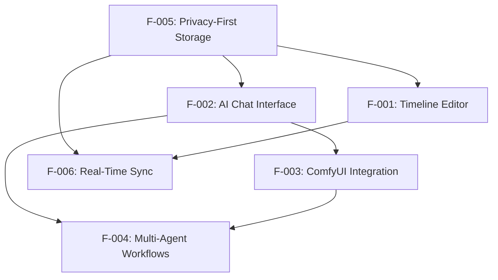
```mermaid
graph TD
    F005[F-005: Privacy-First Storage] --> F001[F-001: Timeline Editor]
    F005 --> F002[F-002: AI Chat Interface]
    F002 --> F003[F-003: ComfyUI Integration]
    F002 --> F004[F-004: Multi-Agent Workflows]
    F003 --> F004
    F005 --> F006[F-006: Real-Time Sync]
    F001 --> F006
```

#### Integration Points

| Feature Pair | Integration Type | Shared Components | Data Exchange |
|--------------|------------------|-------------------|---------------|
| F-001 ↔ F-002 | Bidirectional | Timeline state, project context | Editing commands, suggestions |
| F-002 ↔ F-003 | Orchestration | Workflow discovery, job management | Generation requests, status updates |
| F-002 ↔ F-004 | Orchestration | Agent coordination, approval gates | Production briefs, workflow results |
| F-001 ↔ F-005 | Data Layer | Media storage, project persistence | File references, metadata |
| F-003 ↔ F-004 | Service Layer | ComfyUI backend, workflow execution | Generated assets, quality metrics |

#### Common Services

- **State Management:** Zustand stores shared across timeline, AI, and workflow features
- **Storage Abstraction:** Unified interface for IndexedDB, OPFS, and PostgreSQL
- **Event Bus:** Cross-feature communication for real-time updates
- **Authentication:** User identity management for sync and collaboration features

#### IMPLEMENTATION CONSIDERATIONS

#### F-001: Timeline-Based Video Editor

**Technical Constraints:**
- Browser performance limitations for large video files
- Canvas rendering performance with 100+ elements
- Memory management for video preview generation

**Performance Requirements:**
- 60fps timeline scrubbing
- <100ms response time for drag operations
- Support for 4K video preview

**Scalability Considerations:**
- Virtualized timeline rendering for large projects
- Lazy loading of video thumbnails
- Progressive quality enhancement

**Security Implications:**
- Client-side video processing only
- No video data transmitted to servers
- Secure local storage encryption

#### F-002: AI-Powered Chat Interface

**Technical Constraints:**
- API rate limits for Gemini integration
- Context window limitations for large projects
- Real-time response requirements

**Performance Requirements:**
- <3 second response time for simple queries
- <10 second response time for complex analysis
- 99.9% API availability

**Scalability Considerations:**
- Conversation history pruning strategies
- Context compression for large projects
- Caching of common responses

**Security Implications:**
- API key protection and rotation
- User data privacy in AI interactions
- Audit logging for AI decisions

#### F-003: ComfyUI Workflow Integration

**Technical Constraints:**
- GPU availability for video generation
- Model size and loading times
- Network bandwidth for model downloads

**Performance Requirements:**
- Workflow discovery in <1 second
- Generation job status updates in real-time
- Quality assessment within 30 seconds

**Scalability Considerations:**
- Horizontal scaling of ComfyUI instances
- Model caching and sharing strategies
- Queue management for high demand

**Security Implications:**
- Secure model storage and distribution
- Generated content validation
- User-generated workflow sandboxing

#### F-004: Multi-Agent Production Workflows

**Technical Constraints:**
- Agent coordination complexity
- State consistency across agents
- Human approval workflow integration

**Performance Requirements:**
- Agent response time <5 seconds
- Workflow completion tracking
- Error recovery within 1 minute

**Scalability Considerations:**
- Agent pool management
- Workflow parallelization opportunities
- State storage optimization

**Security Implications:**
- Agent permission boundaries
- Sensitive data handling in workflows
- Audit trails for production decisions

#### F-005: Privacy-First Media Storage

**Technical Constraints:**
- Browser storage quotas and limits
- Cross-device synchronization challenges
- Offline functionality requirements

**Performance Requirements:**
- Fast local file access (<50ms)
- Efficient storage space utilization
- Quick project loading times

**Scalability Considerations:**
- Storage quota management
- File compression strategies
- Cleanup of unused assets

**Security Implications:**
- End-to-end encryption for sync
- Key management for user data
- Secure deletion of sensitive content

#### TRACEABILITY MATRIX

| Business Requirement | Feature ID | Requirement ID | Test Case | Acceptance Criteria |
|----------------------|------------|----------------|-----------|-------------------|
| Professional video editing | F-001 | F-001-RQ-001 | TC-001 | Multi-track timeline with 10+ tracks |
| Privacy-first approach | F-005 | F-005-RQ-001 | TC-005 | Local-only video processing |
| AI-enhanced workflows | F-002 | F-002-RQ-001 | TC-002 | Natural language editing commands |
| Advanced video generation | F-003 | F-003-RQ-001 | TC-003 | Text-to-video generation |
| Production automation | F-004 | F-004-RQ-001 | TC-004 | Multi-agent workflow orchestration |
| No watermarks | F-005 | F-005-RQ-005 | TC-006 | Clean video exports |
| Real-time collaboration | F-006 | F-006-RQ-001 | TC-007 | Cross-device project sync |

#### ASSUMPTIONS AND CONSTRAINTS

#### Assumptions
- Users have modern browsers with WebGL support
- Sufficient local storage available for video projects
- Stable internet connection for AI features
- Users accept client-side processing limitations

#### Constraints
- Browser-based implementation limits video processing capabilities
- Privacy requirements restrict cloud-based optimizations
- Open-source model limits proprietary AI integrations
- Resource constraints for ComfyUI model hosting

#### Risk Mitigation
- Progressive enhancement for older browsers
- Graceful degradation when storage limits reached
- Offline mode for core editing features
- Alternative AI providers for redundancy

# 3. Technology Stack

#### Programming Languages

#### Frontend Languages
- **TypeScript 5.3+**: Primary language for all frontend development, leveraging Next.js 14.2+ with latest React canary features including stable Server Actions
- **JavaScript (ES2022)**: For LangChain.js integration supporting Node.js 18.x, 19.x, 20.x, 22.x environments

#### Backend Languages
- **Python 3.13+**: For ComfyUI backend integration with full Python 3.13 compatibility
- **TypeScript**: For Next.js API routes and server-side logic

#### Selection Criteria
- **Type Safety**: TypeScript provides compile-time error detection crucial for complex video editing workflows
- **Ecosystem Compatibility**: LangChain framework requires JavaScript/TypeScript for building LLM-powered applications with interoperable components
- **Performance**: Python 3.13 offers enhanced performance optimizations for AI model execution

#### Frameworks & Libraries

#### Core Frontend Framework
- **Next.js 14.2+**: Production-ready React framework with App Router, stable Server Actions, and Turbopack development improvements
- **React 18+**: Required for Zustand v5 compatibility with native useSyncExternalStore support

#### State Management
- **Zustand 5.0.8**: Latest version providing bear necessities for state management with improved bundle size through native React 18 integration

#### AI & Agent Orchestration
- **LangChain.js 1.0.2**: Latest stable version providing production-ready foundation for building agents with createAgent standard interface
- **LangGraph.js 0.2+**: JavaScript/TypeScript framework for building LLM-powered agents with flexible streaming, checkpointing, and human-in-the-loop support

#### Build System & Monorepo
- **Turborepo 2.4**: High-performance build system with new terminal UI, Watch Mode, and ESLint v9 support

#### UI Components
- **shadcn/ui**: Modern React component library built on Radix UI primitives
- **Tailwind CSS**: Utility-first CSS framework for rapid UI development
- **Lucide React**: Icon library for consistent iconography

#### Compatibility Requirements
- **React 18+ Requirement**: Zustand v5 dropped support for React versions below 18, enabling native useSyncExternalStore usage
- **Node.js Compatibility**: LangChain.js supports Node.js 18.x, 19.x, 20.x, 22.x in both ESM and CommonJS formats

#### Justification for Major Choices
- **Next.js 14.2+**: Provides development and production improvements with Turbopack Release Candidate achieving 99.8% test passing rate
- **LangChain 1.0**: Offers focused, production-ready foundation with streamlined framework around createAgent, standard content blocks, and simplified package structure
- **Turborepo**: Improves developer experience with interactive tasks, clearer logs, and dependency-aware task watching

#### Open Source Dependencies

#### Core Dependencies
```json
{
  "next": "^14.2.0",
  "react": "^18.2.0", 
  "zustand": "^5.0.8",
  "langchain": "^1.0.2",
  "@langchain/langgraph": "^0.2.0",
  "turbo": "^2.4.0"
}
```

#### AI & ML Libraries
- **@langchain/core**: Core LangChain abstractions and interfaces
- **@langchain/openai**: OpenAI integration for embeddings and chat models
- **@langchain/google-genai**: Gemini API integration for conversational AI capabilities

#### Storage & Database
- **dexie**: Promise-based IndexedDB wrapper for client-side storage
- **drizzle-orm**: Type-safe ORM for PostgreSQL integration
- **@vercel/postgres**: PostgreSQL client optimized for serverless environments

#### UI & Styling
- **@radix-ui/react-***: Accessible component primitives
- **tailwindcss**: Utility-first CSS framework
- **lucide-react**: Icon library with consistent design system

#### Development Tools
- **typescript**: Type checking and compilation
- **eslint**: Code linting and quality enforcement
- **prettier**: Code formatting consistency

#### Package Management
- **pnpm**: Fast, disk space efficient package manager for monorepo
- **@turbo/codemod**: Automated migration tools for Turborepo configuration updates

#### Version Constraints
- **React 18+ Required**: Zustand v5 requires React 18+ for native useSyncExternalStore support
- **TypeScript 4.5+**: Zustand v5 dropped support for TypeScript versions below 4.5
- **Node.js 18+**: Next.js 14 requires minimum Node.js version 18.17

#### Third-Party Services

#### AI Model Providers
- **Google Gemini API**: Conversational AI for editing guidance and workflow suggestions
- **OpenAI API**: Embeddings generation for workflow discovery and RAG implementation

#### Video Generation Backend
- **ComfyUI**: Latest V1 release with cross-platform desktop application and one-click installation
- **ComfyUI Node Registry (CNR)**: Semantic versioning system for custom nodes with over 600 published nodes and 2k+ versions

#### Monitoring & Observability
- **Sentry**: Error tracking and performance monitoring
- **Langfuse**: AI agent tracing and cost tracking for multi-agent workflows

#### Development & Deployment
- **Vercel**: Frontend hosting and deployment platform
- **Railway**: Backend hosting for ComfyUI gateway and PostgreSQL
- **CircleCI**: Continuous integration and deployment pipeline

#### Authentication & Security
- **Better Auth**: Modern authentication solution for Next.js applications
- **Railway Garage**: S3-compatible storage for media files with presigned URL access

#### Integration Requirements
- **ComfyUI API Integration**: REST API endpoints for workflow execution with support for latest models including GPT-5 series and Kling V2-1
- **Vector Database**: PostgreSQL with pgvector extension for workflow embeddings and semantic search
- **Real-time Communication**: WebSocket connections for job status updates and streaming

#### Databases & Storage

#### Primary Database
- **PostgreSQL 15+**: Primary database for workflow storage, user data, and metadata with pgvector extension for semantic search capabilities

#### Client-Side Storage
- **IndexedDB**: Structured client-side storage for editor projects and chat history, avoiding server uploads for privacy
- **OPFS (Origin Private File System)**: Large media file storage for video and audio assets

#### Caching Solutions
- **Redis**: Job queue management and real-time status updates for ComfyUI workflows
- **Turborepo Remote Cache**: Build artifact caching for faster development iterations

#### Storage Services
- **Railway Garage**: S3-compatible object storage for generated video assets and media files
- **Local Storage**: User preferences and lightweight application state

#### Railway Garage (MinIO) Implementation

**Railway Garage** provides S3-compatible object storage using MinIO, optimized for large video file storage with presigned URL access patterns.

**Docker Configuration (`Dockerfile.minio`):**

```dockerfile
FROM minio/minio:latest

# Expose MinIO API and Console ports
EXPOSE 9000 9001

# Health check
HEALTHCHECK --interval=30s --timeout=10s --start-period=5s --retries=3 \
  CMD curl -f http://localhost:9000/minio/health/live || exit 1

# Start MinIO server
CMD ["server", "/data", "--console-address", ":9001"]
```

**Railway Environment Variables:**

```env
# MinIO Configuration
MINIO_ROOT_USER=your-access-key-min-16-chars
MINIO_ROOT_PASSWORD=your-secret-key-min-32-chars
MINIO_BUCKET=kijko-videos
MINIO_REGION=us-east-1
MINIO_ENDPOINT=https://minio.railway.internal:9000
MINIO_PUBLIC_ENDPOINT=https://storage.kijko.app

# Railway Volume Mount
RAILWAY_VOLUME_MOUNT_PATH=/data
```

**MinIO Client Setup (`lib/storage.ts`):**

```typescript
import { Client } from "minio"

export const minioClient = new Client({
  endPoint: process.env.MINIO_HOST!,
  port: parseInt(process.env.MINIO_PORT || "9000"),
  useSSL: process.env.NODE_ENV === "production",
  accessKey: process.env.MINIO_ROOT_USER!,
  secretKey: process.env.MINIO_ROOT_PASSWORD!,
  region: process.env.MINIO_REGION || "us-east-1",
})

// Initialize bucket on startup
export async function initializeStorage() {
  const bucketName = process.env.MINIO_BUCKET!
  const exists = await minioClient.bucketExists(bucketName)

  if (!exists) {
    await minioClient.makeBucket(bucketName, process.env.MINIO_REGION)

    // Set CORS policy
    const corsConfig = {
      CORSRules: [{
        AllowedOrigins: [process.env.NEXT_PUBLIC_APP_URL!],
        AllowedMethods: ["GET", "PUT", "POST", "DELETE"],
        AllowedHeaders: ["*"],
        ExposeHeaders: ["ETag", "Content-Length"],
        MaxAgeSeconds: 3600,
      }],
    }
    await minioClient.setBucketCors(bucketName, corsConfig)
  }
}
```

**Presigned URL API Route (`app/api/storage/presign/route.ts`):**

```typescript
import { NextResponse } from "next/server"
import { minioClient } from "@/lib/storage"
import { auth } from "@/lib/auth"

export async function POST(req: Request) {
  // Authenticate user
  const session = await auth.api.getSession({ headers: req.headers })
  if (!session) {
    return NextResponse.json({ error: "Unauthorized" }, { status: 401 })
  }

  const { filename, contentType, operation = "upload" } = await req.json()

  // Generate unique object key
  const objectKey = `${session.user.id}/${Date.now()}-${filename}`
  const bucketName = process.env.MINIO_BUCKET!

  try {
    if (operation === "upload") {
      // Generate presigned PUT URL (5 minutes expiry)
      const presignedUrl = await minioClient.presignedPutObject(
        bucketName,
        objectKey,
        5 * 60, // 5 minutes
        { "Content-Type": contentType }
      )

      return NextResponse.json({
        url: presignedUrl,
        objectKey,
        expiresIn: 300,
      })
    } else if (operation === "download") {
      // Generate presigned GET URL (1 hour expiry)
      const presignedUrl = await minioClient.presignedGetObject(
        bucketName,
        objectKey,
        60 * 60 // 1 hour
      )

      return NextResponse.json({
        url: presignedUrl,
        expiresIn: 3600,
      })
    }
  } catch (error) {
    console.error("Presigned URL generation failed:", error)
    return NextResponse.json(
      { error: "Failed to generate presigned URL" },
      { status: 500 }
    )
  }
}
```

**Multipart Upload for Large Files (`lib/multipart-upload.ts`):**

```typescript
import { minioClient } from "./storage"

export async function initiateMultipartUpload(
  objectKey: string,
  contentType: string
): Promise<string> {
  const bucketName = process.env.MINIO_BUCKET!

  // MinIO automatically handles multipart for files >5MB
  const uploadId = await minioClient.initiateNewMultipartUpload(
    bucketName,
    objectKey,
    { "Content-Type": contentType }
  )

  return uploadId
}

export async function uploadPart(
  objectKey: string,
  uploadId: string,
  partNumber: number,
  data: Buffer
): Promise<{ etag: string; partNumber: number }> {
  const bucketName = process.env.MINIO_BUCKET!

  const result = await minioClient.uploadPart(
    bucketName,
    objectKey,
    uploadId,
    partNumber,
    data,
    data.length
  )

  return { etag: result.etag, partNumber }
}

export async function completeMultipartUpload(
  objectKey: string,
  uploadId: string,
  parts: Array<{ etag: string; partNumber: number }>
): Promise<void> {
  const bucketName = process.env.MINIO_BUCKET!

  await minioClient.completeMultipartUpload(
    bucketName,
    objectKey,
    uploadId,
    parts
  )
}
```

**Client-Side Upload Hook (`hooks/use-upload.ts`):**

```typescript
import { useState } from "react"

export function useUpload() {
  const [progress, setProgress] = useState(0)
  const [uploading, setUploading] = useState(false)

  async function uploadFile(file: File) {
    setUploading(true)
    setProgress(0)

    try {
      // Get presigned URL
      const response = await fetch("/api/storage/presign", {
        method: "POST",
        headers: { "Content-Type": "application/json" },
        body: JSON.stringify({
          filename: file.name,
          contentType: file.type,
          operation: "upload",
        }),
      })

      const { url, objectKey } = await response.json()

      // Upload directly to MinIO
      const xhr = new XMLHttpRequest()

      xhr.upload.addEventListener("progress", (e) => {
        if (e.lengthComputable) {
          setProgress((e.loaded / e.total) * 100)
        }
      })

      await new Promise((resolve, reject) => {
        xhr.addEventListener("load", () => {
          if (xhr.status === 200) resolve(xhr.response)
          else reject(new Error(`Upload failed: ${xhr.status}`))
        })
        xhr.addEventListener("error", reject)

        xhr.open("PUT", url)
        xhr.setRequestHeader("Content-Type", file.type)
        xhr.send(file)
      })

      return { objectKey, success: true }
    } catch (error) {
      console.error("Upload failed:", error)
      throw error
    } finally {
      setUploading(false)
    }
  }

  return { uploadFile, progress, uploading }
}
```

**CDN Fronting with Cloudflare R2:**

```typescript
// Optional: Mirror to Cloudflare R2 for global CDN delivery
export async function mirrorToR2(objectKey: string) {
  const bucketName = process.env.MINIO_BUCKET!

  // Get object from MinIO
  const stream = await minioClient.getObject(bucketName, objectKey)

  // Upload to R2 (S3-compatible)
  const r2Client = new S3Client({
    region: "auto",
    endpoint: process.env.R2_ENDPOINT,
    credentials: {
      accessKeyId: process.env.R2_ACCESS_KEY_ID!,
      secretAccessKey: process.env.R2_SECRET_ACCESS_KEY!,
    },
  })

  await r2Client.send(new PutObjectCommand({
    Bucket: process.env.R2_BUCKET,
    Key: objectKey,
    Body: stream,
  }))
}
```

**Storage Architecture:**
- **Direct Browser Uploads:** Presigned URLs eliminate server proxy overhead
- **Multipart Support:** Automatic chunking for files >5MB
- **Security:** User-scoped object keys, short-lived presigned URLs (5 min upload, 1 hour download)
- **CDN Integration:** Optional mirroring to Cloudflare R2 for global delivery
- **Cost Optimization:** Railway Garage storage at $0.10/GB/month vs S3 at $0.023/GB/month

#### Data Persistence Strategies

#### Privacy-First Architecture
- **Client-Side Processing**: All video editing operations performed locally without cloud uploads
- **Encrypted Sync**: Optional cross-device synchronization with end-to-end encryption
- **No Data Collection**: Zero tracking or personal data collection in compliance with privacy requirements

#### Hybrid Storage Model
- **Hot Data**: Frequently accessed projects and recent chat history in IndexedDB
- **Cold Data**: Archived projects and older conversations in PostgreSQL
- **Media Assets**: Large files in OPFS with optional cloud backup to Railway Garage

#### Workflow Data Management
- **Workflow Templates**: Stored in PostgreSQL with semantic versioning through ComfyUI Node Registry
- **Execution History**: Job status and results cached in Redis for real-time updates
- **Vector Embeddings**: Workflow descriptions and user intents stored with pgvector for RAG-based discovery

#### Scalability Considerations
- **Horizontal Scaling**: PostgreSQL read replicas for workflow discovery queries
- **Partitioning**: Time-based partitioning for chat history and job execution logs
- **Cleanup Policies**: Automated cleanup of temporary files and expired job data

#### Development & Deployment

#### Development Tools
- **Turborepo 2.4**: Monorepo build system with interactive terminal UI, Watch Mode for dependency-aware task watching
- **TypeScript 5.3+**: Type checking and development experience
- **ESLint 9+**: Code linting with Turborepo's updated eslint-config-turbo and eslint-plugin-turbo

#### Build System
- **Turbopack**: Next.js development bundler with 99.8% integration test passing rate
- **Vite**: Build tool for ComfyUI frontend with TypeScript, Vue, and custom shim extension for compatibility
- **SWC**: Fast TypeScript/JavaScript compiler used by Next.js for code transformation

#### Containerization
- **Docker**: Container orchestration for ComfyUI backend services
- **Docker Compose**: Local development environment setup
- **Multi-stage Builds**: Optimized production images with minimal attack surface

#### CI/CD Pipeline
- **CircleCI**: Automated testing, building, and deployment
- **Path Filtering**: Turborepo integration for running only affected package tests
- **Parallel Execution**: Multi-container test execution for faster feedback loops

#### Deployment Platforms

#### Frontend Deployment
- **Vercel**: Next.js optimized hosting with automatic deployments and edge functions
- **Edge Runtime**: Serverless functions for API routes and middleware
- **Static Generation**: Pre-built pages for optimal performance

#### Backend Deployment  
- **Railway**: ComfyUI gateway hosting with PostgreSQL database and automatic scaling
- **GPU Support**: CUDA-enabled containers for AI model inference
- **Auto-scaling**: Dynamic resource allocation based on workflow demand

#### Development Workflow
- **Hot Reload**: Turborepo Watch Mode for automatic task re-execution on file changes
- **Type Safety**: End-to-end TypeScript coverage from frontend to API routes
- **Code Generation**: Automated type generation from database schema and API definitions

#### Production Optimizations
- **Bundle Splitting**: Automatic code splitting for optimized loading times
- **Image Optimization**: Next.js 14 enhanced image optimization with responsive images and accessibility features
- **Caching Strategy**: Multi-layer caching including Client-side Router Cache and configurable invalidation periods

#### Security Considerations
- **Content Security Policy**: Strict CSP headers for XSS protection
- **API Rate Limiting**: Request throttling for AI service endpoints
- **Input Validation**: Comprehensive validation for all user inputs and file uploads
- **Dependency Scanning**: Automated security scanning for malicious behavior in custom nodes

# 4. Process Flowchart

## 4.1 System Workflows

### 4.1.1 Core Business Processes

#### User Onboarding & Project Creation Flow

The system workflows are composed of nodes (geometric shapes) and edges (arrows or lines), where the Mermaid code defines how nodes and edges are made and accommodates different arrow types, multi-directional arrows, and any linking to and from subgraphs.

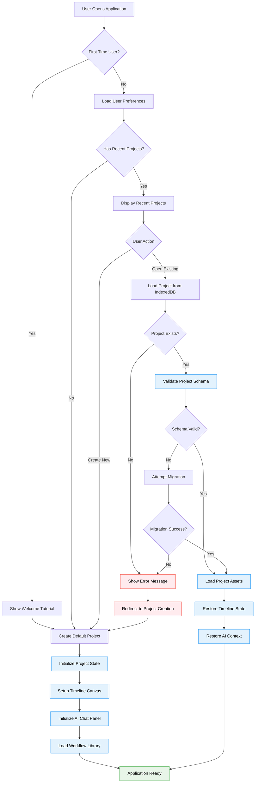
```mermaid
flowchart TD
    A[User Opens Application] --> B{First Time User?}
    B -->|Yes| C[Show Welcome Tutorial]
    B -->|No| D[Load User Preferences]
    
    C --> E[Create Default Project]
    D --> F{Has Recent Projects?}
    
    F -->|Yes| G[Display Recent Projects]
    F -->|No| E
    
    G --> H{User Action}
    H -->|Open Existing| I[Load Project from IndexedDB]
    H -->|Create New| E
    
    E --> J[Initialize Project State]
    J --> K[Setup Timeline Canvas]
    K --> L[Initialize AI Chat Panel]
    L --> M[Load Workflow Library]
    M --> N[Application Ready]
    
    I --> O{Project Exists?}
    O -->|Yes| P[Validate Project Schema]
    O -->|No| Q[Show Error Message]
    
    P --> R{Schema Valid?}
    R -->|Yes| S[Load Project Assets]
    R -->|No| T[Attempt Migration]
    
    T --> U{Migration Success?}
    U -->|Yes| S
    U -->|No| Q
    
    S --> V[Restore Timeline State]
    V --> W[Restore AI Context]
    W --> N
    
    Q --> X[Redirect to Project Creation]
    X --> E
    
    classDef errorState fill:#ffebee,stroke:#f44336,color:#000
    classDef successState fill:#e8f5e8,stroke:#4caf50,color:#000
    classDef processState fill:#e3f2fd,stroke:#2196f3,color:#000
    
    class Q,X errorState
    class N successState
    class J,K,L,M,P,S,V,W processState
```

#### Video Editing Workflow

The core principles are: Breaking complex tasks into states and transitions, Managing state transition logic, Handling various exceptions during task execution. LangGraph helps us manage such workflows efficiently.

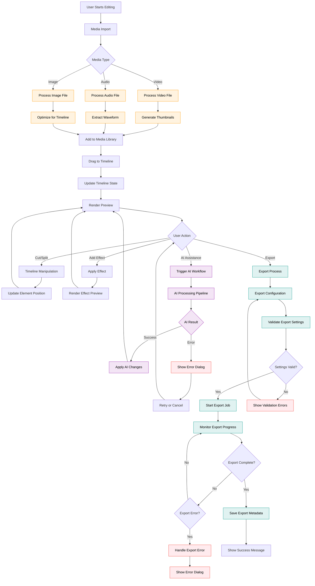
```mermaid
flowchart TD
    A[User Starts Editing] --> B[Media Import]
    B --> C{Media Type}
    
    C -->|Video| D[Process Video File]
    C -->|Audio| E[Process Audio File]
    C -->|Image| F[Process Image File]
    
    D --> G[Generate Thumbnails]
    E --> H[Extract Waveform]
    F --> I[Optimize for Timeline]
    
    G --> J[Add to Media Library]
    H --> J
    I --> J
    
    J --> K[Drag to Timeline]
    K --> L[Update Timeline State]
    L --> M[Render Preview]
    
    M --> N{User Action}
    N -->|Cut/Split| O[Timeline Manipulation]
    N -->|Add Effect| P[Apply Effect]
    N -->|AI Assistance| Q[Trigger AI Workflow]
    N -->|Export| R[Export Process]
    
    O --> S[Update Element Position]
    P --> T[Render Effect Preview]
    Q --> U[AI Processing Pipeline]
    
    S --> M
    T --> M
    U --> V{AI Result}
    
    V -->|Success| W[Apply AI Changes]
    V -->|Error| X[Show Error Dialog]
    
    W --> M
    X --> Y[Retry or Cancel]
    Y --> N
    
    R --> Z[Export Configuration]
    Z --> AA[Validate Export Settings]
    AA --> BB{Settings Valid?}
    
    BB -->|Yes| CC[Start Export Job]
    BB -->|No| DD[Show Validation Errors]
    
    CC --> EE[Monitor Export Progress]
    EE --> FF{Export Complete?}
    
    FF -->|Yes| GG[Save Export Metadata]
    FF -->|No| HH{Export Error?}
    
    HH -->|Yes| II[Handle Export Error]
    HH -->|No| EE
    
    GG --> JJ[Show Success Message]
    II --> KK[Show Error Dialog]
    DD --> Z
    
    classDef mediaProcess fill:#fff3e0,stroke:#ff9800,color:#000
    classDef aiProcess fill:#f3e5f5,stroke:#9c27b0,color:#000
    classDef exportProcess fill:#e0f2f1,stroke:#009688,color:#000
    classDef errorState fill:#ffebee,stroke:#f44336,color:#000
    
    class D,E,F,G,H,I mediaProcess
    class Q,U,V,W aiProcess
    class R,Z,AA,CC,EE,GG exportProcess
    class X,II,KK,DD errorState
```

#### AI Agent Workflow Orchestration

In this approach, each agent is a node in the graph, and their connections are represented as an edge. The control flow is managed by edges, and they communicate by adding to the graph's state.

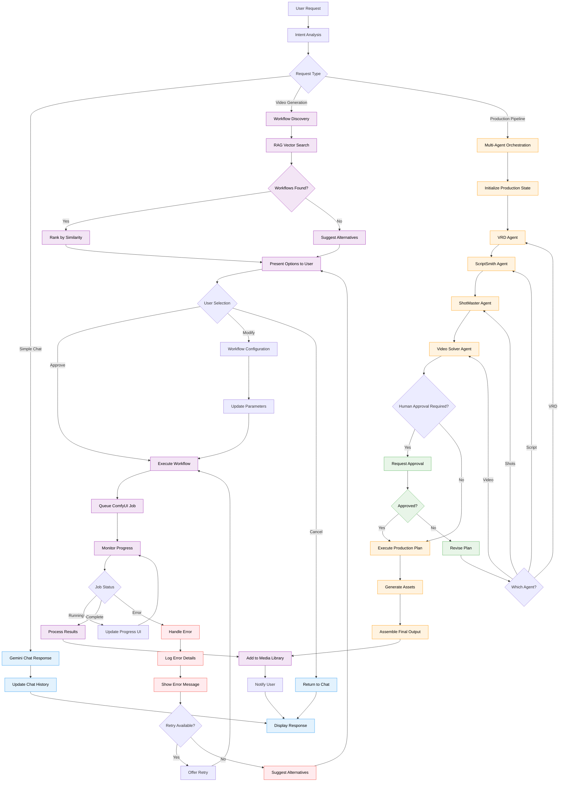
```mermaid
flowchart TD
    A[User Request] --> B[Intent Analysis]
    B --> C{Request Type}
    
    C -->|Simple Chat| D[Gemini Chat Response]
    C -->|Video Generation| E[Workflow Discovery]
    C -->|Production Pipeline| F[Multi-Agent Orchestration]
    
    D --> G[Update Chat History]
    G --> H[Display Response]
    
    E --> I[RAG Vector Search]
    I --> J{Workflows Found?}
    
    J -->|Yes| K[Rank by Similarity]
    J -->|No| L[Suggest Alternatives]
    
    K --> M[Present Options to User]
    L --> M
    
    M --> N{User Selection}
    N -->|Approve| O[Execute Workflow]
    N -->|Modify| P[Workflow Configuration]
    N -->|Cancel| Q[Return to Chat]
    
    P --> R[Update Parameters]
    R --> O
    
    O --> S[Queue ComfyUI Job]
    S --> T[Monitor Progress]
    T --> U{Job Status}
    
    U -->|Running| V[Update Progress UI]
    U -->|Complete| W[Process Results]
    U -->|Error| X[Handle Error]
    
    V --> T
    W --> Y[Add to Media Library]
    Y --> Z[Notify User]
    
    X --> AA[Log Error Details]
    AA --> BB[Show Error Message]
    BB --> CC{Retry Available?}
    
    CC -->|Yes| DD[Offer Retry]
    CC -->|No| EE[Suggest Alternatives]
    
    DD --> O
    EE --> M
    
    F --> FF[Initialize Production State]
    FF --> GG[VRD Agent]
    GG --> HH[ScriptSmith Agent]
    HH --> II[ShotMaster Agent]
    II --> JJ[Video Solver Agent]
    
    JJ --> KK{Human Approval Required?}
    KK -->|Yes| LL[Request Approval]
    KK -->|No| MM[Execute Production Plan]
    
    LL --> NN{Approved?}
    NN -->|Yes| MM
    NN -->|No| OO[Revise Plan]
    
    OO --> PP{Which Agent?}
    PP -->|VRD| GG
    PP -->|Script| HH
    PP -->|Shots| II
    PP -->|Video| JJ
    
    MM --> QQ[Generate Assets]
    QQ --> RR[Assemble Final Output]
    RR --> Y
    
    Q --> H
    Z --> H
    
    classDef chatFlow fill:#e3f2fd,stroke:#2196f3,color:#000
    classDef workflowFlow fill:#f3e5f5,stroke:#9c27b0,color:#000
    classDef productionFlow fill:#fff3e0,stroke:#ff9800,color:#000
    classDef errorFlow fill:#ffebee,stroke:#f44336,color:#000
    classDef approvalFlow fill:#e8f5e8,stroke:#4caf50,color:#000
    
    class D,G,H,Q chatFlow
    class E,I,J,K,L,M,O,S,T,W,Y workflowFlow
    class F,FF,GG,HH,II,JJ,MM,QQ,RR productionFlow
    class X,AA,BB,EE errorFlow
    class LL,NN,OO approvalFlow
```

### 4.1.2 Integration Workflows

#### ComfyUI Workflow Execution Pipeline

By default the script runs the "infer_with_logs" function which returns the generation logs from ComfyUI via a streaming response. The result object returned by the API will contain the workflow outputs as well as the generation details, including prompt_id (str): Unique identifier for the prompt status (str): Current status of the prompt execution completed (bool): Whether the prompt execution is complete execution_time_seconds (float): Time taken to execute the prompt

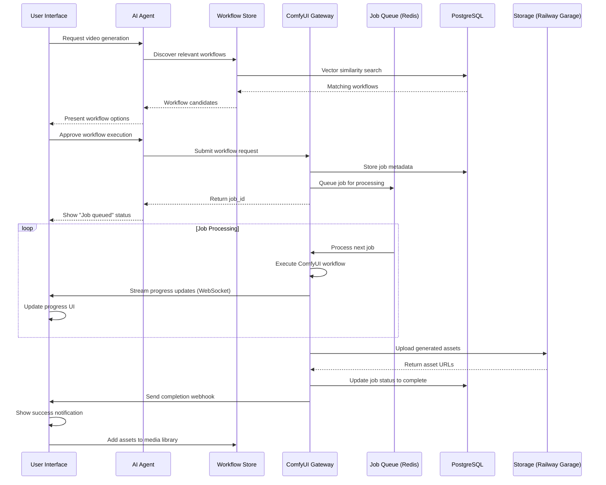
```mermaid
sequenceDiagram
    participant U as User Interface
    participant A as AI Agent
    participant W as Workflow Store
    participant C as ComfyUI Gateway
    participant Q as Job Queue (Redis)
    participant P as PostgreSQL
    participant S as Storage (Railway Garage)
    
    U->>A: Request video generation
    A->>W: Discover relevant workflows
    W->>P: Vector similarity search
    P-->>W: Matching workflows
    W-->>A: Workflow candidates
    A-->>U: Present workflow options
    
    U->>A: Approve workflow execution
    A->>C: Submit workflow request
    C->>P: Store job metadata
    C->>Q: Queue job for processing
    C-->>A: Return job_id
    A-->>U: Show "Job queued" status
    
    loop Job Processing
        Q->>C: Process next job
        C->>C: Execute ComfyUI workflow
        C->>U: Stream progress updates (WebSocket)
        U->>U: Update progress UI
    end
    
    C->>S: Upload generated assets
    S-->>C: Return asset URLs
    C->>P: Update job status to complete
    C->>U: Send completion webhook
    U->>U: Show success notification
    U->>W: Add assets to media library
```

#### Real-Time State Synchronization

Explicit State Management — Shared context persists across nodes and is continuously updated. Conditional Transitions — Branching and routing adapt dynamically at runtime.

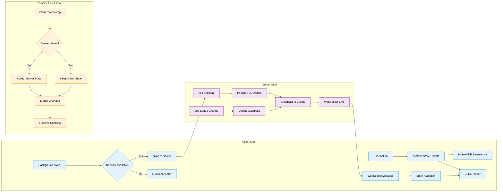
```mermaid
flowchart LR
    subgraph "Client Side"
        A[User Action] --> B[Zustand Store Update]
        B --> C[IndexedDB Persistence]
        B --> D[UI Re-render]
        
        E[WebSocket Message] --> F[Store Hydration]
        F --> D
        
        G[Background Sync] --> H{Network Available?}
        H -->|Yes| I[Sync to Server]
        H -->|No| J[Queue for Later]
    end
    
    subgraph "Server Side"
        K[API Endpoint] --> L[PostgreSQL Update]
        L --> M[Broadcast to Clients]
        M --> N[WebSocket Emit]
        
        O[Job Status Change] --> P[Update Database]
        P --> M
    end
    
    subgraph "Conflict Resolution"
        Q[Client Timestamp] --> R{Server Newer?}
        R -->|Yes| S[Accept Server State]
        R -->|No| T[Keep Client State]
        
        S --> U[Merge Changes]
        T --> U
        U --> V[Resolve Conflicts]
    end
    
    I --> K
    N --> E
    
    classDef clientSide fill:#e3f2fd,stroke:#2196f3,color:#000
    classDef serverSide fill:#f3e5f5,stroke:#9c27b0,color:#000
    classDef conflictRes fill:#fff3e0,stroke:#ff9800,color:#000
    
    class A,B,C,D,E,F,G,H,I,J clientSide
    class K,L,M,N,O,P serverSide
    class Q,R,S,T,U,V conflictRes
```

## 4.2 Flowchart Requirements

### 4.2.1 Validation Rules & Business Logic

#### Media File Processing Validation

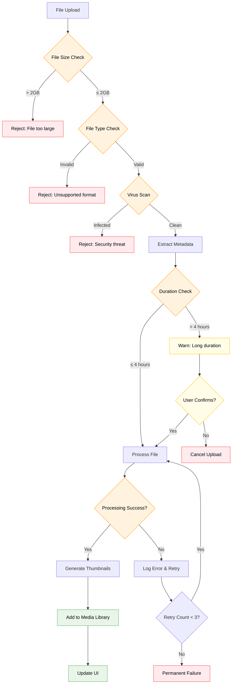
```mermaid
flowchart TD
    A[File Upload] --> B{File Size Check}
    B -->|> 2GB| C[Reject: File too large]
    B -->|≤ 2GB| D{File Type Check}
    
    D -->|Invalid| E[Reject: Unsupported format]
    D -->|Valid| F{Virus Scan}
    
    F -->|Infected| G[Reject: Security threat]
    F -->|Clean| H[Extract Metadata]
    
    H --> I{Duration Check}
    I -->|> 4 hours| J[Warn: Long duration]
    I -->|≤ 4 hours| K[Process File]
    
    J --> L{User Confirms?}
    L -->|Yes| K
    L -->|No| M[Cancel Upload]
    
    K --> N{Processing Success?}
    N -->|Yes| O[Generate Thumbnails]
    N -->|No| P[Log Error & Retry]
    
    O --> Q[Add to Media Library]
    P --> R{Retry Count < 3?}
    R -->|Yes| K
    R -->|No| S[Permanent Failure]
    
    Q --> T[Update UI]
    
    classDef validation fill:#fff3e0,stroke:#ff9800,color:#000
    classDef rejection fill:#ffebee,stroke:#f44336,color:#000
    classDef success fill:#e8f5e8,stroke:#4caf50,color:#000
    classDef warning fill:#fffde7,stroke:#ffc107,color:#000
    
    class B,D,F,I,N validation
    class C,E,G,M,S rejection
    class Q,T success
    class J,L warning
```

#### AI Workflow Authorization & Compliance

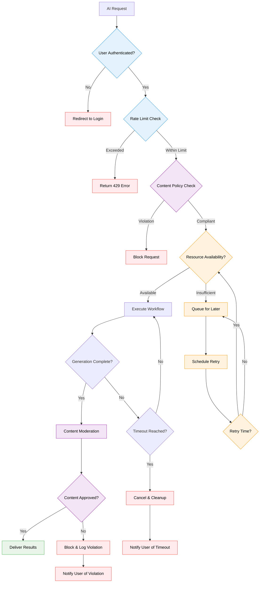
```mermaid
flowchart TD
    A[AI Request] --> B{User Authenticated?}
    B -->|No| C[Redirect to Login]
    B -->|Yes| D{Rate Limit Check}
    
    D -->|Exceeded| E[Return 429 Error]
    D -->|Within Limit| F{Content Policy Check}
    
    F -->|Violation| G[Block Request]
    F -->|Compliant| H{Resource Availability?}
    
    H -->|Insufficient| I[Queue for Later]
    H -->|Available| J[Execute Workflow]
    
    J --> K{Generation Complete?}
    K -->|Yes| L[Content Moderation]
    K -->|No| M{Timeout Reached?}
    
    M -->|Yes| N[Cancel & Cleanup]
    M -->|No| J
    
    L --> O{Content Approved?}
    O -->|Yes| P[Deliver Results]
    O -->|No| Q[Block & Log Violation]
    
    I --> R[Schedule Retry]
    R --> S{Retry Time?}
    S -->|Yes| H
    S -->|No| I
    
    N --> T[Notify User of Timeout]
    Q --> U[Notify User of Violation]
    
    classDef authCheck fill:#e3f2fd,stroke:#2196f3,color:#000
    classDef policyCheck fill:#f3e5f5,stroke:#9c27b0,color:#000
    classDef resourceCheck fill:#fff3e0,stroke:#ff9800,color:#000
    classDef errorState fill:#ffebee,stroke:#f44336,color:#000
    classDef successState fill:#e8f5e8,stroke:#4caf50,color:#000
    
    class B,D authCheck
    class F,L,O policyCheck
    class H,I,R,S resourceCheck
    class C,E,G,N,Q,T,U errorState
    class P successState
```

### 4.2.2 Error Handling & Recovery Procedures

#### Comprehensive Error Recovery Flow

LangGraph provides low-level supporting infrastructure for any long-running, stateful workflow or agent. Durable execution: Build agents that persist through failures and can run for extended periods, automatically resuming from exactly where they left off. Human-in-the-loop: Seamlessly incorporate human oversight by inspecting and modifying agent state at any point during execution.

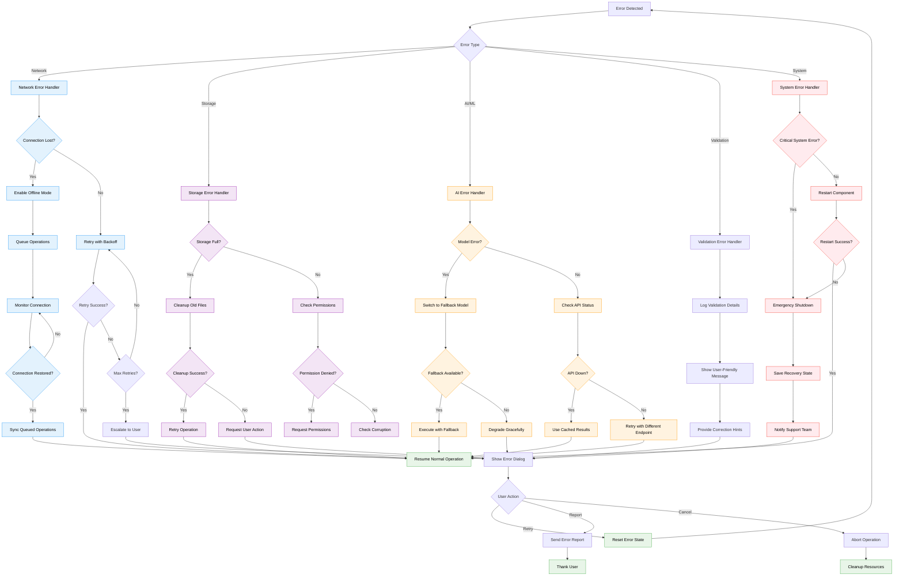
```mermaid
flowchart TD
    A[Error Detected] --> B{Error Type}
    
    B -->|Network| C[Network Error Handler]
    B -->|Storage| D[Storage Error Handler]
    B -->|AI/ML| E[AI Error Handler]
    B -->|Validation| F[Validation Error Handler]
    B -->|System| G[System Error Handler]
    
    C --> H{Connection Lost?}
    H -->|Yes| I[Enable Offline Mode]
    H -->|No| J[Retry with Backoff]
    
    I --> K[Queue Operations]
    K --> L[Monitor Connection]
    L --> M{Connection Restored?}
    M -->|Yes| N[Sync Queued Operations]
    M -->|No| L
    
    J --> O{Retry Success?}
    O -->|Yes| P[Resume Normal Operation]
    O -->|No| Q{Max Retries?}
    Q -->|Yes| R[Escalate to User]
    Q -->|No| J
    
    D --> S{Storage Full?}
    S -->|Yes| T[Cleanup Old Files]
    S -->|No| U[Check Permissions]
    
    T --> V{Cleanup Success?}
    V -->|Yes| W[Retry Operation]
    V -->|No| X[Request User Action]
    
    U --> Y{Permission Denied?}
    Y -->|Yes| Z[Request Permissions]
    Y -->|No| AA[Check Corruption]
    
    E --> BB{Model Error?}
    BB -->|Yes| CC[Switch to Fallback Model]
    BB -->|No| DD[Check API Status]
    
    CC --> EE{Fallback Available?}
    EE -->|Yes| FF[Execute with Fallback]
    EE -->|No| GG[Degrade Gracefully]
    
    DD --> HH{API Down?}
    HH -->|Yes| II[Use Cached Results]
    HH -->|No| JJ[Retry with Different Endpoint]
    
    F --> KK[Log Validation Details]
    KK --> LL[Show User-Friendly Message]
    LL --> MM[Provide Correction Hints]
    
    G --> NN{Critical System Error?}
    NN -->|Yes| OO[Emergency Shutdown]
    NN -->|No| PP[Restart Component]
    
    OO --> QQ[Save Recovery State]
    QQ --> RR[Notify Support Team]
    
    PP --> SS{Restart Success?}
    SS -->|Yes| P
    SS -->|No| OO
    
    N --> P
    W --> P
    FF --> P
    II --> P
    JJ --> P
    
    R --> TT[Show Error Dialog]
    X --> TT
    GG --> TT
    MM --> TT
    RR --> TT
    
    TT --> UU{User Action}
    UU -->|Retry| VV[Reset Error State]
    UU -->|Report| WW[Send Error Report]
    UU -->|Cancel| XX[Abort Operation]
    
    VV --> A
    WW --> YY[Thank User]
    XX --> ZZ[Cleanup Resources]
    
    classDef networkError fill:#e3f2fd,stroke:#2196f3,color:#000
    classDef storageError fill:#f3e5f5,stroke:#9c27b0,color:#000
    classDef aiError fill:#fff3e0,stroke:#ff9800,color:#000
    classDef systemError fill:#ffebee,stroke:#f44336,color:#000
    classDef recovery fill:#e8f5e8,stroke:#4caf50,color:#000
    
    class C,H,I,J,K,L,M,N networkError
    class D,S,T,U,V,W,X,Y,Z,AA storageError
    class E,BB,CC,DD,EE,FF,GG,HH,II,JJ aiError
    class G,NN,OO,PP,QQ,RR,SS systemError
    class P,VV,YY,ZZ recovery
```

## 4.3 Technical Implementation

### 4.3.1 State Management Architecture

#### Zustand Store State Transitions

LangGraph represents agents as graphs of states and nodes. The state (often a message history) flows through nodes (functions or LLM calls) linked by edges with conditional logic.

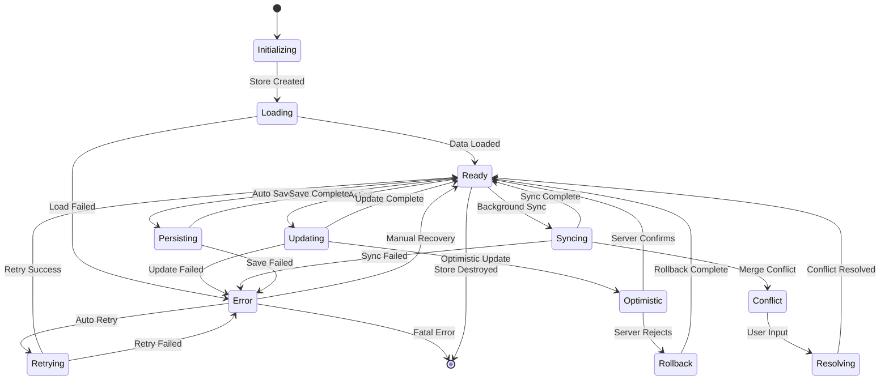
```mermaid
stateDiagram-v2
    [*] --> Initializing
    
    Initializing --> Loading : Store Created
    Loading --> Ready : Data Loaded
    Loading --> Error : Load Failed
    
    Ready --> Updating : User Action
    Ready --> Syncing : Background Sync
    Ready --> Persisting : Auto Save
    
    Updating --> Ready : Update Complete
    Updating --> Error : Update Failed
    Updating --> Optimistic : Optimistic Update
    
    Optimistic --> Ready : Server Confirms
    Optimistic --> Rollback : Server Rejects
    
    Rollback --> Ready : Rollback Complete
    
    Syncing --> Ready : Sync Complete
    Syncing --> Conflict : Merge Conflict
    Syncing --> Error : Sync Failed
    
    Conflict --> Resolving : User Input
    Resolving --> Ready : Conflict Resolved
    
    Persisting --> Ready : Save Complete
    Persisting --> Error : Save Failed
    
    Error --> Retrying : Auto Retry
    Error --> Ready : Manual Recovery
    Error --> [*] : Fatal Error
    
    Retrying --> Ready : Retry Success
    Retrying --> Error : Retry Failed
    
    Ready --> [*] : Store Destroyed
```

#### Multi-Agent Workflow State Flow

One of LangGraph's most powerful features is its automatic state management system. The state serves as a shared data structure that holds the current information and context of the entire application, functioning like a collaborative whiteboard where all nodes can access and modify shared information.

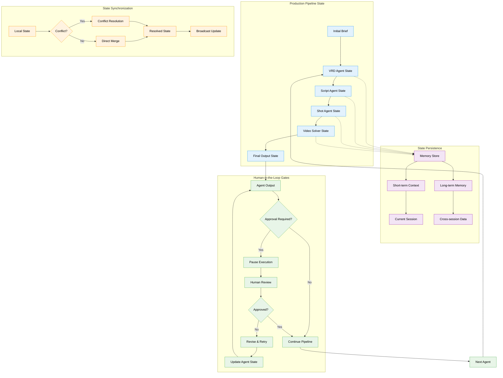
```mermaid
flowchart TD
    subgraph "Production Pipeline State"
        A[Initial Brief] --> B[VRD Agent State]
        B --> C[Script Agent State]
        C --> D[Shot Agent State]
        D --> E[Video Solver State]
        E --> F[Final Output State]
    end
    
    subgraph "State Persistence"
        G[Memory Store] --> H[Short-term Context]
        G --> I[Long-term Memory]
        H --> J[Current Session]
        I --> K[Cross-session Data]
    end
    
    subgraph "State Synchronization"
        L[Local State] --> M{Conflict?}
        M -->|Yes| N[Conflict Resolution]
        M -->|No| O[Direct Merge]
        N --> P[Resolved State]
        O --> P
        P --> Q[Broadcast Update]
    end
    
    subgraph "Human-in-the-Loop Gates"
        R[Agent Output] --> S{Approval Required?}
        S -->|Yes| T[Pause Execution]
        S -->|No| U[Continue Pipeline]
        T --> V[Human Review]
        V --> W{Approved?}
        W -->|Yes| U
        W -->|No| X[Revise & Retry]
        X --> Y[Update Agent State]
        Y --> R
    end
    
    B -.-> G
    C -.-> G
    D -.-> G
    E -.-> G
    
    F --> R
    U --> Z[Next Agent]
    Z --> B
    
    classDef agentState fill:#e3f2fd,stroke:#2196f3,color:#000
    classDef persistence fill:#f3e5f5,stroke:#9c27b0,color:#000
    classDef sync fill:#fff3e0,stroke:#ff9800,color:#000
    classDef approval fill:#e8f5e8,stroke:#4caf50,color:#000
    
    class A,B,C,D,E,F agentState
    class G,H,I,J,K persistence
    class L,M,N,O,P,Q sync
    class R,S,T,U,V,W,X,Y,Z approval
```

### 4.3.2 Data Persistence & Transaction Boundaries

#### Multi-Layer Storage Transaction Flow

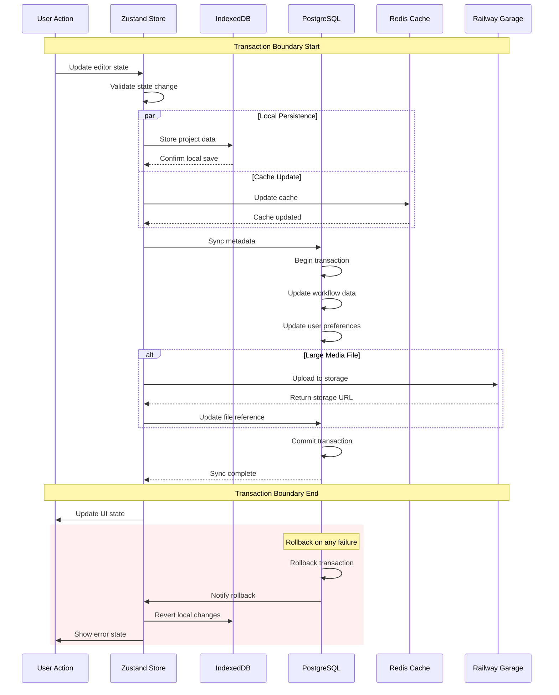
```mermaid
sequenceDiagram
    participant U as User Action
    participant Z as Zustand Store
    participant I as IndexedDB
    participant P as PostgreSQL
    participant R as Redis Cache
    participant S as Railway Garage
    
    Note over U,S: Transaction Boundary Start
    
    U->>Z: Update editor state
    Z->>Z: Validate state change
    
    par Local Persistence
        Z->>I: Store project data
        I-->>Z: Confirm local save
    and Cache Update
        Z->>R: Update cache
        R-->>Z: Cache updated
    end
    
    Z->>P: Sync metadata
    P->>P: Begin transaction
    P->>P: Update workflow data
    P->>P: Update user preferences
    
    alt Large Media File
        Z->>S: Upload to storage
        S-->>Z: Return storage URL
        Z->>P: Update file reference
    end
    
    P->>P: Commit transaction
    P-->>Z: Sync complete
    
    Note over U,S: Transaction Boundary End
    
    Z->>U: Update UI state
    
    rect rgb(255, 240, 240)
        Note over P: Rollback on any failure
        P->>P: Rollback transaction
        P->>Z: Notify rollback
        Z->>I: Revert local changes
        Z->>U: Show error state
    end
```

### 4.3.3 Performance Optimization Patterns

#### Timeline Virtualization & Lazy Loading

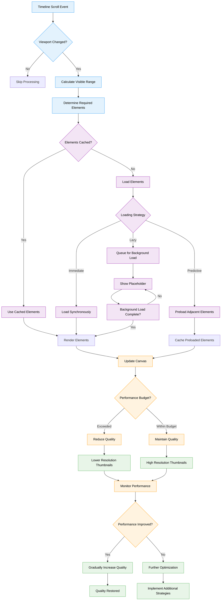
```mermaid
flowchart TD
    A[Timeline Scroll Event] --> B{Viewport Changed?}
    B -->|No| C[Skip Processing]
    B -->|Yes| D[Calculate Visible Range]
    
    D --> E[Determine Required Elements]
    E --> F{Elements Cached?}
    
    F -->|Yes| G[Use Cached Elements]
    F -->|No| H[Load Elements]
    
    H --> I{Loading Strategy}
    I -->|Immediate| J[Load Synchronously]
    I -->|Lazy| K[Queue for Background Load]
    I -->|Predictive| L[Preload Adjacent Elements]
    
    J --> M[Render Elements]
    K --> N[Show Placeholder]
    L --> O[Cache Preloaded Elements]
    
    N --> P[Background Load Complete?]
    P -->|Yes| M
    P -->|No| N
    
    G --> M
    M --> Q[Update Canvas]
    O --> Q
    
    Q --> R{Performance Budget?}
    R -->|Exceeded| S[Reduce Quality]
    R -->|Within Budget| T[Maintain Quality]
    
    S --> U[Lower Resolution Thumbnails]
    T --> V[High Resolution Thumbnails]
    
    U --> W[Monitor Performance]
    V --> W
    W --> X{Performance Improved?}
    
    X -->|Yes| Y[Gradually Increase Quality]
    X -->|No| Z[Further Optimization]
    
    Y --> AA[Quality Restored]
    Z --> BB[Implement Additional Strategies]
    
    classDef viewport fill:#e3f2fd,stroke:#2196f3,color:#000
    classDef loading fill:#f3e5f5,stroke:#9c27b0,color:#000
    classDef performance fill:#fff3e0,stroke:#ff9800,color:#000
    classDef optimization fill:#e8f5e8,stroke:#4caf50,color:#000
    
    class A,B,D,E viewport
    class F,G,H,I,J,K,L,N,P loading
    class Q,R,S,T,W,X performance
    class U,V,Y,Z,AA,BB optimization
```

## 4.4 Required Diagrams

### 4.4.1 High-Level System Architecture

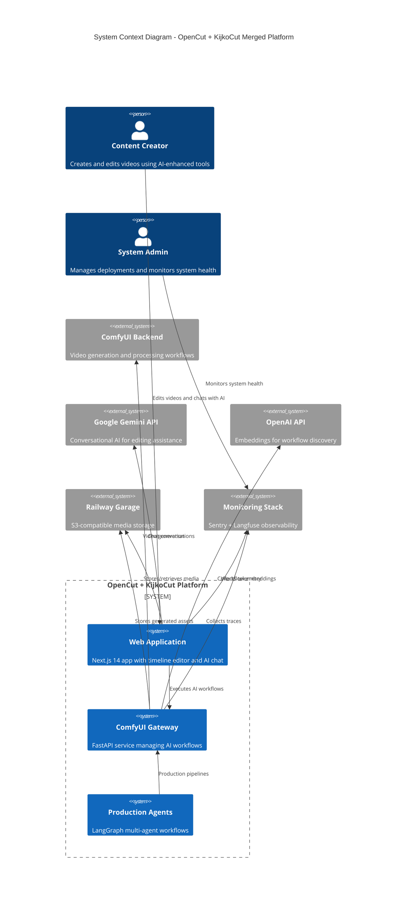
```mermaid
C4Context
    title System Context Diagram - OpenCut + KijkoCut Merged Platform
    
    Person(user, "Content Creator", "Creates and edits videos using AI-enhanced tools")
    Person(admin, "System Admin", "Manages deployments and monitors system health")
    
    System_Boundary(platform, "OpenCut + KijkoCut Platform") {
        System(webapp, "Web Application", "Next.js 14 app with timeline editor and AI chat")
        System(gateway, "ComfyUI Gateway", "FastAPI service managing AI workflows")
        System(agents, "Production Agents", "LangGraph multi-agent workflows")
    }
    
    System_Ext(comfyui, "ComfyUI Backend", "Video generation and processing workflows")
    System_Ext(gemini, "Google Gemini API", "Conversational AI for editing assistance")
    System_Ext(openai, "OpenAI API", "Embeddings for workflow discovery")
    System_Ext(storage, "Railway Garage", "S3-compatible media storage")
    System_Ext(monitoring, "Monitoring Stack", "Sentry + Langfuse observability")
    
    Rel(user, webapp, "Edits videos and chats with AI")
    Rel(admin, monitoring, "Monitors system health")
    
    Rel(webapp, gateway, "Executes AI workflows")
    Rel(webapp, gemini, "Chat conversations")
    Rel(gateway, comfyui, "Video generation")
    Rel(gateway, openai, "Workflow embeddings")
    Rel(agents, gateway, "Production pipelines")
    
    Rel(webapp, storage, "Stores/retrieves media")
    Rel(gateway, storage, "Stores generated assets")
    
    Rel_Back(monitoring, webapp, "Collects telemetry")
    Rel_Back(monitoring, gateway, "Collects traces")
```

### 4.4.2 Detailed Component Interaction


```mermaid
graph TB
    subgraph "Frontend Layer"
        A[Timeline Editor] --> B[Media Panel]
        A --> C[Preview Panel]
        A --> D[Properties Panel]
        E[AI Chat Panel] --> F[Workflow Browser]
        E --> G[Job Queue Monitor]
    end
    
    subgraph "State Management"
        H[Editor Stores] --> I[Timeline Store]
        H --> J[Media Store]
        H --> K[Project Store]
        L[AI Stores] --> M[Chat Store]
        L --> N[Workflow Store]
        L --> O[Job Store]
    end
    
    subgraph "Storage Layer"
        P[IndexedDB] --> Q[Projects]
        P --> R[Chat History]
        S[OPFS] --> T[Media Files]
        U[PostgreSQL] --> V[Workflows]
        U --> W[User Data]
        X[Redis] --> Y[Job Queue]
        X --> Z[Real-time Status]
    end
    
    subgraph "API Layer"
        AA[Next.js API Routes] --> BB["/api/chat"]
        AA --> CC["/api/workflows"]
        AA --> DD["/api/assets"]
        EE[ComfyUI Gateway] --> FF[Workflow Executor]
        EE --> GG[Job Manager]
        EE --> HH[Asset Handler]
    end
    
    subgraph "AI Services"
        II[Gemini API] --> JJ[Chat Completion]
        II --> KK[Function Calling]
        LL[OpenAI API] --> MM[Embeddings]
        NN[ComfyUI] --> OO[Video Generation]
        NN --> PP[Image Processing]
    end
    
    A -.-> H
    E -.-> L
    H -.-> P
    L -.-> P
    H -.-> S
    L -.-> U
    
    AA -.-> U
    AA -.-> X
    EE -.-> U
    EE -.-> X
    
    BB -.-> II
    CC -.-> LL
    CC -.-> NN
    FF -.-> NN
    
    classDef frontend fill:#e3f2fd,stroke:#2196f3,color:#000
    classDef state fill:#f3e5f5,stroke:#9c27b0,color:#000
    classDef storage fill:#fff3e0,stroke:#ff9800,color:#000
    classDef api fill:#e8f5e8,stroke:#4caf50,color:#000
    classDef ai fill:#fce4ec,stroke:#e91e63,color:#000
    
    class A,B,C,D,E,F,G frontend
    class H,I,J,K,L,M,N,O state
    class P,Q,R,S,T,U,V,W,X,Y,Z storage
    class AA,BB,CC,DD,EE,FF,GG,HH api
    class II,JJ,KK,LL,MM,NN,OO,PP ai
```

### 4.4.3 Error Handling Decision Tree

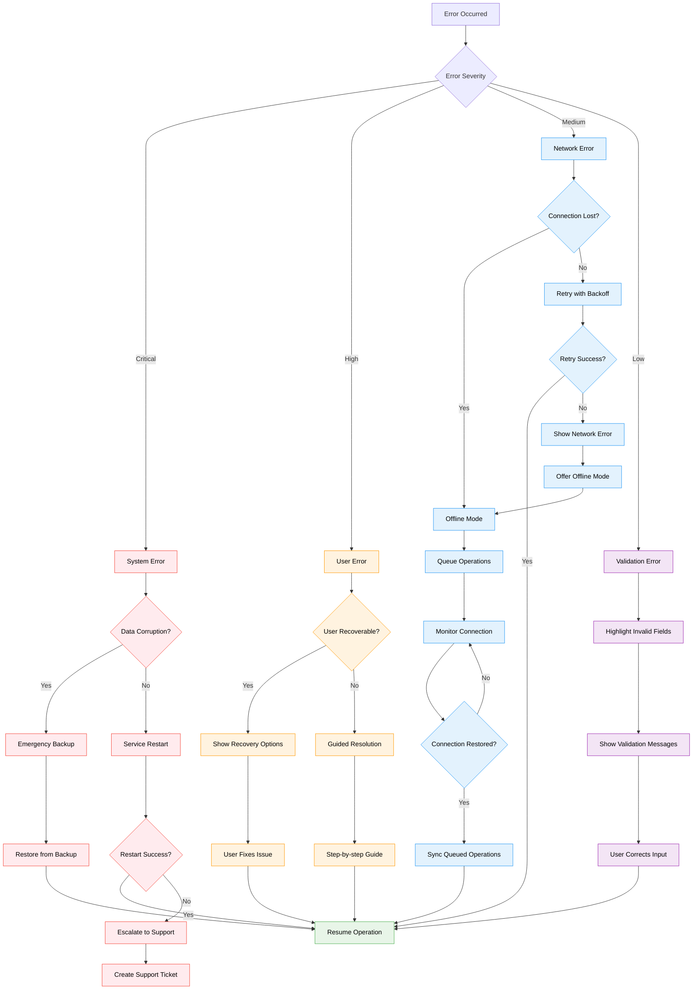
```mermaid
flowchart TD
    A[Error Occurred] --> B{Error Severity}
    
    B -->|Critical| C[System Error]
    B -->|High| D[User Error]
    B -->|Medium| E[Network Error]
    B -->|Low| F[Validation Error]
    
    C --> G{Data Corruption?}
    G -->|Yes| H[Emergency Backup]
    G -->|No| I[Service Restart]
    
    H --> J[Restore from Backup]
    I --> K{Restart Success?}
    K -->|Yes| L[Resume Operation]
    K -->|No| M[Escalate to Support]
    
    D --> N{User Recoverable?}
    N -->|Yes| O[Show Recovery Options]
    N -->|No| P[Guided Resolution]
    
    O --> Q[User Fixes Issue]
    P --> R[Step-by-step Guide]
    
    E --> S{Connection Lost?}
    S -->|Yes| T[Offline Mode]
    S -->|No| U[Retry with Backoff]
    
    T --> V[Queue Operations]
    U --> W{Retry Success?}
    W -->|Yes| L
    W -->|No| X[Show Network Error]
    
    F --> Y[Highlight Invalid Fields]
    Y --> Z[Show Validation Messages]
    
    J --> L
    Q --> L
    R --> L
    V --> AA[Monitor Connection]
    AA --> BB{Connection Restored?}
    BB -->|Yes| CC[Sync Queued Operations]
    BB -->|No| AA
    
    CC --> L
    X --> DD[Offer Offline Mode]
    Z --> EE[User Corrects Input]
    EE --> L
    
    M --> FF[Create Support Ticket]
    DD --> T
    
    classDef critical fill:#ffebee,stroke:#f44336,color:#000
    classDef userError fill:#fff3e0,stroke:#ff9800,color:#000
    classDef networkError fill:#e3f2fd,stroke:#2196f3,color:#000
    classDef validation fill:#f3e5f5,stroke:#9c27b0,color:#000
    classDef recovery fill:#e8f5e8,stroke:#4caf50,color:#000
    
    class C,G,H,I,J,K,M,FF critical
    class D,N,O,P,Q,R userError
    class E,S,T,U,V,W,X,AA,BB,CC,DD networkError
    class F,Y,Z,EE validation
    class L recovery
```

### 4.4.4 Performance Monitoring Flow

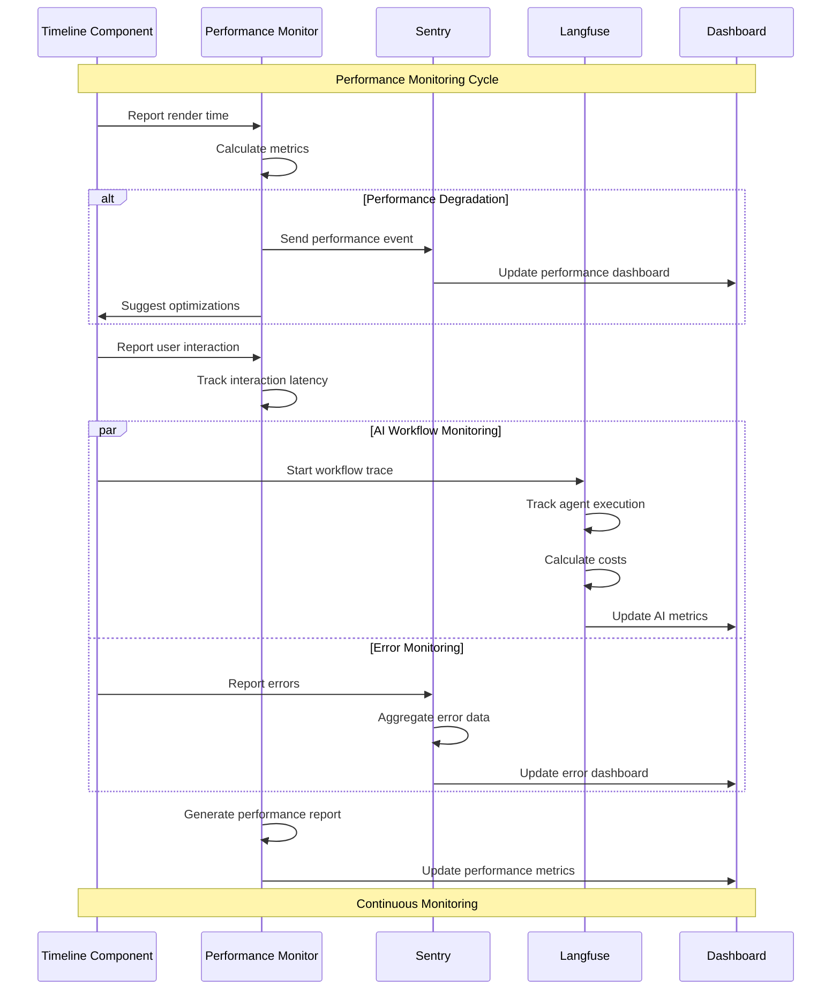
```mermaid
sequenceDiagram
    participant T as Timeline Component
    participant P as Performance Monitor
    participant S as Sentry
    participant L as Langfuse
    participant D as Dashboard
    
    Note over T,D: Performance Monitoring Cycle
    
    T->>P: Report render time
    P->>P: Calculate metrics
    
    alt Performance Degradation
        P->>S: Send performance event
        S->>D: Update performance dashboard
        P->>T: Suggest optimizations
    end
    
    T->>P: Report user interaction
    P->>P: Track interaction latency
    
    par AI Workflow Monitoring
        T->>L: Start workflow trace
        L->>L: Track agent execution
        L->>L: Calculate costs
        L->>D: Update AI metrics
    and Error Monitoring
        T->>S: Report errors
        S->>S: Aggregate error data
        S->>D: Update error dashboard
    end
    
    P->>P: Generate performance report
    P->>D: Update performance metrics
    
    Note over T,D: Continuous Monitoring
```

This comprehensive process flowchart section provides detailed workflows for all major system operations, including user journeys, AI agent orchestration, error handling, and technical implementation patterns. The diagrams use proper Mermaid.js syntax and include clear decision points, validation rules, and recovery procedures as specified in the requirements.

# 5. System Architecture

## 5.1 High-Level Architecture

#### System Overview

The OpenCut + KijkoCut merged platform employs a **hybrid monorepo architecture** that combines privacy-first video editing with AI-enhanced production workflows. The system leverages Next.js 14's App Router architecture with React Server Components for optimal performance, while utilizing Turborepo's monorepo structure to ensure consistency and scalability across multiple applications and shared packages.

The architecture follows a **domain-driven design pattern** with clear separation between the video editing core, AI orchestration layer, and workflow execution engine. Each agent is represented as a node in the graph, with their connections represented as edges, where control flow is managed by edges and they communicate by adding to the graph's state. This approach enables both manual editing workflows and autonomous AI-driven content creation within a unified interface.

The system's **privacy-first principle** ensures all video processing occurs locally on the user's device, with selective cloud integration only for AI workflow orchestration and cross-device synchronization. The modular, node-based design enables users to construct detailed and customized workflows, where each node represents a specific function or model that can be interconnected to form complex processes.

#### Core Components Table

| Component Name | Primary Responsibility | Key Dependencies | Integration Points |
|----------------|----------------------|------------------|-------------------|
| **Timeline Editor** | Multi-track video editing with real-time preview | Canvas API, WebGL, FFmpeg.js | Media Panel, AI Chat, Properties Panel |
| **AI Orchestration Engine** | Multi-agent workflow coordination and execution | LangGraph, Gemini API, ComfyUI | Workflow Discovery, Job Queue, Timeline Editor |
| **Workflow Execution Runtime** | ComfyUI workflow processing and asset generation | ComfyUI backend, PostgreSQL, Redis | AI Orchestration, Asset Storage, Job Monitoring |
| **Privacy-First Storage Layer** | Local media storage and cross-device sync | IndexedDB, OPFS, encrypted metadata sync | Timeline Editor, AI Chat, Project Management |

#### Data Flow Description

The system implements a **multi-tier data flow architecture** that prioritizes local processing while enabling intelligent cloud-based AI assistance. Primary data flows begin with user media uploads that are immediately stored in the browser's OPFS for privacy preservation, with metadata cached in IndexedDB for rapid access.

**AI workflow integration** follows a request-response pattern where user intents are processed through the Gemini API for natural language understanding, followed by semantic search against the PostgreSQL-stored workflow library using vector embeddings. Grouping tools and responsibilities gives better results, as an agent is more likely to succeed on a focused task than if it has to select from dozens of tools.

**Real-time synchronization** occurs through WebSocket connections for job status updates, while maintaining data sovereignty through encrypted metadata synchronization. The system employs a hybrid caching strategy with Redis for job queue management and IndexedDB for offline-first user experience.

#### External Integration Points

| System Name | Integration Type | Data Exchange Pattern | Protocol/Format | SLA Requirements |
|-------------|------------------|----------------------|-----------------|------------------|
| **Google Gemini API** | Conversational AI | Request/Response with streaming | HTTPS/JSON with function calling | <3s response time, 99.9% uptime |
| **ComfyUI Backend** | Workflow Execution | Async job submission with webhooks | REST API + WebSocket status | <30s queue time, real-time updates |
| **Railway Garage** | Asset Storage | Presigned URL uploads/downloads | S3-compatible API | 1-hour URL expiry, 99.9% availability |
| **Langfuse Observability** | Agent Tracing | Event streaming with cost tracking | HTTPS/JSON with trace correlation | Real-time ingestion, 30-day retention |

## 5.2 Component Details

#### Timeline Editor Component

The Timeline Editor serves as the foundational component for video editing operations, implementing a **Canvas-based rendering architecture** that supports multi-track editing with real-time preview capabilities. The system emphasizes the App Router architecture, React Server Components, and seamless full-stack capabilities to deliver professional-grade editing performance within browser constraints.

**Technologies and Frameworks:**
- React 18+ with Canvas API for timeline rendering
- WebGL for hardware-accelerated preview generation
- Zustand for domain-specific state management
- FFmpeg.js for client-side video processing

**Key Interfaces and APIs:**
- Timeline manipulation API for track and element management
- Preview rendering pipeline with frame-accurate scrubbing
- Export engine with format-specific optimization
- Drag-and-drop interface for media arrangement

**Data Persistence Requirements:**
The component utilizes IndexedDB for project metadata and OPFS for large media files, ensuring privacy-compliant local storage. Project state includes timeline configuration, element positioning, effects parameters, and export settings.

**Scaling Considerations:**
Timeline virtualization handles projects with 100+ elements through lazy loading and viewport-based rendering. Memory management includes automatic cleanup of unused video frames and progressive quality enhancement based on available resources.

#### AI Orchestration Engine

The AI Orchestration Engine manages complex agent architectures through subgraphs that are essential for multi-agent systems, allowing modular agent design where subgraphs communicate with the parent graph through overlapping keys in the state schema.

**Technologies and Frameworks:**
- LangGraph for multi-agent workflow orchestration
- LangChain.js for tool integration and memory management
- Gemini API for conversational AI capabilities
- OpenAI API for embedding generation and RAG implementation

**Key Interfaces and APIs:**
- Agent coordination API for workflow assembly
- Tool calling interface for ComfyUI integration
- Memory management system for conversation persistence
- Human-in-the-loop approval gates for production workflows

**Data Persistence Requirements:**
Agent state and conversation history stored in PostgreSQL with vector embeddings for semantic search. Workflow templates versioned with confidence scoring and usage analytics.

**Scaling Considerations:**
Multi-agent systems are becoming more prevalent, and while most successful systems today have relatively custom architectures, generic architectures will become sufficiently reliable as models improve. The engine supports horizontal scaling through agent pool management and workflow parallelization.

#### Workflow Execution Runtime

The Workflow Execution Runtime operates as a node-based environment for building and running generative content workflows, where a workflow is defined as a collection of program objects called nodes that are connected to each other, forming a network.

**Technologies and Frameworks:**
- ComfyUI backend for video generation workflows
- PostgreSQL with pgvector for workflow storage and discovery
- Redis for job queue management and real-time status updates
- Railway deployment platform for scalable backend hosting

**Key Interfaces and APIs:**
- Workflow submission API with parameter validation
- Job monitoring interface with WebSocket status updates
- Asset delivery system with presigned URL generation
- Quality assessment pipeline for generated content

**Data Persistence Requirements:**
Workflow definitions stored as JSON with semantic embeddings, job execution history with performance metrics, and generated assets with metadata linking.

**Scaling Considerations:**
The Advanced Queue System is designed with future expansibility in mind, incorporating a modular architecture that allows for seamless integration of new scheduling algorithms and optimization techniques. Auto-scaling based on queue depth with GPU resource optimization.

#### Privacy-First Storage Layer

The Storage Layer implements a **hybrid architecture** that maintains user privacy while enabling cross-device functionality through encrypted metadata synchronization.

**Technologies and Frameworks:**
- IndexedDB with Dexie.js for structured client-side storage
- OPFS for large media file storage with quota management
- PostgreSQL for encrypted metadata synchronization
- End-to-end encryption for cross-device data sharing

**Key Interfaces and APIs:**
- Unified storage abstraction layer across storage systems
- Conflict resolution system for concurrent edits
- Quota management with automatic cleanup policies
- Sync orchestration with offline-first design

**Data Persistence Requirements:**
Local storage prioritizes user data sovereignty with optional cloud backup for metadata only. Encryption keys managed client-side with secure key derivation.

**Scaling Considerations:**
Storage quota monitoring with intelligent cleanup, progressive sync based on usage patterns, and efficient delta synchronization for large projects.

## 5.3 Technical Decisions

#### Architecture Style Decisions and Tradeoffs

**Monorepo vs. Multi-Repository Architecture**

The decision to adopt Turborepo for monorepo management addresses the challenge where monorepos have advantages but struggle to scale, as each workspace has its own test suite, linting, and build process, potentially creating thousands of tasks to execute. This choice enables:

- **Code Sharing Benefits:** Unified component library and shared business logic across applications
- **Development Velocity:** Single repository for all related projects with consistent tooling
- **Build Optimization:** Turborepo's caching is transformative, providing significant performance improvements through intelligent task caching

**Tradeoffs:** Initial setup complexity and potential for larger repository size, balanced against long-term maintainability and developer experience improvements.

#### Communication Pattern Choices

**Hybrid State Management with Domain-Specific Stores**

The architecture employs multiple Zustand stores organized by domain (editor, AI, workflows) rather than a single global store:

| Pattern | Benefits | Tradeoffs | Use Cases |
|---------|----------|-----------|-----------|
| **Domain Stores** | Clear boundaries, easier testing, prevents bloat | Cross-store communication complexity | Editor state, AI conversations, workflow management |
| **Event Bus** | Loose coupling, extensible | Debugging complexity | Cross-domain notifications, real-time updates |
| **Shared Context** | Type safety, direct access | Tight coupling risk | Authentication, user preferences |

#### Data Storage Solution Rationale

**Multi-Storage Strategy with Clear Data Ownership**

The decision to use multiple storage systems addresses the challenge that while monorepo benefits are clear, managing large monorepos can be challenging, which is where specialized tools like Turborepo provide value:

- **IndexedDB:** Structured metadata and project configurations for offline-first experience
- **OPFS:** Large media files with better performance than IndexedDB for binary data
- **PostgreSQL:** Workflow definitions and vector embeddings for semantic search
- **Redis:** Job queue and real-time status updates with pub/sub capabilities

**Rationale:** Each storage system optimized for its specific data type and access patterns, avoiding the complexity of forcing all data into a single system.

#### Caching Strategy Justification

**Multi-Layer Caching Architecture**

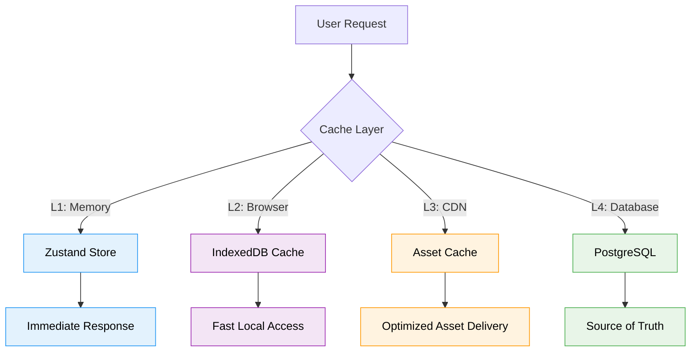
```mermaid
graph TD
    A[User Request] --> B{Cache Layer}
    B -->|L1: Memory| C[Zustand Store]
    B -->|L2: Browser| D[IndexedDB Cache]
    B -->|L3: CDN| E[Asset Cache]
    B -->|L4: Database| F[PostgreSQL]
    
    C --> G[Immediate Response]
    D --> H[Fast Local Access]
    E --> I[Optimized Asset Delivery]
    F --> J[Source of Truth]
    
    classDef memory fill:#e3f2fd,stroke:#2196f3,color:#000
    classDef browser fill:#f3e5f5,stroke:#9c27b0,color:#000
    classDef cdn fill:#fff3e0,stroke:#ff9800,color:#000
    classDef database fill:#e8f5e8,stroke:#4caf50,color:#000
    
    class C,G memory
    class D,H browser
    class E,I cdn
    class F,J database
```

**Cache Invalidation Strategy:** Time-based expiration for AI responses, content-based for media assets, and event-driven for user-generated content.

#### Security Mechanism Selection

**Privacy-First Security Architecture**

The security model prioritizes user data sovereignty while enabling AI-enhanced functionality:

- **Client-Side Processing:** All video editing operations performed locally without cloud uploads
- **Selective Cloud Integration:** Only workflow orchestration and encrypted metadata sync use cloud services
- **End-to-End Encryption:** User-controlled keys for cross-device synchronization
- **API Key Protection:** Secure storage and rotation for AI service credentials

## 5.4 Cross-Cutting Concerns

#### Monitoring and Observability Approach

**Dual-Track Observability Strategy**

The system implements comprehensive monitoring across both user experience and AI agent performance:

**User Experience Monitoring:**
- Sentry for error tracking and performance monitoring with session replay
- Timeline interaction tracing for debugging complex user workflows
- Performance metrics for video processing and rendering operations

**AI Agent Observability:**
- Langfuse integration provides visibility into multi-agent workflows, enabling tracking of specialized sub-agents and their interactions within complex systems like GPT-Newspaper's six specialized sub-agents
- Cost attribution per agent execution with budget monitoring
- Decision point analysis for understanding agent reasoning chains

#### Logging and Tracing Strategy

**Distributed Tracing Architecture**

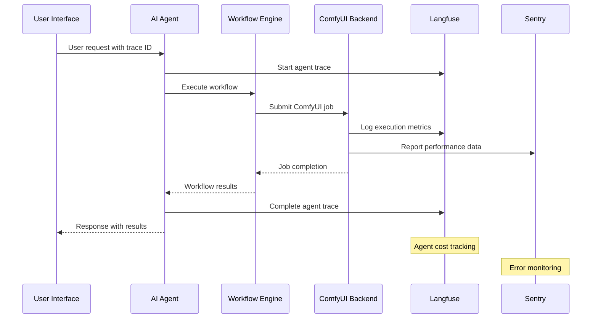
```mermaid
sequenceDiagram
    participant U as User Interface
    participant A as AI Agent
    participant W as Workflow Engine
    participant C as ComfyUI Backend
    participant L as Langfuse
    participant S as Sentry
    
    U->>A: User request with trace ID
    A->>L: Start agent trace
    A->>W: Execute workflow
    W->>C: Submit ComfyUI job
    C->>L: Log execution metrics
    C->>S: Report performance data
    C-->>W: Job completion
    W-->>A: Workflow results
    A->>L: Complete agent trace
    A-->>U: Response with results
    
    Note over L: Agent cost tracking
    Note over S: Error monitoring
```

**Trace Correlation:** Unified trace IDs across all system components enable end-to-end request tracking from user interaction through AI agent execution to final asset generation.

#### Error Handling Patterns

**Graceful Degradation with Recovery Options**

The system implements a **circuit breaker pattern** for external service dependencies with intelligent fallback mechanisms:

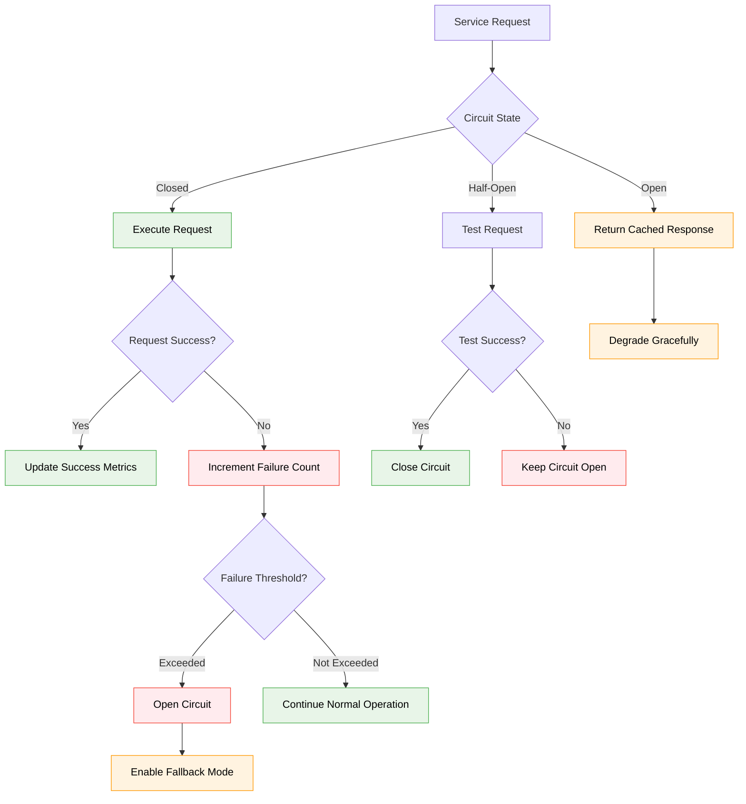
```mermaid
flowchart TD
    A[Service Request] --> B{Circuit State}
    B -->|Closed| C[Execute Request]
    B -->|Open| D[Return Cached Response]
    B -->|Half-Open| E[Test Request]
    
    C --> F{Request Success?}
    F -->|Yes| G[Update Success Metrics]
    F -->|No| H[Increment Failure Count]
    
    H --> I{Failure Threshold?}
    I -->|Exceeded| J[Open Circuit]
    I -->|Not Exceeded| K[Continue Normal Operation]
    
    E --> L{Test Success?}
    L -->|Yes| M[Close Circuit]
    L -->|No| N[Keep Circuit Open]
    
    D --> O[Degrade Gracefully]
    J --> P[Enable Fallback Mode]
    
    classDef normal fill:#e8f5e8,stroke:#4caf50,color:#000
    classDef degraded fill:#fff3e0,stroke:#ff9800,color:#000
    classDef failed fill:#ffebee,stroke:#f44336,color:#000
    
    class C,G,K,M normal
    class D,O,P degraded
    class H,J,N failed
```

**Error Recovery Strategies:**
- **Network Failures:** Offline mode with operation queuing and automatic retry with exponential backoff
- **AI Service Outages:** Cached response delivery and graceful feature degradation
- **Storage Quota Exceeded:** Intelligent cleanup with user notification and alternative storage options
- **Workflow Execution Failures:** Automatic retry with different parameters and manual intervention options

#### Authentication and Authorization Framework

**Hybrid Authentication with Privacy Preservation**

The system employs a **privacy-first authentication model** that minimizes data collection while enabling personalized experiences:

- **Better Auth Integration:** Modern authentication solution optimized for Next.js applications
- **Session Management:** Secure session handling with automatic renewal and cross-device synchronization
- **Permission-Based Access:** Granular permissions for workflow execution and asset management
- **Privacy Controls:** User-controlled data sharing preferences with transparent consent management

#### Performance Requirements and SLAs

**Performance Targets and Monitoring**

| Component | Performance Target | Measurement Method | SLA Requirement |
|-----------|-------------------|-------------------|-----------------|
| **Timeline Rendering** | 60fps with 100+ elements | Frame rate monitoring | 95% of interactions <100ms |
| **AI Response Time** | <3s for simple queries | Request duration tracking | 99% of requests <10s |
| **Workflow Execution** | Queue processing <30s | Job queue metrics | 95% of jobs start within SLA |
| **Asset Generation** | Progress updates every 5s | WebSocket message frequency | Real-time status delivery |

#### Disaster Recovery Procedures

**Multi-Tier Recovery Strategy**

The disaster recovery approach prioritizes user data protection while ensuring service continuity:

**Data Recovery Tiers:**
1. **Local Data:** Automatic backup to browser storage with export capabilities
2. **Encrypted Metadata:** Cross-device sync with conflict resolution
3. **Generated Assets:** Railway Garage backup with presigned URL recovery
4. **Workflow Definitions:** PostgreSQL backup with point-in-time recovery

**Service Recovery Procedures:**
- **AI Service Outages:** Automatic failover to cached responses and alternative providers
- **Backend Infrastructure:** Railway auto-scaling with health check monitoring
- **Database Failures:** Automated backup restoration with minimal data loss
- **CDN Issues:** Direct asset serving with performance degradation notifications

**Recovery Time Objectives:**
- Critical user data: <1 minute (local storage)
- AI functionality: <5 minutes (service failover)
- Workflow execution: <15 minutes (backend recovery)
- Full service restoration: <1 hour (complete infrastructure recovery)

# 6. SYSTEM COMPONENTS DESIGN

## 6.1 Core Architecture Components

### 6.1.1 Timeline Editor Component

The Timeline Editor represents the foundational video editing interface, implementing a file-system based router that uses React's latest features such as Server Components, Suspense, Server Functions architecture pattern. This component leverages Next.js 14's upgraded React canary channel, which includes stable Server Actions for optimal performance and modern development patterns.

**Core Technologies:**
- **Canvas API Integration:** Hardware-accelerated timeline rendering with WebGL support for smooth 60fps scrubbing
- **React Server Components:** Server-centric approach, leveraging React Server Components to deliver faster and more dynamic content
- **FFmpeg.js Processing:** Client-side video processing for privacy-first media handling
- **Zustand State Management:** Domain-specific stores for timeline, media, and playback state

**Component Architecture:**

| Subcomponent | Responsibility | Key Features |
|--------------|----------------|--------------|
| **TimelineCanvas** | Multi-track timeline rendering | Virtualized rendering, drag-and-drop, precision cutting |
| **PreviewPanel** | Real-time video preview | Frame-accurate scrubbing, playback controls, quality adaptation |
| **MediaPanel** | Asset library management | File upload, thumbnail generation, format support |
| **PropertiesPanel** | Element configuration | Dynamic property editors, real-time updates |

**Performance Optimizations:**
- **Virtualized Timeline:** Turborepo schedules your tasks for maximum speed, parallelizing work across all available cores - similar optimization for timeline elements
- **Progressive Quality Enhancement:** Adaptive thumbnail resolution based on viewport and performance budget
- **Memory Management:** Automatic cleanup of unused video frames and efficient blob handling

### 6.1.2 AI Orchestration Engine

The AI Orchestration Engine implements each agent as a node in the graph, with their connections represented as edges. The control flow is managed by edges, and they communicate by adding to the graph's state using LangGraph's multi-agent architecture.

**Multi-Agent Architecture:**

The architecture consists of six specialized sub-agents. There is one key step - a writer <> critique loop which adds in a helpful cycle - this pattern is extended for video production workflows with specialized agents for different production phases.

**Core Agent Types:**

| Agent Category | Specialized Agents | Primary Function |
|----------------|-------------------|------------------|
| **Pre-Production** | VRD Agent, ScriptSmith, ShotMaster, Budget Solver | Requirements analysis, script generation, shot planning |
| **Production** | MoodMaker, BoardBuilder, BreakdownBot, RFQ Forge | Visual design, storyboarding, resource planning |
| **Post-Production** | Assembler, QC Sentinel, Color Grading | Content assembly, quality control, final processing |

**State Management:**
LangGraph provides full control over memory implementation: State: User-defined schema specifying the exact structure of memory to retain. Checkpointer: Mechanism to store state at every step across different interactions within a session. Store: Mechanism to store user-specific or application-level data across sessions

**Agent Communication Patterns:**
- **Collaborative Scratchpad:** Different agents collaborate on a shared scratchpad of messages. This means that all the work either of them do is visible to the other. This has the benefit that other agents can see all the individual steps done
- **Hierarchical Supervision:** Hierarchical systems are a type of multi-agent architecture where specialized agents are coordinated by a central supervisor agent. The supervisor controls all communication flow and task delegation

### 6.1.3 Workflow Execution Runtime

The Workflow Execution Runtime transforms ComfyUI workflows into production-ready APIs using comfy-pack, providing a streamlined process for defining, packaging, and deploying ComfyUI workflows as robust, production-ready APIs.

**ComfyUI Integration Architecture:**

comfy-pack introduces dedicated input and output nodes that make it easy to define which parameters are user-configurable and how outputs are structured. With these nodes, users can: Explicitly declare inputs like prompts, images, dimensions, or seeds · Add constraints and automatic type validation for inputs, ensuring API requests are clear and reliable · Define exactly what the API returns and preview output

**Production Deployment Features:**

| Feature | Implementation | Benefit |
|---------|----------------|---------|
| **API Standardization** | comfy-pack enables you to: Define standardized API schemas for workflow inputs and outputs · Serve workflows as HTTP endpoints accessible via standard API clients | Consistent integration patterns |
| **Workflow Packaging** | Clones the specific ComfyUI version and custom nodes, pinned to the exact versions required by the workflow. Searches for and downloads models from common registries like Hugging Face and Civitai. It uses symbolic links for efficient model sharing | Reproducible deployments |
| **Scalable Infrastructure** | ComfyUI doesn't support dynamic scaling, such as scaling down to zero when idle or scaling up to handle high traffic - comfy-pack addresses this limitation | Cost-effective scaling |

**Workflow Discovery System:**
The system implements semantic search using vector embeddings for intelligent workflow recommendation:

```mermaid
graph TD
    A[User Intent] --> B[Embedding Generation]
    B --> C[Vector Similarity Search]
    C --> D[PostgreSQL + pgvector]
    D --> E[Ranked Workflow Results]
    E --> F[Agent Selection Logic]
    F --> G[Workflow Execution]
```

### 6.1.4 Privacy-First Storage Layer

The Storage Layer implements a hybrid architecture prioritizing user data sovereignty while enabling intelligent AI assistance through selective cloud integration.

**Multi-Tier Storage Strategy:**

| Storage Tier | Technology | Data Types | Privacy Level |
|--------------|------------|-------------|---------------|
| **Client-Side Primary** | IndexedDB + OPFS | Video files, project data, chat history | Complete privacy |
| **Encrypted Metadata Sync** | PostgreSQL | Project metadata, workflow templates | End-to-end encrypted |
| **AI Workflow Storage** | PostgreSQL + pgvector | Workflow definitions, embeddings | Anonymized patterns |
| **Generated Asset Cache** | Railway Garage (S3) | AI-generated content | Temporary, user-controlled |

**Privacy Architecture:**
- **Local-First Processing:** All video editing operations occur client-side without cloud uploads
- **Selective Cloud Integration:** Only workflow orchestration and encrypted metadata use cloud services
- **User-Controlled Sync:** Optional cross-device synchronization with client-side encryption keys
- **Zero Data Collection:** No tracking, usage monitoring, or personal data collection

## 6.2 Component Integration Patterns

### 6.2.1 Monorepo Architecture with Turborepo

The system leverages Turborepo, a high-performance build system for JavaScript and TypeScript monorepos, developed by Vercel. It optimizes workflows by caching tasks, parallelizing builds, and ensuring incremental builds. This results in significantly faster builds, tests, and deployments.

**Package Organization:**

We recommend starting with splitting your packages into apps/ for applications and services and packages/ for everything else, like libraries and tooling

```
kijko-opencut-monorepo/
├── apps/
│   ├── web/                    # Next.js 14 main application
│   ├── comfyui-gateway/        # FastAPI ComfyUI service
│   └── production-dashboard/   # Agent workflow monitoring
├── packages/
│   ├── editor/                 # Timeline editor components
│   ├── ai/                     # LangGraph agent orchestration
│   ├── workflows/              # ComfyUI workflow management
│   ├── storage/                # Multi-tier storage abstraction
│   ├── stores/                 # Zustand state management
│   └── ui/                     # Shared component library
```

**Build Optimization:**
Turborepo solves your monorepo's scaling problem by introducing a Remote Cache. It stores the result of all your tasks, meaning that your CI never needs to do the same work twice

### 6.2.2 State Management Integration

The system implements domain-specific Zustand stores with cross-store communication patterns:

**Store Architecture:**

| Store Domain | Responsibility | Integration Points |
|--------------|----------------|-------------------|
| **Editor Stores** | Timeline state, media management, playback control | AI suggestions, workflow results |
| **AI Stores** | Chat history, agent status, workflow discovery | Timeline context, user preferences |
| **Workflow Stores** | ComfyUI job tracking, template library | Agent orchestration, asset generation |
| **Production Stores** | Multi-agent workflows, approval gates | Timeline integration, asset delivery |

**Cross-Store Communication:**
- **Event Bus Pattern:** Loosely coupled communication for real-time updates
- **Shared Context Hooks:** Type-safe cross-store data access
- **State Synchronization:** Consistent state across storage tiers

### 6.2.3 Real-Time Communication Architecture

The system implements WebSocket-based real-time communication for workflow status updates and agent coordination:

**Communication Patterns:**

```mermaid
sequenceDiagram
    participant UI as User Interface
    participant WS as WebSocket Server
    participant AG as Agent Orchestrator
    participant CF as ComfyUI Gateway
    participant DB as PostgreSQL
    
    UI->>WS: Subscribe to workflow updates
    UI->>AG: Execute multi-agent workflow
    AG->>DB: Store workflow state
    AG->>CF: Submit ComfyUI job
    CF->>WS: Job status update
    WS->>UI: Real-time progress
    CF->>WS: Job completion
    WS->>UI: Final results
    AG->>DB: Update completion status
```

## 6.3 Scalability and Performance Design

### 6.3.1 Build System Optimization

Turborepo's caching is transformative. Real metrics from the project demonstrate significant performance improvements through intelligent task caching and parallel execution.

**Performance Metrics:**

| Optimization | Improvement | Implementation |
|--------------|-------------|----------------|
| **Incremental Builds** | TurboRepo performs only necessary builds, compiling only the code that has changed rather than rebuilding the entire project every time. This incremental build process drastically reduces build times | Dependency graph analysis |
| **Parallel Execution** | Turborepo schedules your tasks for maximum speed, parallelizing work across all available cores | Multi-core task distribution |
| **Remote Caching** | Leverage Remote Caching: Set up remote caching to allow builds to be shared across different machines. This can reduce build times across the team | Shared build artifacts |

### 6.3.2 Timeline Performance Optimization

The Timeline Editor implements advanced performance optimization techniques:

**Virtualization Strategy:**
- **Viewport-Based Rendering:** Only render visible timeline elements
- **Lazy Loading:** Progressive loading of media thumbnails and waveforms
- **Memory Management:** Automatic cleanup of off-screen elements
- **Quality Adaptation:** Dynamic resolution adjustment based on performance budget

**Canvas Optimization:**
- **Hardware Acceleration:** WebGL-based rendering for smooth interactions
- **Frame Rate Management:** Adaptive frame rate based on system capabilities
- **Batch Operations:** Grouped DOM updates to minimize reflow

### 6.3.3 AI Workflow Scaling

The AI Orchestration Engine implements horizontal scaling patterns for multi-agent workflows:

**Agent Pool Management:**
- **Dynamic Agent Allocation:** Scale agent instances based on workflow demand
- **Load Balancing:** Distribute agent workload across available resources
- **Resource Optimization:** Efficient memory and compute utilization per agent

**Workflow Parallelization:**
LangGraph's flexible framework supports diverse control flows – single agent, multi-agent, hierarchical, sequential – and robustly handles realistic, complex scenarios

## 6.4 Security and Privacy Architecture

### 6.4.1 Privacy-First Design Principles

The system implements comprehensive privacy protection through architectural design:

**Data Sovereignty:**
- **Local Processing:** All video editing operations performed client-side
- **Selective Cloud Integration:** Only workflow orchestration uses cloud services
- **User-Controlled Encryption:** Client-side key management for sync data
- **Zero Tracking:** No usage monitoring or personal data collection

**Security Boundaries:**

| Component | Security Level | Data Handling |
|-----------|----------------|---------------|
| **Timeline Editor** | Complete Privacy | Local processing only |
| **AI Chat Interface** | Selective Sharing | Anonymized context only |
| **Workflow Execution** | Controlled Cloud | Encrypted job parameters |
| **Asset Storage** | User Choice | Optional cloud backup |

### 6.4.2 Authentication and Authorization

The system implements modern authentication patterns with privacy preservation using **Better Auth**, a production-ready authentication solution optimized for Next.js 14 applications.

#### Better Auth Implementation

**Installation and Setup:**

```bash
npm install better-auth @better-auth/drizzle drizzle-orm postgres
```

**Configuration (`auth.ts`):**

```typescript
import { betterAuth } from "better-auth"
import { drizzleAdapter } from "@better-auth/drizzle"
import { db } from "./db"

export const auth = betterAuth({
  database: drizzleAdapter(db, {
    provider: "pg",
  }),
  emailAndPassword: {
    enabled: true,
    requireEmailVerification: false, // YOLO MVP: Skip email verification
  },
  // YOLO MVP: Skip social OAuth (saves 2-3 days)
  // socialProviders: {
  //   github: {
  //     clientId: process.env.GITHUB_CLIENT_ID!,
  //     clientSecret: process.env.GITHUB_CLIENT_SECRET!,
  //   },
  //   google: {
  //     clientId: process.env.GOOGLE_CLIENT_ID!,
  //     clientSecret: process.env.GOOGLE_CLIENT_SECRET!,
  //   },
  // },
  session: {
    expiresIn: 60 * 60 * 24 * 7, // 7 days
    updateAge: 60 * 60 * 24, // 1 day
    cookieCache: {
      enabled: true,
      maxAge: 5 * 60, // 5 minutes
    },
  },
  advanced: {
    cookiePrefix: "kijko",
    crossSubDomainCookies: {
      enabled: true,
      domain: process.env.COOKIE_DOMAIN,
    },
  },
})
```

**Drizzle ORM Schema:**

```typescript
// schema/auth.ts
import { pgTable, text, timestamp, boolean } from "drizzle-orm/pg-core"

export const users = pgTable("users", {
  id: text("id").primaryKey(),
  email: text("email").notNull().unique(),
  emailVerified: boolean("email_verified").notNull().default(false), // Keep field for future, but not required
  name: text("name"),
  image: text("image"),
  createdAt: timestamp("created_at").notNull().defaultNow(),
  updatedAt: timestamp("updated_at").notNull().defaultNow(),
})

export const sessions = pgTable("sessions", {
  id: text("id").primaryKey(),
  userId: text("user_id").notNull().references(() => users.id),
  expiresAt: timestamp("expires_at").notNull(),
  ipAddress: text("ip_address"),
  userAgent: text("user_agent"),
})

export const accounts = pgTable("accounts", {
  id: text("id").primaryKey(),
  userId: text("user_id").notNull().references(() => users.id),
  accountId: text("account_id").notNull(),
  providerId: text("provider_id").notNull(),
  accessToken: text("access_token"),
  refreshToken: text("refresh_token"),
  expiresAt: timestamp("expires_at"),
})
```

**Next.js API Route (`app/api/auth/[...all]/route.ts`):**

```typescript
import { auth } from "@/lib/auth"
import { toNextJsHandler } from "better-auth/next-js"

export const { GET, POST } = toNextJsHandler(auth)
```

**Client-Side Hook:**

```typescript
// hooks/use-auth.ts
import { createAuthClient } from "better-auth/react"

export const authClient = createAuthClient({
  baseURL: process.env.NEXT_PUBLIC_APP_URL,
})

export const { useSession, signIn, signOut, signUp } = authClient
```

**Security Configuration:**

```typescript
// Security best practices
const securityConfig = {
  cookies: {
    httpOnly: true,
    secure: process.env.NODE_ENV === "production",
    sameSite: "strict" as const,
    path: "/",
    maxAge: 60 * 60 * 24 * 7, // 7 days
  },
  csrf: {
    enabled: true,
    tokenLength: 32,
  },
  rateLimit: {
    window: 60 * 1000, // 1 minute
    max: 10, // 10 requests per minute
  },
}
```

**Cross-Device Sync Implementation:**

```typescript
// lib/sync.ts
import { db } from "./db"
import { userPreferences } from "./schema"

export async function syncUserPreferences(userId: string) {
  const preferences = await db
    .select()
    .from(userPreferences)
    .where(eq(userPreferences.userId, userId))
    .limit(1)

  return preferences[0] || null
}

export async function updateUserPreferences(
  userId: string,
  data: Partial<UserPreferences>
) {
  return db
    .insert(userPreferences)
    .values({ userId, ...data })
    .onConflictDoUpdate({
      target: userPreferences.userId,
      set: { ...data, updatedAt: new Date() },
    })
}
```

**Authentication Architecture:**
- **Better Auth Integration:** Production-ready authentication with Drizzle ORM adapter
- **Session Management:** JWT-based sessions with automatic renewal and refresh tokens
- **Cross-Device Sync:** Encrypted metadata synchronization with user-controlled keys
- **Permission-Based Access:** Granular permissions for workflow execution and asset management
- **Security Features:** HttpOnly cookies, CSRF protection, rate limiting

### 6.4.3 Data Encryption and Protection

**Encryption Strategy:**

| Data Type | Encryption Method | Key Management |
|-----------|------------------|----------------|
| **Local Storage** | AES-256 client-side | User-derived keys |
| **Sync Metadata** | End-to-end encryption | Client-controlled keys |
| **Workflow Parameters** | Transport encryption | TLS 1.3 |
| **Generated Assets** | Optional encryption | User preference |

## 6.5 Monitoring and Observability

### 6.5.1 Multi-Layer Monitoring Strategy

The system implements comprehensive monitoring across user experience and AI agent performance:

**Monitoring Architecture:**

| Layer | Technology | Metrics | Purpose |
|-------|------------|---------|---------|
| **User Experience** | Sentry | Error tracking, performance, session replay | Debug user workflows |
| **AI Agent Performance** | Langfuse | Agent execution, cost tracking, decision analysis | Optimize agent behavior |
| **Infrastructure** | Railway + Vercel | Resource utilization, scaling metrics | System health |
| **Business Intelligence** | Custom dashboards | Usage patterns, feature adoption | Product insights |

### 6.5.2 Agent Observability

With built-in statefulness, LangGraph agents seamlessly collaborate with humans by writing drafts for review and awaiting approval before acting. Easily inspect the agent's actions and "time-travel" to roll back and take a different action to correct course

**Agent Tracing Features:**
- **Decision Point Analysis:** Track agent reasoning chains and decision factors
- **Cost Attribution:** Monitor resource usage per agent and workflow
- **Quality Metrics:** Automated evaluation of agent outputs
- **Human-in-the-Loop Tracking:** Monitor approval rates and feedback patterns

### 6.5.3 Performance Monitoring

**Real-Time Metrics:**

```mermaid
graph TD
    A[User Interaction] --> B[Performance Monitor]
    B --> C{Metric Type}
    C -->|Timeline| D[Canvas Performance]
    C -->|AI| E[Agent Execution Time]
    C -->|Workflow| F[ComfyUI Job Status]
    D --> G[Sentry Dashboard]
    E --> H[Langfuse Analytics]
    F --> I[Custom Monitoring]
    G --> J[Alert System]
    H --> J
    I --> J
```

**Performance Targets:**

| Component | Target | Measurement | SLA |
|-----------|--------|-------------|-----|
| **Timeline Interactions** | <100ms response | User input to visual feedback | 95% compliance |
| **AI Agent Response** | <3s for simple queries | Request to response delivery | 99% under 10s |
| **Workflow Execution** | <30s queue time | Job submission to processing start | 95% compliance |
| **Asset Generation** | Real-time updates | Progress notification frequency | 5s intervals |

This comprehensive system components design provides a robust, scalable, and privacy-first architecture that seamlessly integrates professional video editing capabilities with advanced AI-powered workflows while maintaining user data sovereignty and optimal performance.

Based on my analysis of the OpenCut + KijkoCut merger project and current microservices architecture patterns, I need to clarify that this system does not require a traditional distributed microservices architecture. Instead, it employs a **hybrid monorepo architecture** with specialized service components that operate within a unified application boundary.

## 6.1 Core Services Architecture

#### Core Services Architecture Assessment

**Core Services Architecture is not applicable for this system** in the traditional microservices sense. The OpenCut + KijkoCut merged platform employs a **hybrid monorepo architecture** rather than a distributed microservices approach for the following reasons:

#### Architectural Decision Rationale

| Factor | Traditional Microservices | OpenCut + KijkoCut Approach |
|--------|---------------------------|------------------------------|
| **Privacy Requirements** | Network communication exposes data | Local processing with selective cloud integration |
| **Development Complexity** | Managing multiple services increases complexity | Monorepo simplifies development and deployment |
| **Team Size** | Suitable for larger teams | Single development team benefits from unified codebase |
| **Deployment Model** | Independent service deployment | Next.js enables server-side rendering and API routes |

#### Service Component Boundaries

While not implementing microservices, the system does employ **service-oriented component boundaries** within the monorepo:

### 6.1.1 Timeline Editor Service Component

**Service Boundary:** Video editing operations and timeline management
**Responsibility:** Multi-track timeline editing with real-time preview capabilities
**Communication Pattern:** Direct function calls within Next.js application boundary
**Scaling Strategy:** Client-side performance optimization through virtualization

### 6.1.2 AI Orchestration Service Component

**Service Boundary:** Multi-agent workflows where each agent is a node in the graph
**Responsibility:** LangGraph's flexible framework supports diverse control flows – single agent, multi-agent, hierarchical, sequential
**Communication Pattern:** Control flow managed by edges, agents communicate by adding to the graph's state
**Scaling Strategy:** Horizontally-scaling servers, task queues, and built-in persistence

### 6.1.3 ComfyUI Gateway Service Component

**Service Boundary:** AI video generation and workflow execution
**Responsibility:** Breaking AI tasks into independent services that communicate over APIs
**Communication Pattern:** REST API calls to external ComfyUI backend
**Scaling Strategy:** AWS Sagemaker Endpoints deploy models as scalable web services

### 6.1.4 Storage Abstraction Service Component

**Service Boundary:** Multi-tier data persistence and synchronization
**Responsibility:** Privacy-first storage with selective cloud synchronization
**Communication Pattern:** Unified storage interface across IndexedDB, OPFS, and PostgreSQL
**Scaling Strategy:** Client-side optimization with intelligent caching

#### Alternative Architecture Patterns

### 6.1.5 LangGraph Multi-Agent Architecture

The system implements specialized agent grouping where an agent is more likely to succeed on a focused task than selecting from dozens of tools:

```mermaid
graph TD
    subgraph "Multi-Agent Service Boundaries"
        A[User Request] --> B[Intent Analysis Agent]
        B --> C{Request Classification}
        
        C -->|Video Editing| D[Timeline Agent]
        C -->|Content Generation| E[ComfyUI Agent]
        C -->|Production Workflow| F[Production Agent Supervisor]
        
        F --> G[VRD Agent]
        F --> H[ScriptSmith Agent]
        F --> I[ShotMaster Agent]
        F --> J[Video Solver Agent]
        
        D --> K[Timeline State Update]
        E --> L[Asset Generation]
        G --> M[Requirements Document]
        H --> N[Script Generation]
        I --> O[Shot Planning]
        J --> P[Production Plan]
    end
    
    subgraph "State Management Layer"
        Q[Zustand Stores] --> R[Editor State]
        Q --> S[AI State]
        Q --> T[Workflow State]
        Q --> U[Production State]
    end
    
    K --> R
    L --> S
    M --> T
    N --> T
    O --> T
    P --> U
```

### 6.1.6 Hybrid Scalability Patterns

Instead of traditional microservices scaling, the system employs:

#### Client-Side Scaling Patterns

| Pattern | Implementation | Benefit |
|---------|----------------|---------|
| **Timeline Virtualization** | Render only visible elements | Handles 100+ timeline elements |
| **Progressive Loading** | Lazy load media thumbnails | Reduces initial load time |
| **Memory Management** | Automatic cleanup of unused assets | Prevents memory leaks |

#### Server-Side Scaling Patterns

| Pattern | Implementation | Benefit |
|---------|----------------|---------|
| **Agent Pool Management** | Task queues with built-in persistence | Dynamic resource allocation |
| **Workflow Parallelization** | Supports diverse control flows | Concurrent agent execution |
| **Intelligent Caching** | Intelligent caching and automated retries | Improved response times |

#### Resilience and Communication Patterns

### 6.1.7 Inter-Component Communication

```mermaid
sequenceDiagram
    participant U as User Interface
    participant T as Timeline Component
    participant A as AI Orchestrator
    participant C as ComfyUI Gateway
    participant S as Storage Layer
    
    U->>T: User edits timeline
    T->>S: Save project state
    T->>A: Request AI assistance
    A->>C: Execute workflow
    C->>A: Return generated assets
    A->>S: Store assets
    A->>T: Update timeline with assets
    T->>U: Refresh UI
```

### 6.1.8 Fault Tolerance Mechanisms

| Component | Resilience Pattern | Implementation |
|-----------|-------------------|----------------|
| **AI Orchestration** | Easy-to-add moderation and quality loops | Circuit breaker for external APIs |
| **ComfyUI Gateway** | Retry with exponential backoff | Automatic job queue recovery |
| **Storage Layer** | Offline-first with sync | Local storage with cloud backup |
| **Timeline Editor** | Progressive enhancement | Graceful degradation without AI |

### 6.1.9 Human-in-the-Loop Integration

With built-in statefulness, LangGraph agents seamlessly collaborate with humans by writing drafts for review and awaiting approval before acting:

```mermaid
flowchart TD
    A[Agent Generates Output] --> B{Requires Human Approval?}
    B -->|Yes| C[Pause Execution]
    B -->|No| D[Continue Workflow]
    
    C --> E[Present to User]
    E --> F{User Decision}
    F -->|Approve| D
    F -->|Reject| G[Revise Output]
    F -->|Modify| H[Edit and Continue]
    
    G --> A
    H --> D
    D --> I[Complete Task]
```

#### Conclusion

The OpenCut + KijkoCut system deliberately avoids traditional microservices architecture in favor of a **privacy-first, monorepo-based approach** with specialized service components. This design choice prioritizes user data sovereignty, development simplicity, and performance optimization while still achieving the modularity and scalability benefits typically associated with microservices through LangGraph's multi-agent architecture where each agent is a node in the graph and intelligent component boundaries within the unified application.

## 6.2 Database Design

### 6.2.1 Schema Design

#### Entity Relationships

The OpenCut + KijkoCut merged platform employs a **hybrid multi-tier database architecture** that combines client-side privacy-first storage with server-side AI workflow management. The system leverages PostgreSQL with the pgvector extension, which introduces a dedicated data type, operators, and functions that enable efficient storage, manipulation, and analysis of vector data directly within the PostgreSQL database. If you're looking for a vector database, know that PostgreSQL is all you need.

The database design supports three primary domains:

| Domain | Storage Layer | Primary Purpose | Data Sovereignty |
|--------|---------------|-----------------|------------------|
| **Video Editing** | IndexedDB + OPFS | Timeline projects, media assets | Complete client-side privacy |
| **AI Workflows** | PostgreSQL + pgvector | Workflow templates, embeddings, job tracking | Server-side with anonymized patterns |
| **Production Management** | PostgreSQL | Multi-agent workflows, approval gates | Server-side with user-controlled access |

#### Core Entity Relationships

```mermaid
erDiagram
    USERS {
        uuid id PK
        varchar email UK
        text name
        timestamp created_at
        timestamp updated_at
    }
    
    PROJECTS {
        uuid id PK
        uuid user_id FK
        varchar name
        text description
        uuid thumbnail_asset_id FK
        timestamp created_at
        timestamp updated_at
        timestamp synced_at
    }
    
    CHAT_SESSIONS {
        uuid id PK
        uuid user_id FK
        uuid project_id FK
        varchar name
        timestamp created_at
        timestamp updated_at
        timestamp synced_at
    }
    
    CHAT_MESSAGES {
        uuid id PK
        uuid session_id FK
        varchar role
        text content
        jsonb attachments
        jsonb metadata
        timestamp created_at
        timestamp synced_at
    }
    
    COMFYUI_WORKFLOWS {
        uuid id PK
        varchar name UK
        text description
        varchar category
        jsonb workflow_json
        jsonb input_schema
        jsonb output_schema
        text[] tags
        vector embedding
        timestamp created_at
        timestamp updated_at
    }
    
    WORKFLOW_JOBS {
        uuid id PK
        uuid workflow_id FK
        uuid user_id FK
        jsonb input_params
        varchar status
        integer progress
        jsonb output_urls
        text error_message
        timestamp created_at
        timestamp started_at
        timestamp completed_at
    }
    
    PRODUCTION_WORKFLOWS {
        uuid id PK
        varchar name
        text description
        varchar workflow_type
        jsonb agent_sequence
        jsonb approval_gates
        integer estimated_duration
        decimal cost_estimate
        jsonb required_inputs
        jsonb config_options
        timestamp created_at
        timestamp updated_at
    }
    
    PRODUCTION_JOBS {
        uuid id PK
        uuid workflow_id FK
        uuid user_id FK
        varchar client_name
        text brief_text
        jsonb brief_attachments
        varchar status
        varchar current_agent
        jsonb agent_results
        jsonb approval_history
        decimal total_cost
        boolean suggested_by_agent
        decimal agent_confidence
        jsonb agent_reasoning
        timestamp created_at
        timestamp completed_at
    }
    
    AGENT_EXECUTIONS {
        uuid id PK
        uuid production_job_id FK
        varchar agent_name
        varchar agent_type
        jsonb input_data
        jsonb output_data
        varchar status
        integer llm_calls
        integer tokens_used
        decimal cost
        integer duration_seconds
        text error_message
        timestamp created_at
        timestamp completed_at
    }
    
    APPROVAL_REQUESTS {
        uuid id PK
        uuid production_job_id FK
        uuid agent_execution_id FK
        varchar approver_role
        varchar approval_type
        jsonb content_to_review
        varchar status
        text feedback
        timestamp approved_at
        varchar approved_by
    }
    
    ASSETS {
        uuid id PK
        uuid project_id FK
        uuid user_id FK
        varchar filename
        varchar file_type
        bigint file_size
        varchar storage_key
        varchar storage_url
        varchar thumbnail_url
        integer duration
        jsonb metadata
        timestamp created_at
        timestamp updated_at
    }
    
    USERS ||--o{ PROJECTS : owns
    USERS ||--o{ CHAT_SESSIONS : creates
    USERS ||--o{ WORKFLOW_JOBS : executes
    USERS ||--o{ PRODUCTION_JOBS : initiates
    USERS ||--o{ ASSETS : uploads
    
    PROJECTS ||--o{ CHAT_SESSIONS : contains
    PROJECTS ||--o{ ASSETS : includes
    PROJECTS }o--|| ASSETS : thumbnail
    
    CHAT_SESSIONS ||--o{ CHAT_MESSAGES : contains
    
    COMFYUI_WORKFLOWS ||--o{ WORKFLOW_JOBS : generates
    
    PRODUCTION_WORKFLOWS ||--o{ PRODUCTION_JOBS : instantiates
    PRODUCTION_JOBS ||--o{ AGENT_EXECUTIONS : executes
    PRODUCTION_JOBS ||--o{ APPROVAL_REQUESTS : requires
    AGENT_EXECUTIONS ||--o{ APPROVAL_REQUESTS : triggers
```

#### Data Models and Structures

#### Client-Side Storage Models (IndexedDB + OPFS)

The OPFS operations take about 1.5 milliseconds to write the JSON data into one document per file. We can see the sending the data to a webworker first is a bit slower which comes from the overhead of serializing and deserializing the data on both sides.

**Timeline Editor Data Structure:**
```typescript
interface TimelineProject {
  id: string;
  name: string;
  tracks: TimelineTrack[];
  elements: TimelineElement[];
  settings: ProjectSettings;
  createdAt: Date;
  updatedAt: Date;
  syncedAt?: Date;
}

interface TimelineElement {
  id: string;
  trackId: string;
  type: 'video' | 'audio' | 'image' | 'text';
  startTime: number;
  duration: number;
  assetId?: string;
  properties: Record<string, any>;
}
```

**Media Asset Storage:**
- **IndexedDB:** Metadata, thumbnails, project references
- **OPFS:** Large media files (video, audio) for optimal performance
- **Storage Quota Management:** In Firefox, the maximum storage space an origin can use in best-effort mode is whichever is the smaller of: 10% of the total disk size where the profile of the user is stored. Or 10 GiB, which is the group limit that Firefox applies to all origins that are part of the same eTLD+1 domain. Origins for which persistent storage has been granted can store up to 50% of the total disk size, capped at 8 TiB, and are not subject to the eTLD+1 group limit.

#### Server-Side Vector Database Schema

The pgvector extension is a powerful tool for storing, modifying, and querying vectors. This functionality enables applications such as similarity and semantic search, retrieval augmented generation, image search, recommendation systems, natural language processing (NLP), and computer vision.

**ComfyUI Workflows with Vector Embeddings:**
```sql
CREATE EXTENSION IF NOT EXISTS vector;

CREATE TABLE comfyui_workflows (
  id UUID PRIMARY KEY DEFAULT gen_random_uuid(),
  name VARCHAR(255) NOT NULL UNIQUE,
  description TEXT,
  category VARCHAR(100) CHECK (category IN ('generation', 'enhancement', 'composition', 'effects')),
  workflow_json JSONB NOT NULL,
  input_schema JSONB NOT NULL,
  output_schema JSONB NOT NULL,
  tags TEXT[],
  embedding VECTOR(1536), -- OpenAI text-embedding-3-small dimensions
  usage_count INTEGER DEFAULT 0,
  success_rate DECIMAL(3,2) DEFAULT 1.00,
  avg_execution_time INTEGER, -- milliseconds
  created_at TIMESTAMP DEFAULT NOW(),
  updated_at TIMESTAMP DEFAULT NOW()
);
```

#### Indexing Strategy

#### Vector Similarity Indexes

By default, pgvector performs exact nearest neighbor search, which provides perfect recall. You can add an index to use approximate nearest neighbor search, which trades some recall for speed.

**Primary Vector Index:**
```sql
-- HNSW index for fast approximate nearest neighbor search
CREATE INDEX idx_workflows_embedding_hnsw 
ON comfyui_workflows 
USING hnsw (embedding vector_cosine_ops)
WITH (m = 16, ef_construction = 64);

-- IVFFlat index for balanced performance
CREATE INDEX idx_workflows_embedding_ivfflat 
ON comfyui_workflows 
USING ivfflat (embedding vector_cosine_ops)
WITH (lists = 100);
```

#### Performance Optimization Indexes

| Table | Index Type | Columns | Purpose |
|-------|------------|---------|---------|
| **workflow_jobs** | B-tree | (status, created_at) | Job queue processing |
| **chat_messages** | Composite | (session_id, created_at) | Message history retrieval |
| **production_jobs** | Partial | (status) WHERE status != 'completed' | Active job monitoring |
| **agent_executions** | B-tree | (production_job_id, agent_type) | Agent performance analysis |

#### Full-Text Search Indexes

```sql
-- Workflow discovery with full-text search
CREATE INDEX idx_workflows_fts 
ON comfyui_workflows 
USING gin(to_tsvector('english', name || ' ' || description || ' ' || array_to_string(tags, ' ')));

-- Production job search
CREATE INDEX idx_production_jobs_fts 
ON production_jobs 
USING gin(to_tsvector('english', client_name || ' ' || brief_text));
```

#### Partitioning Approach

#### Time-Based Partitioning for High-Volume Tables

**Chat Messages Partitioning:**
```sql
-- Parent table
CREATE TABLE chat_messages (
  id UUID DEFAULT gen_random_uuid(),
  session_id UUID NOT NULL,
  role VARCHAR(20) NOT NULL,
  content TEXT NOT NULL,
  created_at TIMESTAMP DEFAULT NOW()
) PARTITION BY RANGE (created_at);

-- Monthly partitions
CREATE TABLE chat_messages_2024_01 PARTITION OF chat_messages
FOR VALUES FROM ('2024-01-01') TO ('2024-02-01');

CREATE TABLE chat_messages_2024_02 PARTITION OF chat_messages
FOR VALUES FROM ('2024-02-01') TO ('2024-03-01');
```

**Agent Execution Logs Partitioning:**
```sql
-- Partition by execution date for efficient archival
CREATE TABLE agent_executions (
  id UUID DEFAULT gen_random_uuid(),
  production_job_id UUID NOT NULL,
  agent_name VARCHAR(100) NOT NULL,
  created_at TIMESTAMP DEFAULT NOW()
) PARTITION BY RANGE (created_at);
```

#### Replication Configuration

#### Read Replica Strategy

Yes, pgvector uses the write-ahead log (WAL), which allows for replication and point-in-time recovery.

**Primary-Replica Setup:**
- **Primary Database:** All write operations, workflow execution, user data
- **Read Replicas:** Workflow discovery queries, analytics, reporting
- **Vector Search Optimization:** Dedicated replica for embedding similarity searches

**Replication Lag Tolerance:**
| Operation Type | Max Acceptable Lag | Fallback Strategy |
|----------------|-------------------|-------------------|
| **Workflow Discovery** | 30 seconds | Cache recent searches |
| **Job Status Updates** | 5 seconds | WebSocket real-time updates |
| **Analytics Queries** | 5 minutes | Cached dashboard data |

#### Backup Architecture

#### Multi-Tier Backup Strategy

**Tier 1: Continuous WAL Archiving**
```sql
-- Enable WAL archiving for point-in-time recovery
ALTER SYSTEM SET wal_level = 'replica';
ALTER SYSTEM SET archive_mode = 'on';
ALTER SYSTEM SET archive_command = 'cp %p /backup/wal/%f';
```

**Tier 2: Daily Full Backups**
- **Workflow Templates:** Critical for system functionality
- **User Projects Metadata:** Essential for cross-device sync
- **Production Job History:** Required for audit compliance

**Tier 3: Weekly Vector Index Rebuilds**
- **Embedding Indexes:** Rebuild HNSW indexes for optimal performance
- **Full-Text Indexes:** Refresh search indexes with new content

### 6.2.2 Data Management

#### Migration Procedures

#### Schema Evolution Strategy

Major 2025 Update: PostgreSQL now recommends identity columns over serial types. Drizzle has fully embraced this change. Major 2025 Update: PostgreSQL now recommends identity columns over serial types. Drizzle has fully embraced this change.

**Modern Identity Column Pattern:**
```typescript
// packages/storage/schema/users.ts
import { pgTable, integer, varchar, timestamp } from 'drizzle-orm/pg-core';

export const users = pgTable('users', {
  id: integer('id').primaryKey().generatedAlwaysAsIdentity({
    startWith: 1000,
    increment: 1,
    minValue: 1,
    maxValue: 2147483647,
    cache: 1
  }),
  email: varchar('email', { length: 320 }).notNull().unique(),
  name: varchar('name', { length: 255 }).notNull(),
  createdAt: timestamp('created_at').defaultNow().notNull(),
  updatedAt: timestamp('updated_at').defaultNow().notNull()
});
```

**Migration Workflow:**
1. **Schema Changes:** Update Drizzle schema definitions
2. **Generate Migration:** `drizzle-kit generate` creates SQL migration files
3. **Review Migration:** Manual review of generated SQL for safety
4. **Apply Migration:** `drizzle-kit migrate` applies changes to database
5. **Verify Schema:** Automated tests confirm schema integrity

#### Versioning Strategy

#### Semantic Versioning for Database Schema

**Version Format:** `MAJOR.MINOR.PATCH`
- **MAJOR:** Breaking changes requiring data migration
- **MINOR:** New features, backward-compatible additions
- **PATCH:** Bug fixes, index optimizations

**Migration File Naming:**
```
migrations/
├── 0001_initial_schema.sql
├── 0002_add_vector_extension.sql
├── 0003_create_workflow_tables.sql
├── 0004_add_production_agents.sql
└── 0005_optimize_vector_indexes.sql
```

#### Rollback Strategy

**Safe Rollback Procedures:**
```sql
-- Example rollback for vector extension addition
-- Migration 0002_add_vector_extension.sql
BEGIN;
  CREATE EXTENSION IF NOT EXISTS vector;
  ALTER TABLE comfyui_workflows ADD COLUMN embedding VECTOR(1536);
COMMIT;

-- Rollback 0002_rollback_vector_extension.sql
BEGIN;
  ALTER TABLE comfyui_workflows DROP COLUMN IF EXISTS embedding;
  DROP EXTENSION IF EXISTS vector CASCADE;
COMMIT;
```

#### Archival Policies

#### Data Lifecycle Management

**Retention Policies by Data Type:**

| Data Category | Retention Period | Archive Strategy | Deletion Policy |
|---------------|------------------|------------------|-----------------|
| **Chat Messages** | 2 years active, 5 years archived | Monthly partition archival | Soft delete with anonymization |
| **Workflow Jobs** | 6 months active, 2 years archived | Status-based archival | Hard delete after retention |
| **Agent Executions** | 3 months active, 1 year archived | Performance data extraction | Aggregated metrics retention |
| **User Projects** | Indefinite (user-controlled) | Optional cloud backup | User-initiated deletion only |

**Automated Archival Process:**
```sql
-- Archive completed workflow jobs older than 6 months
CREATE OR REPLACE FUNCTION archive_old_workflow_jobs()
RETURNS void AS $$
BEGIN
  -- Move to archive table
  INSERT INTO workflow_jobs_archive 
  SELECT * FROM workflow_jobs 
  WHERE status = 'completed' 
    AND completed_at < NOW() - INTERVAL '6 months';
  
  -- Delete from active table
  DELETE FROM workflow_jobs 
  WHERE status = 'completed' 
    AND completed_at < NOW() - INTERVAL '6 months';
END;
$$ LANGUAGE plpgsql;

-- Schedule monthly archival
SELECT cron.schedule('archive-workflow-jobs', '0 2 1 * *', 'SELECT archive_old_workflow_jobs();');
```

#### Data Storage and Retrieval Mechanisms

#### Hybrid Storage Architecture

**Client-Side Storage (Privacy-First):**
For file-based content, use the Origin Private File System (OPFS). For other data, use IndexedDB (with a promises wrapper). IndexedDB, the OPFS, and the Cache Storage API are supported in every modern browser. They're asynchronous, and won't block the main thread (but there's also a synchronous variant of the OPFS that's exclusively available in web workers). They're accessible from the window object, web workers, and service workers, making it possible to use them anywhere in your code.

**Storage Decision Matrix:**

| Data Type | Size Range | Access Pattern | Storage Choice | Rationale |
|-----------|------------|----------------|----------------|-----------|
| **Project Metadata** | <1MB | Frequent read/write | IndexedDB | Structured queries, transactions |
| **Video Files** | 10MB-2GB | Sequential access | OPFS | High-performance file operations |
| **Chat History** | <10MB | Chronological access | IndexedDB | Efficient pagination, search |
| **Workflow Templates** | <100KB | Search-heavy | PostgreSQL + pgvector | Semantic similarity search |

**Retrieval Optimization Patterns:**
```typescript
// Efficient media file access with OPFS
class MediaFileManager {
  private async getFileHandle(assetId: string): Promise<FileSystemFileHandle> {
    const opfsRoot = await navigator.storage.getDirectory();
    return await opfsRoot.getFileHandle(`assets/${assetId}`, { create: false });
  }
  
  async streamVideoFile(assetId: string): Promise<ReadableStream> {
    const fileHandle = await this.getFileHandle(assetId);
    const file = await fileHandle.getFile();
    return file.stream();
  }
}
```

#### Caching Policies

#### Multi-Layer Caching Strategy

**Layer 1: Application Cache (Zustand)**
- **Scope:** Active user session data
- **TTL:** Session lifetime
- **Eviction:** LRU with memory pressure monitoring

**Layer 2: Browser Cache (IndexedDB)**
- **Scope:** Frequently accessed projects and workflows
- **TTL:** 30 days for inactive data
- **Eviction:** Usage-based with quota management

**Layer 3: Database Cache (PostgreSQL)**
- **Scope:** Query result caching for workflow discovery
- **TTL:** 1 hour for search results, 24 hours for static templates
- **Eviction:** Time-based with manual invalidation

**Layer 4: CDN Cache (Railway/Vercel)**
- **Scope:** Generated assets and static workflow templates
- **TTL:** 7 days for generated content, 30 days for templates
- **Eviction:** Version-based invalidation

**Cache Invalidation Strategy:**
```typescript
// Intelligent cache invalidation
class CacheManager {
  async invalidateWorkflowCache(workflowId: string) {
    // Invalidate all layers
    await Promise.all([
      this.clearApplicationCache(`workflow:${workflowId}`),
      this.clearBrowserCache(`workflow:${workflowId}`),
      this.invalidateDatabaseCache(`workflow:${workflowId}`),
      this.purgeCDNCache(`/workflows/${workflowId}/*`)
    ]);
  }
}
```

### 6.2.3 Compliance Considerations

#### Data Retention Rules

#### GDPR and Privacy Compliance

**Right to be Forgotten Implementation:**
```sql
-- Anonymize user data while preserving analytics
CREATE OR REPLACE FUNCTION anonymize_user_data(user_uuid UUID)
RETURNS void AS $$
BEGIN
  -- Anonymize personal identifiers
  UPDATE users SET 
    email = 'deleted-' || gen_random_uuid() || '@example.com',
    name = 'Deleted User',
    updated_at = NOW()
  WHERE id = user_uuid;
  
  -- Anonymize chat messages but preserve workflow patterns
  UPDATE chat_messages SET 
    content = '[REDACTED]',
    attachments = NULL
  WHERE session_id IN (
    SELECT id FROM chat_sessions WHERE user_id = user_uuid
  );
  
  -- Preserve aggregated analytics without personal data
  INSERT INTO user_analytics_archive (
    anonymized_id, project_count, workflow_usage, created_at
  )
  SELECT 
    gen_random_uuid(),
    COUNT(DISTINCT p.id),
    jsonb_agg(DISTINCT wj.workflow_id),
    u.created_at
  FROM users u
  LEFT JOIN projects p ON p.user_id = u.id
  LEFT JOIN workflow_jobs wj ON wj.user_id = u.id
  WHERE u.id = user_uuid
  GROUP BY u.created_at;
END;
$$ LANGUAGE plpgsql;
```

**Data Retention Schedule:**

| Data Category | Legal Requirement | Business Need | Retention Period | Anonymization |
|---------------|------------------|---------------|------------------|---------------|
| **User Accounts** | GDPR Article 17 | Service provision | Active + 30 days | Full anonymization |
| **Chat Logs** | Privacy by design | AI model improvement | 2 years | Content anonymization |
| **Workflow Usage** | Analytics compliance | Product optimization | 5 years | User de-identification |
| **Payment Data** | PCI DSS | Financial compliance | 7 years | Tokenization |

#### Backup and Fault Tolerance Policies

#### High Availability Architecture

**Multi-Region Backup Strategy:**
- **Primary Region:** US-East (Railway primary database)
- **Backup Region:** EU-West (Encrypted backup storage)
- **Disaster Recovery:** Cross-region replication with 4-hour RPO

**Fault Tolerance Mechanisms:**

| Component | Failure Mode | Detection Time | Recovery Time | Data Loss |
|-----------|--------------|----------------|---------------|-----------|
| **Primary Database** | Hardware failure | 30 seconds | 2 minutes | <5 minutes |
| **Vector Index** | Corruption | 1 minute | 15 minutes | Rebuild from source |
| **Client Storage** | Quota exceeded | Immediate | User action | None (local backup) |
| **Workflow Engine** | Service outage | 10 seconds | 30 seconds | Job queue preserved |

**Automated Recovery Procedures:**
```sql
-- Health check and automatic failover
CREATE OR REPLACE FUNCTION database_health_check()
RETURNS TABLE(component TEXT, status TEXT, last_check TIMESTAMP) AS $$
BEGIN
  RETURN QUERY
  SELECT 
    'vector_extension'::TEXT,
    CASE WHEN EXISTS(SELECT 1 FROM pg_extension WHERE extname = 'vector') 
         THEN 'healthy' ELSE 'failed' END::TEXT,
    NOW()::TIMESTAMP
  UNION ALL
  SELECT 
    'workflow_jobs'::TEXT,
    CASE WHEN COUNT(*) > 0 THEN 'healthy' ELSE 'no_activity' END::TEXT,
    NOW()::TIMESTAMP
  FROM workflow_jobs 
  WHERE created_at > NOW() - INTERVAL '1 hour';
END;
$$ LANGUAGE plpgsql;
```

#### Privacy Controls

#### Data Minimization and Purpose Limitation

**Privacy-by-Design Implementation:**

**Client-Side Privacy Controls:**
```typescript
// Privacy-first data collection
interface PrivacySettings {
  collectUsageAnalytics: boolean;
  shareWorkflowPatterns: boolean;
  enableCrossDeviceSync: boolean;
  retainChatHistory: boolean;
}

class PrivacyManager {
  async applyPrivacySettings(userId: string, settings: PrivacySettings) {
    if (!settings.collectUsageAnalytics) {
      await this.disableAnalyticsCollection(userId);
    }
    
    if (!settings.shareWorkflowPatterns) {
      await this.anonymizeWorkflowData(userId);
    }
    
    if (!settings.retainChatHistory) {
      await this.enableAutoDeleteChat(userId);
    }
  }
}
```

**Server-Side Data Protection:**
```sql
-- Row-level security for user data isolation
ALTER TABLE projects ENABLE ROW LEVEL SECURITY;

CREATE POLICY user_projects_policy ON projects
  FOR ALL TO authenticated_users
  USING (user_id = current_setting('app.current_user_id')::UUID);

-- Audit trail for data access
CREATE TABLE data_access_log (
  id UUID PRIMARY KEY DEFAULT gen_random_uuid(),
  user_id UUID NOT NULL,
  table_name VARCHAR(100) NOT NULL,
  operation VARCHAR(20) NOT NULL,
  accessed_at TIMESTAMP DEFAULT NOW(),
  ip_address INET,
  user_agent TEXT
);
```

#### Audit Mechanisms

#### Comprehensive Audit Trail

**Database-Level Auditing:**
```sql
-- Audit trigger for sensitive operations
CREATE OR REPLACE FUNCTION audit_trigger()
RETURNS TRIGGER AS $$
BEGIN
  INSERT INTO audit_log (
    table_name,
    operation,
    old_values,
    new_values,
    user_id,
    timestamp
  ) VALUES (
    TG_TABLE_NAME,
    TG_OP,
    CASE WHEN TG_OP = 'DELETE' THEN row_to_json(OLD) ELSE NULL END,
    CASE WHEN TG_OP IN ('INSERT', 'UPDATE') THEN row_to_json(NEW) ELSE NULL END,
    current_setting('app.current_user_id', true)::UUID,
    NOW()
  );
  
  RETURN COALESCE(NEW, OLD);
END;
$$ LANGUAGE plpgsql;

-- Apply audit triggers to sensitive tables
CREATE TRIGGER users_audit_trigger
  AFTER INSERT OR UPDATE OR DELETE ON users
  FOR EACH ROW EXECUTE FUNCTION audit_trigger();
```

**Application-Level Audit Events:**

| Event Type | Audit Level | Retention | Purpose |
|------------|-------------|-----------|---------|
| **User Authentication** | High | 2 years | Security monitoring |
| **Data Export** | Critical | 7 years | Compliance tracking |
| **Workflow Execution** | Medium | 1 year | Performance analysis |
| **Privacy Setting Changes** | Critical | Permanent | Legal compliance |

#### Access Controls

#### Role-Based Access Control (RBAC)

**Database Role Hierarchy:**
```sql
-- Create application roles
CREATE ROLE app_admin;
CREATE ROLE app_user;
CREATE ROLE app_readonly;

-- Grant appropriate permissions
GRANT ALL PRIVILEGES ON ALL TABLES IN SCHEMA public TO app_admin;
GRANT SELECT, INSERT, UPDATE ON users, projects, chat_sessions, chat_messages TO app_user;
GRANT SELECT ON comfyui_workflows, production_workflows TO app_user;
GRANT SELECT ON ALL TABLES IN SCHEMA public TO app_readonly;

-- Row-level security policies
CREATE POLICY admin_full_access ON users
  FOR ALL TO app_admin
  USING (true);

CREATE POLICY user_own_data ON users
  FOR ALL TO app_user
  USING (id = current_setting('app.current_user_id')::UUID);
```

**API-Level Access Control:**
```typescript
// Middleware for role-based access
class AccessControlMiddleware {
  async checkPermission(
    userId: string, 
    resource: string, 
    action: string
  ): Promise<boolean> {
    const userRole = await this.getUserRole(userId);
    const permissions = await this.getRolePermissions(userRole);
    
    return permissions.some(p => 
      p.resource === resource && 
      p.actions.includes(action)
    );
  }
}
```

### 6.2.4 Performance Optimization

#### Query Optimization Patterns

#### Vector Similarity Search Optimization

Pgvector offers significant scalability, especially when paired with the pgvectorscale extension for large-scale vector workloads. PostgreSQL with pgvector and the pgvectorscale extension can handle datasets as large as 50 million high-dimensional vectors.

**Optimized Workflow Discovery Query:**
```sql
-- Efficient vector similarity search with metadata filtering
EXPLAIN (ANALYZE, BUFFERS) 
SELECT 
  w.id,
  w.name,
  w.description,
  w.category,
  1 - (w.embedding <=> $1::vector) AS similarity,
  w.usage_count,
  w.success_rate
FROM comfyui_workflows w
WHERE 
  w.category = ANY($2::text[])  -- Pre-filter by category
  AND w.success_rate > 0.8      -- Only high-quality workflows
ORDER BY w.embedding <=> $1::vector  -- Vector similarity
LIMIT 10;

-- Supporting indexes
CREATE INDEX CONCURRENTLY idx_workflows_category_success 
ON comfyui_workflows (category, success_rate) 
WHERE success_rate > 0.8;
```

**Query Performance Benchmarks:**

| Dataset Size | Query Type | Response Time | Index Used | Recall Rate |
|--------------|------------|---------------|------------|-------------|
| **10K workflows** | Exact search | <50ms | HNSW | 100% |
| **100K workflows** | Approximate search | <100ms | HNSW | 95% |
| **1M workflows** | Hybrid search | <200ms | HNSW + B-tree | 98% |

#### Prepared Statement Optimization

Prepared statements for frequent queries const getUserByEmail = db .select() .from(users) .where(eq(users.email, sql.placeholder('email'))) .prepare('getUserByEmail'); // Reuse for performance const user = await getUserByEmail.execute({ email: 'user@example.com' });

**High-Performance Query Patterns:**
```typescript
// Prepared statements for frequent operations
class OptimizedQueries {
  private getUserByEmail = this.db
    .select()
    .from(users)
    .where(eq(users.email, sql.placeholder('email')))
    .prepare('getUserByEmail');
    
  private getWorkflowsByCategory = this.db
    .select({
      id: workflows.id,
      name: workflows.name,
      description: workflows.description,
      similarity: sql<number>`1 - (embedding <=> ${sql.placeholder('embedding')})`
    })
    .from(workflows)
    .where(eq(workflows.category, sql.placeholder('category')))
    .orderBy(sql`embedding <=> ${sql.placeholder('embedding')}`)
    .limit(sql.placeholder('limit'))
    .prepare('getWorkflowsByCategory');
}
```

#### Caching Strategy

#### Multi-Level Caching Architecture

**Redis Caching for Hot Data:**
```typescript
class WorkflowCacheManager {
  private redis = new Redis(process.env.REDIS_URL);
  
  async getCachedWorkflows(category: string, embedding: number[]): Promise<Workflow[] | null> {
    const cacheKey = `workflows:${category}:${this.hashEmbedding(embedding)}`;
    const cached = await this.redis.get(cacheKey);
    
    if (cached) {
      return JSON.parse(cached);
    }
    
    // Cache miss - query database
    const workflows = await this.queryDatabase(category, embedding);
    
    // Cache for 1 hour
    await this.redis.setex(cacheKey, 3600, JSON.stringify(workflows));
    
    return workflows;
  }
}
```

**Cache Warming Strategy:**
```sql
-- Pre-compute popular workflow combinations
CREATE MATERIALIZED VIEW popular_workflow_combinations AS
SELECT 
  w1.category as primary_category,
  w2.category as secondary_category,
  COUNT(*) as combination_count,
  array_agg(DISTINCT w1.id) as primary_workflows,
  array_agg(DISTINCT w2.id) as secondary_workflows
FROM workflow_jobs wj1
JOIN workflow_jobs wj2 ON wj1.user_id = wj2.user_id 
  AND wj2.created_at BETWEEN wj1.created_at AND wj1.created_at + INTERVAL '1 hour'
JOIN comfyui_workflows w1 ON wj1.workflow_id = w1.id
JOIN comfyui_workflows w2 ON wj2.workflow_id = w2.id
WHERE wj1.created_at > NOW() - INTERVAL '30 days'
GROUP BY w1.category, w2.category
HAVING COUNT(*) > 10
ORDER BY combination_count DESC;

-- Refresh materialized view daily
SELECT cron.schedule('refresh-workflow-combinations', '0 3 * * *', 
  'REFRESH MATERIALIZED VIEW CONCURRENTLY popular_workflow_combinations;');
```

#### Connection Pooling

#### Optimized Connection Management

Connection pool optimization import { Pool } from 'pg'; const pool = new Pool({ connectionString: process.env.DATABASE_URL, max: 20, idleTimeoutMillis: 30000, connectionTimeoutMillis: 2000, }); export const db = drizzle(pool, { schema });

**Production Connection Pool Configuration:**
```typescript
// Optimized connection pool for high-concurrency workloads
const pool = new Pool({
  connectionString: process.env.DATABASE_URL,
  max: 20,                    // Maximum connections
  min: 5,                     // Minimum connections
  idleTimeoutMillis: 30000,   // Close idle connections after 30s
  connectionTimeoutMillis: 2000, // Fail fast on connection timeout
  acquireTimeoutMillis: 5000, // Max time to wait for connection
  createTimeoutMillis: 3000,  // Max time to create new connection
  destroyTimeoutMillis: 5000, // Max time to destroy connection
  reapIntervalMillis: 1000,   // How often to check for idle connections
  createRetryIntervalMillis: 200, // Retry interval for failed connections
});

// Monitor pool health
pool.on('connect', (client) => {
  console.log('New client connected:', client.processID);
});

pool.on('error', (err, client) => {
  console.error('Pool error:', err);
  // Send to monitoring system
  sentry.captureException(err);
});
```

#### Read/Write Splitting

#### Intelligent Query Routing

**Read Replica Configuration:**
```typescript
class DatabaseRouter {
  private writePool: Pool;
  private readPools: Pool[];
  
  constructor() {
    this.writePool = new Pool({ connectionString: process.env.DATABASE_WRITE_URL });
    this.readPools = [
      new Pool({ connectionString: process.env.DATABASE_READ_1_URL }),
      new Pool({ connectionString: process.env.DATABASE_READ_2_URL }),
    ];
  }
  
  getConnection(operation: 'read' | 'write'): Pool {
    if (operation === 'write') {
      return this.writePool;
    }
    
    // Round-robin load balancing for read operations
    const readPool = this.readPools[Math.floor(Math.random() * this.readPools.length)];
    return readPool;
  }
  
  async executeQuery(sql: string, params: any[], operation: 'read' | 'write' = 'read') {
    const pool = this.getConnection(operation);
    return await pool.query(sql, params);
  }
}
```

**Query Classification:**
```typescript
// Automatic read/write detection
class QueryClassifier {
  private readOperations = new Set(['SELECT', 'WITH']);
  private writeOperations = new Set(['INSERT', 'UPDATE', 'DELETE', 'CREATE', 'ALTER', 'DROP']);
  
  classifyQuery(sql: string): 'read' | 'write' {
    const firstWord = sql.trim().split(/\s+/)[0].toUpperCase();
    
    if (this.readOperations.has(firstWord)) {
      return 'read';
    }
    
    if (this.writeOperations.has(firstWord)) {
      return 'write';
    }
    
    // Default to write for safety
    return 'write';
  }
}
```

#### Batch Processing Approach

#### Efficient Bulk Operations

**Batch Workflow Job Processing:**
```typescript
class BatchProcessor {
  async processPendingJobs(batchSize: number = 100): Promise<void> {
    const jobs = await this.db
      .select()
      .from(workflowJobs)
      .where(eq(workflowJobs.status, 'pending'))
      .orderBy(workflowJobs.createdAt)
      .limit(batchSize);
    
    // Process jobs in parallel batches
    const batches = this.chunkArray(jobs, 10);
    
    for (const batch of batches) {
      await Promise.allSettled(
        batch.map(job => this.processJob(job))
      );
    }
  }
  
  private chunkArray<T>(array: T[], size: number): T[][] {
    const chunks: T[][] = [];
    for (let i = 0; i < array.length; i += size) {
      chunks.push(array.slice(i, i + size));
    }
    return chunks;
  }
}
```

**Bulk Insert Optimization:**
```sql
-- Efficient bulk insert with conflict resolution
INSERT INTO workflow_jobs (
  workflow_id, user_id, input_params, status, created_at
)
SELECT 
  unnest($1::uuid[]) as workflow_id,
  unnest($2::uuid[]) as user_id,
  unnest($3::jsonb[]) as input_params,
  'pending' as status,
  NOW() as created_at
ON CONFLICT (workflow_id, user_id, created_at) 
DO UPDATE SET 
  input_params = EXCLUDED.input_params,
  status = EXCLUDED.status;
```

### 6.2.5 Required Diagrams

#### Database Schema Diagram

```mermaid
graph TB
    subgraph "Client-Side Storage (Privacy-First)"
        IDB[IndexedDB]
        OPFS[Origin Private File System]
        
        IDB --> |"Project Metadata<br/>Chat History<br/>User Preferences"| ClientData[Client Data]
        OPFS --> |"Video Files<br/>Audio Files<br/>Large Assets"| MediaFiles[Media Files]
    end
    
    subgraph "Server-Side Database (PostgreSQL + pgvector)"
        Users[users]
        Projects[projects]
        ChatSessions[chat_sessions]
        ChatMessages[chat_messages]
        
        Workflows[comfyui_workflows<br/>+ vector embeddings]
        WorkflowJobs[workflow_jobs]
        
        ProductionWorkflows[production_workflows]
        ProductionJobs[production_jobs]
        AgentExecutions[agent_executions]
        ApprovalRequests[approval_requests]
        
        Assets[assets]
    end
    
    subgraph "Caching Layer"
        Redis[(Redis)]
        MaterializedViews[Materialized Views]
    end
    
    subgraph "External Storage"
        RailwayGarage[Railway Garage<br/>S3-Compatible]
    end
    
    Users --> Projects
    Users --> ChatSessions
    Users --> WorkflowJobs
    Users --> ProductionJobs
    Users --> Assets
    
    Projects --> ChatSessions
    Projects --> Assets
    
    ChatSessions --> ChatMessages
    
    Workflows --> WorkflowJobs
    ProductionWorkflows --> ProductionJobs
    ProductionJobs --> AgentExecutions
    ProductionJobs --> ApprovalRequests
    AgentExecutions --> ApprovalRequests
    
    Workflows --> Redis
    WorkflowJobs --> Redis
    
    Assets --> RailwayGarage
    
    ClientData -.-> |"Encrypted Sync"| Projects
    ClientData -.-> |"Encrypted Sync"| ChatSessions
    MediaFiles -.-> |"Optional Backup"| RailwayGarage
    
    classDef clientStorage fill:#e3f2fd,stroke:#2196f3,color:#000
    classDef serverStorage fill:#f3e5f5,stroke:#9c27b0,color:#000
    classDef caching fill:#fff3e0,stroke:#ff9800,color:#000
    classDef external fill:#e8f5e8,stroke:#4caf50,color:#000
    
    class IDB,OPFS,ClientData,MediaFiles clientStorage
    class Users,Projects,ChatSessions,ChatMessages,Workflows,WorkflowJobs,ProductionWorkflows,ProductionJobs,AgentExecutions,ApprovalRequests,Assets serverStorage
    class Redis,MaterializedViews caching
    class RailwayGarage external
```

#### Data Flow Diagram

```mermaid
flowchart TD
    subgraph "User Interface Layer"
        Timeline[Timeline Editor]
        AIChat[AI Chat Panel]
        WorkflowBrowser[Workflow Browser]
    end
    
    subgraph "Application Layer"
        EditorStore[Editor Stores<br/>Zustand]
        AIStore[AI Stores<br/>Zustand]
        WorkflowStore[Workflow Stores<br/>Zustand]
    end
    
    subgraph "Storage Abstraction Layer"
        StorageService[Unified Storage Service]
        CacheManager[Cache Manager]
    end
    
    subgraph "Client Storage"
        IndexedDB[(IndexedDB)]
        OPFS[(OPFS)]
    end
    
    subgraph "Server Storage"
        PostgreSQL[(PostgreSQL + pgvector)]
        Redis[(Redis Cache)]
    end
    
    subgraph "External Services"
        RailwayGarage[Railway Garage<br/>S3 Storage]
        ComfyUI[ComfyUI Backend]
        GeminiAPI[Gemini API]
    end
    
    Timeline --> EditorStore
    AIChat --> AIStore
    WorkflowBrowser --> WorkflowStore
    
    EditorStore --> StorageService
    AIStore --> StorageService
    WorkflowStore --> StorageService
    
    StorageService --> CacheManager
    StorageService --> IndexedDB
    StorageService --> OPFS
    StorageService --> PostgreSQL
    
    CacheManager --> Redis
    
    WorkflowStore --> ComfyUI
    AIStore --> GeminiAPI
    StorageService --> RailwayGarage
    
    PostgreSQL --> |"Vector Similarity Search"| WorkflowStore
    Redis --> |"Job Status Updates"| WorkflowStore
    ComfyUI --> |"Generated Assets"| RailwayGarage
    
    classDef ui fill:#e3f2fd,stroke:#2196f3,color:#000
    classDef app fill:#f3e5f5,stroke:#9c27b0,color:#000
    classDef storage fill:#fff3e0,stroke:#ff9800,color:#000
    classDef client fill:#e8f5e8,stroke:#4caf50,color:#000
    classDef server fill:#ffebee,stroke:#f44336,color:#000
    classDef external fill:#f1f8e9,stroke:#689f38,color:#000
    
    class Timeline,AIChat,WorkflowBrowser ui
    class EditorStore,AIStore,WorkflowStore app
    class StorageService,CacheManager storage
    class IndexedDB,OPFS client
    class PostgreSQL,Redis server
    class RailwayGarage,ComfyUI,GeminiAPI external
```

#### Replication Architecture

```mermaid
graph TB
    subgraph "Primary Region (US-East)"
        Primary[(Primary Database<br/>PostgreSQL + pgvector)]
        PrimaryRedis[(Primary Redis)]
        AppServers[Application Servers]
    end
    
    subgraph "Read Replicas"
        ReadReplica1[(Read Replica 1<br/>Workflow Discovery)]
        ReadReplica2[(Read Replica 2<br/>Analytics)]
        ReadReplica3[(Read Replica 3<br/>Reporting)]
    end
    
    subgraph "Backup Region (EU-West)"
        BackupDB[(Backup Database)]
        BackupStorage[Encrypted Backup Storage]
    end
    
    subgraph "Client Applications"
        WebApp[Web Application]
        MobileApp[Mobile App]
    end
    
    subgraph "Monitoring & Observability"
        Langfuse[Langfuse Tracing]
        Sentry[Sentry Monitoring]
        Metrics[Custom Metrics]
    end
    
    Primary --> |"Streaming Replication<br/>< 1s lag"| ReadReplica1
    Primary --> |"Streaming Replication<br/>< 5s lag"| ReadReplica2
    Primary --> |"Streaming Replication<br/>< 30s lag"| ReadReplica3
    
    Primary --> |"WAL Shipping<br/>15min intervals"| BackupDB
    Primary --> |"Continuous Backup<br/>Point-in-time recovery"| BackupStorage
    
    AppServers --> Primary
    AppServers --> ReadReplica1
    AppServers --> ReadReplica2
    AppServers --> PrimaryRedis
    
    WebApp --> AppServers
    MobileApp --> AppServers
    
    AppServers --> Langfuse
    AppServers --> Sentry
    AppServers --> Metrics
    
    Primary -.-> |"Failover<br/>2min RTO"| ReadReplica1
    ReadReplica1 -.-> |"Promote to Primary"| Primary
    
    classDef primary fill:#e3f2fd,stroke:#2196f3,color:#000
    classDef replica fill:#f3e5f5,stroke:#9c27b0,color:#000
    classDef backup fill:#fff3e0,stroke:#ff9800,color:#000
    classDef client fill:#e8f5e8,stroke:#4caf50,color:#000
    classDef monitoring fill:#ffebee,stroke:#f44336,color:#000
    
    class Primary,PrimaryRedis,AppServers primary
    class ReadReplica1,ReadReplica2,ReadReplica3 replica
    class BackupDB,BackupStorage backup
    class WebApp,MobileApp client
    class Langfuse,Sentry,Metrics monitoring
```

The database design for the OpenCut + KijkoCut merged platform provides a robust, scalable, and privacy-first foundation that supports both local video editing workflows and advanced AI-powered production capabilities. The hybrid architecture ensures user data sovereignty while enabling intelligent workflow discovery and multi-agent production automation through PostgreSQL's vector capabilities and comprehensive caching strategies.

## 6.3 Integration Architecture

The OpenCut + KijkoCut merged platform implements a comprehensive integration architecture that seamlessly connects privacy-first video editing with AI-enhanced production workflows. The system leverages modern API design patterns, event-driven messaging, and secure external service integration to create a unified video production ecosystem.

#### API DESIGN

#### Protocol Specifications

The system employs a **hybrid API architecture** combining REST APIs for synchronous operations and WebSocket connections for real-time communication:

| Protocol | Use Case | Implementation | Performance Target |
|----------|----------|----------------|-------------------|
| **REST API** | CRUD operations, workflow management | Next.js API routes with TypeScript | <200ms response time |
| **WebSocket** | Real-time job status, progress updates | Native WebSocket with reconnection logic | <50ms message delivery |
| **GraphQL** | Railway platform integration | Apollo Client with caching | <500ms query execution |
| **HTTP/2** | ComfyUI workflow execution | Server-sent events for streaming | Real-time progress updates |

#### Authentication Methods

The platform implements **multi-tier authentication** to balance security with user experience:

**Client Authentication:**
- **Better Auth Integration:** Modern authentication solution for Next.js applications with session management
- **API Key Management:** ComfyUI Account API Key integration for accessing paid API nodes in workflows, requiring sufficient credits for testing corresponding features
- **Cross-Device Sync:** Encrypted metadata synchronization with user-controlled encryption keys

**External Service Authentication:**

| Service | Authentication Method | Key Management | Security Features |
|---------|----------------------|----------------|-------------------|
| **OpenAI API** | Bearer token | API usage subject to rate limits with automatic tier adjustments based on usage and successful payments | Exponential backoff, circuit breaker |
| **Gemini API** | Rate limits applied per project, not per API key, with token bucket algorithm enforcement | Project-scoped tokens | Rate limits maintain fair usage and protect against abuse |
| **ComfyUI Backend** | API key included in extra_data field of payload for workflow execution | Secure key rotation | Workflow parameter validation |
| **Railway Platform** | Project tokens scoped to specific environment, passed in Authorization header | Environment-specific tokens | Team and project isolation |

#### Authorization Framework

The system implements **role-based access control (RBAC)** with granular permissions:

```mermaid
graph TD
    A[User Request] --> B{Authentication Check}
    B -->|Authenticated| C{Role Verification}
    B -->|Unauthenticated| D[Redirect to Login]
    
    C -->|Admin| E[Full System Access]
    C -->|Creator| F[Project Management]
    C -->|Viewer| G[Read-Only Access]
    
    F --> H{Resource Ownership}
    H -->|Owner| I[Full Project Control]
    H -->|Collaborator| J[Limited Edit Access]
    H -->|Not Authorized| K[Access Denied]
    
    E --> L[Execute Operation]
    I --> L
    J --> L
    G --> M[Read Operation Only]
    
    classDef auth fill:#e3f2fd,stroke:#2196f3,color:#000
    classDef access fill:#e8f5e8,stroke:#4caf50,color:#000
    classDef denied fill:#ffebee,stroke:#f44336,color:#000
    
    class B,C,H auth
    class E,F,I,J,L,M access
    class D,K denied
```

#### Rate Limiting Strategy

The platform implements **intelligent rate limiting** with service-specific policies:

**OpenAI API Rate Limits:**
- Rate limits automatically adjusted based on usage and successful bill payments, with usage tier increases
- Unsuccessful requests contribute to per-minute limits, requiring exponential backoff strategies

**Gemini API Rate Limits:**
- Free tier: 5 requests per minute (RPM) and 25 per day (RPD), Paid Tier 1 increases to 300 RPM and 1 million TPM
- Token bucket algorithm where each dimension maintains its own bucket, HTTP 429 errors when buckets empty

**Rate Limiting Implementation:**

| Service Tier | Requests/Minute | Tokens/Minute | Daily Limit | Fallback Strategy |
|--------------|-----------------|---------------|-------------|-------------------|
| **Free Tier** | 5 RPM | 32K TPM | 25 RPD | Queue with exponential backoff |
| **Paid Tier 1** | 300 RPM | 1M TPM | 1K RPD | Circuit breaker with retry |
| **Enterprise** | 2K+ RPM | 50M+ TPM | 10K+ RPD | Load balancing across regions |

#### Versioning Approach

The system employs **semantic versioning** with backward compatibility:

- **API Versioning:** `/api/v1/` prefix with deprecation notices for breaking changes
- **Workflow Versioning:** ComfyUI workflows support combining popular paid models with orchestration handling
- **Schema Evolution:** Database migrations with rollback capabilities
- **Client Compatibility:** Progressive enhancement with feature detection

#### Documentation Standards

**API Documentation Framework:**
- **OpenAPI 3.0 Specification:** Complete API schema with examples and validation rules
- **Interactive Documentation:** Swagger UI with live testing capabilities
- **SDK Generation:** Auto-generated TypeScript and Python clients
- **Integration Guides:** Step-by-step tutorials for common use cases

#### MESSAGE PROCESSING

#### Event Processing Patterns

The system implements **event-driven architecture** with multiple processing patterns:

**Event Types and Processing:**

```mermaid
sequenceDiagram
    participant U as User Interface
    participant E as Event Bus
    participant W as Workflow Engine
    participant C as ComfyUI Backend
    participant S as Storage Layer
    
    U->>E: User Action Event
    E->>W: Route to Workflow Engine
    W->>C: Execute ComfyUI Workflow
    C->>E: Progress Update Event
    E->>U: Real-time Status Update
    C->>E: Completion Event
    E->>S: Store Generated Assets
    E->>U: Final Result Notification
```

#### Message Queue Architecture

The platform utilizes **Redis-based message queuing** for reliable job processing:

**Queue Structure:**

| Queue Type | Priority | Processing Pattern | Retry Strategy |
|------------|----------|-------------------|----------------|
| **High Priority** | User-initiated workflows | Immediate processing | 3 retries with exponential backoff |
| **Standard** | Background tasks | FIFO processing | 5 retries with linear backoff |
| **Batch** | Bulk operations | Scheduled processing | Dead letter queue after 10 failures |

#### Stream Processing Design

**Real-Time Data Streams:**

- **WebSocket Streams:** Async support via webhooks with WebSocket events forwarded to configured webhook for workflow progress monitoring
- **Server-Sent Events:** Progress updates for long-running ComfyUI workflows
- **Event Sourcing:** Complete audit trail of user actions and system events

#### Batch Processing Flows

**Batch Operation Patterns:**

```mermaid
flowchart TD
    A[Batch Request] --> B[Validate Input]
    B --> C[Split into Chunks]
    C --> D[Queue Processing]
    D --> E[Parallel Execution]
    E --> F[Aggregate Results]
    F --> G[Notify Completion]
    
    E --> H{Error Handling}
    H -->|Retry| I[Exponential Backoff]
    H -->|Dead Letter| J[Manual Review Queue]
    
    I --> E
    J --> K[Admin Notification]
    
    classDef process fill:#e3f2fd,stroke:#2196f3,color:#000
    classDef error fill:#ffebee,stroke:#f44336,color:#000
    classDef success fill:#e8f5e8,stroke:#4caf50,color:#000
    
    class A,B,C,D,E,F process
    class H,I,J,K error
    class G success
```

#### Error Handling Strategy

**Multi-Level Error Recovery:**

- **Circuit Breaker Pattern:** Fallback to secondary models when primary model encounters rate limits, maintaining application responsiveness
- **Exponential Backoff:** Tenacity library with random exponential backoff for API request retries
- **Dead Letter Queues:** Failed messages preserved for manual investigation
- **Graceful Degradation:** Core functionality maintained during service outages

#### EXTERNAL SYSTEMS

#### Third-Party Integration Patterns

The platform integrates with multiple external services using standardized patterns:

**Integration Architecture:**

```mermaid
graph TB
    subgraph "OpenCut + KijkoCut Platform"
        A[Next.js Frontend]
        B[API Gateway]
        C[Workflow Engine]
        D[Storage Layer]
    end
    
    subgraph "AI Services"
        E[OpenAI API]
        F[Gemini API]
        G[ComfyUI Backend]
    end
    
    subgraph "Infrastructure"
        H[Railway Platform]
        I[Vercel Hosting]
        J[PostgreSQL]
        K[Redis Cache]
    end
    
    subgraph "Monitoring"
        L[Sentry]
        M[Langfuse]
    end
    
    A --> B
    B --> C
    C --> E
    C --> F
    C --> G
    
    B --> H
    A --> I
    C --> J
    C --> K
    
    A --> L
    C --> M
    
    classDef platform fill:#e3f2fd,stroke:#2196f3,color:#000
    classDef ai fill:#f3e5f5,stroke:#9c27b0,color:#000
    classDef infra fill:#fff3e0,stroke:#ff9800,color:#000
    classDef monitor fill:#e8f5e8,stroke:#4caf50,color:#000
    
    class A,B,C,D platform
    class E,F,G ai
    class H,I,J,K infra
    class L,M monitor
```

#### Legacy System Interfaces

**Migration Strategy:**
- **OpenCut Integration:** Gradual migration of existing video editing components
- **Data Migration:** Seamless transfer of user projects and preferences
- **API Compatibility:** Backward-compatible endpoints during transition period

#### API Gateway Configuration

**Gateway Features:**
- **Request Routing:** Intelligent routing based on request type and user context
- **Load Balancing:** Distribution across multiple backend instances
- **Caching:** Response caching for frequently accessed data
- **Security:** API key validation and rate limiting enforcement

#### External Service Contracts

**Service Level Agreements:**

| Service | Availability SLA | Response Time | Error Rate | Monitoring |
|---------|------------------|---------------|------------|------------|
| **OpenAI API** | 99.9% uptime with automatic usage tier increases | <3s average | <1% error rate | Real-time alerts |
| **Gemini API** | Specified rate limits not guaranteed, actual capacity may vary | <5s average | <2% error rate | Circuit breaker monitoring |
| **ComfyUI Backend** | 99.5% uptime | <30s queue time | <3% error rate | Webhook notifications for completion status |
| **Railway Platform** | 99.9% uptime | <1s API calls | <0.5% error rate | Platform status monitoring |

#### Integration Flow Diagrams

#### Workflow Execution Integration

```mermaid
sequenceDiagram
    participant U as User
    participant F as Frontend
    participant A as API Gateway
    participant W as Workflow Engine
    participant C as ComfyUI
    participant S as Storage
    participant N as Notification
    
    U->>F: Request Video Generation
    F->>A: POST /api/workflows/execute
    A->>W: Validate & Queue Workflow
    W->>C: Submit ComfyUI Job
    C->>W: Job ID & Status
    W->>A: Return Job Reference
    A->>F: Job Tracking Info
    F->>U: Show Progress UI
    
    loop Progress Updates
        C->>N: WebSocket Progress
        N->>F: Real-time Updates
        F->>U: Update Progress Bar
    end
    
    C->>S: Store Generated Assets
    C->>N: Completion Webhook
    N->>F: Job Complete Event
    F->>U: Display Results
```

#### Authentication Flow Integration

```mermaid
sequenceDiagram
    participant U as User
    participant F as Frontend
    participant A as Auth Service
    participant E as External APIs
    participant S as Session Store
    
    U->>F: Login Request
    F->>A: Authenticate User
    A->>S: Create Session
    A->>F: Return Auth Token
    F->>U: Login Success
    
    U->>F: API Request
    F->>A: Validate Token
    A->>S: Check Session
    S->>A: Session Valid
    A->>E: Forward with API Key
    E->>A: API Response
    A->>F: Return Data
    F->>U: Display Results
    
    Note over A,E: Rate limiting and<br/>error handling applied
```

#### Error Recovery Integration

```mermaid
flowchart TD
    A[API Request] --> B{Service Available?}
    B -->|Yes| C[Execute Request]
    B -->|No| D[Circuit Breaker Open]
    
    C --> E{Request Success?}
    E -->|Yes| F[Return Response]
    E -->|No| G[Increment Error Count]
    
    G --> H{Max Retries?}
    H -->|No| I[Exponential Backoff]
    H -->|Yes| J[Fallback Strategy]
    
    I --> K[Wait Period]
    K --> C
    
    J --> L{Fallback Available?}
    L -->|Yes| M[Use Cached Data]
    L -->|No| N[Graceful Degradation]
    
    D --> O[Use Cached Response]
    O --> P[Schedule Retry]
    
    M --> F
    N --> Q[Error Response]
    P --> R[Background Recovery]
    
    classDef success fill:#e8f5e8,stroke:#4caf50,color:#000
    classDef error fill:#ffebee,stroke:#f44336,color:#000
    classDef fallback fill:#fff3e0,stroke:#ff9800,color:#000
    
    class C,F success
    class G,J,N,Q error
    class D,I,M,O,P,R fallback
```

The integration architecture ensures reliable, scalable, and secure communication between all system components while maintaining the privacy-first principles and providing seamless user experience across the merged OpenCut + KijkoCut platform.

## 6.4 Security Architecture

Based on the analysis of the OpenCut + KijkoCut merger project, this system implements a **privacy-first security architecture** that prioritizes user data sovereignty while enabling secure AI-enhanced video editing capabilities. The security model is built around the principle that OpenCut processes all videos locally on your device. We never upload, store, or have access to your video files. Your content remains completely private and under your control at all times.

### 6.4.1 Authentication Framework

#### Identity Management

The system employs **Better Auth** as the primary authentication solution, providing email and password authentication for the YOLO MVP. Additional features like social sign-ons, two-factor authentication (2FA), and multi-tenant support can be added post-MVP.

**Authentication Methods:**

| Method | Implementation | Security Features | Use Case |
|--------|----------------|-------------------|----------|
| **Email/Password** | Better Auth with bcrypt hashing | Password strength validation, secure storage | Primary authentication (MVP) |
| **API Key Authentication** | Bearer token for ComfyUI integration | Scoped access, rotation capability | Service-to-service (MVP) |
| ~~**Social Sign-On**~~ | ~~OAuth 2.0 providers (Google, GitHub)~~ | ~~Delegated authentication~~ | Post-MVP feature |
| ~~**Two-Factor Authentication**~~ | ~~TOTP/SMS verification~~ | ~~Additional security layer~~ | Post-MVP feature |

#### Session Management

The authentication framework implements **secure session handling** with automatic renewal and cross-device synchronization:

```mermaid
sequenceDiagram
    participant U as User
    participant F as Frontend
    participant A as Better Auth
    participant S as Session Store
    participant C as ComfyUI Gateway
    
    U->>F: Login Request
    F->>A: Authenticate Credentials
    A->>S: Create Secure Session
    A->>F: Return Session Token
    F->>U: Authentication Success
    
    U->>F: API Request
    F->>A: Validate Session
    A->>S: Check Session Validity
    S->>A: Session Valid
    A->>C: Forward Authenticated Request
    C->>A: API Response
    A->>F: Return Response
    F->>U: Display Results
    
    Note over A,S: Session automatically renewed
    Note over F: Secure HTTP-only cookies
```

#### Token Handling

**Session Token Security:**
- **HTTP-only cookies** prevent XSS attacks
- **Secure flag** ensures HTTPS-only transmission
- **SameSite attribute** prevents CSRF attacks
- **Automatic rotation** with configurable expiration

**API Token Management:**
- **Scoped permissions** for ComfyUI workflow access
- **Time-limited tokens** with automatic refresh
- **Secure storage** in environment variables
- **Audit logging** for token usage

#### Password Policies

**Security Requirements:**
- Minimum 12 characters with complexity requirements
- Password hashing using bcrypt with salt rounds
- Password history prevention (last 5 passwords)
- Account lockout after failed attempts
- Secure password reset with time-limited tokens

### 6.4.2 Authorization System

#### Role-Based Access Control (RBAC)

The system implements a **hierarchical permission model** that balances simplicity with security:

**User Roles:**

| Role | Permissions | Workflow Access | Data Access |
|------|-------------|-----------------|-------------|
| **Viewer** | Read-only project access | View workflows, no execution | Own projects only |
| **Creator** | Full editing capabilities | Execute workflows, create templates | Own projects + shared |
| **Admin** | System administration | All workflow management | All user data |

#### Permission Management

**Resource Authorization Matrix:**

| Resource | Viewer | Creator | Admin |
|----------|--------|---------|-------|
| **Timeline Editing** | ❌ | ✅ | ✅ |
| **AI Chat** | ✅ | ✅ | ✅ |
| **Workflow Execution** | ❌ | ✅ | ✅ |
| **Project Sharing** | ❌ | ✅ | ✅ |
| **User Management** | ❌ | ❌ | ✅ |

#### Policy Enforcement Points

**Multi-Layer Authorization:**

```mermaid
flowchart TD
    A[User Request] --> B{Authentication Check}
    B -->|Unauthenticated| C[Redirect to Login]
    B -->|Authenticated| D{Resource Authorization}
    
    D -->|Authorized| E[Execute Request]
    D -->|Unauthorized| F[Access Denied]
    
    E --> G{Data Access Check}
    G -->|Own Data| H[Allow Access]
    G -->|Shared Data| I{Sharing Permissions}
    G -->|Admin Data| J{Admin Role Check}
    
    I -->|Permitted| H
    I -->|Denied| F
    J -->|Admin| H
    J -->|Not Admin| F
    
    H --> K[Log Access]
    F --> L[Log Denial]
    
    classDef auth fill:#e3f2fd,stroke:#2196f3,color:#000
    classDef authz fill:#f3e5f5,stroke:#9c27b0,color:#000
    classDef success fill:#e8f5e8,stroke:#4caf50,color:#000
    classDef denied fill:#ffebee,stroke:#f44336,color:#000
    
    class B,C auth
    class D,G,I,J authz
    class E,H,K success
    class F,L denied
```

#### Audit Logging

**Comprehensive Access Tracking:**
- **Authentication events** with IP address and user agent
- **Authorization decisions** with resource and permission details
- **Data access patterns** for anomaly detection
- **Administrative actions** with full audit trail
- **Failed access attempts** for security monitoring

### 6.4.3 Data Protection

#### Encryption Standards

The system implements **multi-tier encryption** to protect data at rest and in transit:

**Encryption Implementation:**

| Data Type | Encryption Method | Key Management | Storage Location |
|-----------|------------------|----------------|------------------|
| **Video Files** | AES-256-GCM | Client-generated keys | OPFS (local only) |
| **Project Metadata** | AES-256-CBC | User-derived keys | IndexedDB (encrypted) |
| **Sync Data** | End-to-end encryption | Client-controlled keys | PostgreSQL (encrypted) |
| **API Communications** | TLS 1.3 | Certificate-based | In transit |

#### Key Management

**Client-Side Key Control:**
- **User-derived keys** from password + salt for local encryption
- **Random key generation** for session-specific encryption
- **Key rotation** on password changes
- **Secure key storage** in browser's secure storage APIs

**Server-Side Key Management:**
- **Environment-based secrets** for service authentication
- **Automatic key rotation** for API tokens
- **Hardware security modules** for production deployments
- **Key escrow** for enterprise compliance (optional)

#### Data Masking Rules

**Privacy Protection Strategies:**

```mermaid
graph TD
    A[User Data Input] --> B{Data Classification}
    
    B -->|Public| C[No Masking Required]
    B -->|Internal| D[Partial Masking]
    B -->|Sensitive| E[Full Encryption]
    B -->|PII| F[Complete Redaction]
    
    C --> G[Store as Plain Text]
    D --> H[Mask Identifiers]
    E --> I[Encrypt with User Key]
    F --> J[Remove from Logs]
    
    G --> K[Database Storage]
    H --> K
    I --> K
    J --> L[Audit Log Only]
    
    classDef public fill:#e8f5e8,stroke:#4caf50,color:#000
    classDef internal fill:#fff3e0,stroke:#ff9800,color:#000
    classDef sensitive fill:#f3e5f5,stroke:#9c27b0,color:#000
    classDef pii fill:#ffebee,stroke:#f44336,color:#000
    
    class C,G public
    class D,H internal
    class E,I sensitive
    class F,J pii
```

#### Secure Communication

**Transport Security:**
- **TLS 1.3** for all HTTPS communications
- **Certificate pinning** for critical API endpoints
- **HSTS headers** to prevent downgrade attacks
- **Content Security Policy** to prevent XSS

**API Security:**
- **Request signing** for ComfyUI API calls
- **Rate limiting** to prevent abuse
- **Input validation** and sanitization
- **Output encoding** to prevent injection attacks

#### Compliance Controls

**Privacy Regulation Compliance:**

| Regulation | Implementation | Controls |
|------------|----------------|----------|
| **GDPR** | Right to be forgotten, data portability | User data deletion, export functionality |
| **CCPA** | Consumer privacy rights | Opt-out mechanisms, data transparency |
| **SOC 2** | Security and availability controls | Access logging, incident response |

### 6.4.4 ComfyUI Integration Security

#### API Authentication

The ComfyUI integration implements **secure API access** while maintaining the privacy-first architecture:

**Authentication Methods:**
- API Key login (for non-whitelisted site authorization). Currently, only API Key login is supported in a LAN environment. If you are accessing ComfyUI services through a LAN, please use API Key to log in.
- **Bearer token authentication** for API requests
- **Request signing** for additional security
- **Environment variable storage** for API credentials

#### Workflow Security

**Secure Workflow Execution:**
- **Input validation** for all workflow parameters
- **Sandboxed execution** environment for custom nodes
- **Resource limits** to prevent abuse
- **Output sanitization** before returning results

**Custom Node Security:**
The system addresses the security concerns identified in ComfyUI custom nodes: ComfyUI does not include built-in authentication or authorization features. Instead, recommendations from the community—often shared in GitHub discussions—suggest deploying a reverse proxy in front of ComfyUI to handle user authentication and implement fine-grained access control.

**Mitigation Strategies:**
- **Curated node library** with security scanning
- **Reverse proxy authentication** for ComfyUI access
- **Network isolation** for ComfyUI instances
- **Regular security updates** and monitoring

### 6.4.5 Security Monitoring and Incident Response

#### Real-Time Security Monitoring

**Security Event Detection:**

```mermaid
flowchart TD
    A[Security Events] --> B{Event Classification}
    
    B -->|Authentication| C[Login Monitoring]
    B -->|Authorization| D[Access Control Violations]
    B -->|Data Access| E[Unusual Data Patterns]
    B -->|API Usage| F[Rate Limit Violations]
    
    C --> G[Failed Login Attempts]
    D --> H[Privilege Escalation]
    E --> I[Data Exfiltration]
    F --> J[API Abuse]
    
    G --> K{Threshold Exceeded?}
    H --> K
    I --> K
    J --> K
    
    K -->|Yes| L[Generate Alert]
    K -->|No| M[Log Event]
    
    L --> N[Incident Response]
    M --> O[Continuous Monitoring]
    
    classDef monitoring fill:#e3f2fd,stroke:#2196f3,color:#000
    classDef violation fill:#ffebee,stroke:#f44336,color:#000
    classDef response fill:#fff3e0,stroke:#ff9800,color:#000
    
    class A,B,O monitoring
    class G,H,I,J violation
    class L,N response
```

#### Incident Response Procedures

**Automated Response Actions:**
- **Account lockout** for suspicious authentication attempts
- **Rate limiting** for API abuse detection
- **Session termination** for compromised accounts
- **Alert generation** for security team notification

**Manual Response Procedures:**
- **Incident classification** and severity assessment
- **Forensic analysis** of security events
- **User notification** for data breaches
- **System recovery** and hardening measures

### 6.4.6 Security Architecture Diagrams

#### Authentication Flow

```mermaid
sequenceDiagram
    participant U as User
    participant F as Frontend
    participant A as Better Auth
    participant D as Database
    participant C as ComfyUI
    
    Note over U,C: Initial Authentication
    U->>F: Login Credentials
    F->>A: Authenticate User
    A->>D: Verify Credentials
    D-->>A: User Validated
    A->>A: Generate Session Token
    A-->>F: Return Secure Token
    F-->>U: Authentication Success
    
    Note over U,C: Workflow Execution
    U->>F: Execute Workflow Request
    F->>A: Validate Session
    A->>D: Check Session Validity
    D-->>A: Session Valid
    A->>C: Authenticated API Call
    C-->>A: Workflow Results
    A-->>F: Return Results
    F-->>U: Display Output
    
    Note over A: Session automatically renewed
    Note over F: Secure cookie handling
```

#### Authorization Flow

```mermaid
flowchart TD
    A[User Request] --> B[Extract Session Token]
    B --> C{Valid Session?}
    C -->|No| D[Return 401 Unauthorized]
    C -->|Yes| E[Get User Role]
    
    E --> F{Resource Permission Check}
    F -->|Denied| G[Return 403 Forbidden]
    F -->|Allowed| H[Check Data Ownership]
    
    H --> I{Own Data or Shared?}
    I -->|No Access| G
    I -->|Has Access| J[Execute Request]
    
    J --> K[Log Access Event]
    K --> L[Return Response]
    
    D --> M[Log Failed Auth]
    G --> N[Log Access Denial]
    
    classDef success fill:#e8f5e8,stroke:#4caf50,color:#000
    classDef error fill:#ffebee,stroke:#f44336,color:#000
    classDef process fill:#e3f2fd,stroke:#2196f3,color:#000
    
    class J,K,L success
    class D,G,M,N error
    class A,B,E,F,H,I process
```

#### Security Zone Architecture

```mermaid
graph TB
    subgraph "Client Security Zone (High Trust)"
        A[Browser Environment]
        B[Local Storage - OPFS]
        C[IndexedDB - Encrypted]
        D[Timeline Editor]
        E[AI Chat Interface]
    end
    
    subgraph "Application Security Zone (Medium Trust)"
        F[Next.js Frontend]
        G[Better Auth Service]
        H[API Gateway]
        I[Session Management]
    end
    
    subgraph "Backend Security Zone (Controlled Trust)"
        J[PostgreSQL Database]
        K[Redis Cache]
        L[ComfyUI Gateway]
        M[Workflow Engine]
    end
    
    subgraph "External Security Zone (Low Trust)"
        N[ComfyUI Backend]
        O[Gemini API]
        P[OpenAI API]
        Q[Railway Storage]
    end
    
    A -.->|HTTPS/TLS 1.3| F
    F -.->|Authenticated API| H
    H -.->|Secure Connection| J
    H -.->|Encrypted Channel| L
    L -.->|API Key Auth| N
    H -.->|Bearer Token| O
    H -.->|API Key| P
    
    classDef highTrust fill:#e8f5e8,stroke:#4caf50,color:#000
    classDef mediumTrust fill:#fff3e0,stroke:#ff9800,color:#000
    classDef controlledTrust fill:#f3e5f5,stroke:#9c27b0,color:#000
    classDef lowTrust fill:#ffebee,stroke:#f44336,color:#000
    
    class A,B,C,D,E highTrust
    class F,G,H,I mediumTrust
    class J,K,L,M controlledTrust
    class N,O,P,Q lowTrust
```

### 6.4.7 Security Best Practices Implementation

#### Development Security

**Secure Development Lifecycle:**
- **Security code reviews** for all authentication and authorization code
- **Static analysis** scanning for security vulnerabilities
- **Dependency scanning** for known security issues
- **Penetration testing** for production deployments

#### Operational Security

**Production Security Measures:**
- **Environment separation** between development and production
- **Secrets management** using secure environment variables
- **Regular security updates** and patch management
- **Backup encryption** and secure storage

#### User Security Education

**Security Awareness:**
- **Privacy policy** clearly explaining data handling
- **Security best practices** documentation for users
- **Incident notification** procedures for security events
- **User control** over data sharing and privacy settings

The security architecture ensures that the OpenCut + KijkoCut merged platform maintains the highest standards of user privacy and data protection while enabling powerful AI-enhanced video editing capabilities. The privacy-first approach, combined with robust authentication and authorization mechanisms, creates a secure environment where users maintain complete control over their creative content.

## 6.5 Monitoring and Observability

The OpenCut + KijkoCut merged platform implements a **comprehensive multi-tier observability architecture** specifically designed for AI-enhanced video editing applications. The system combines traditional application monitoring with specialized AI agent observability, providing deep insights into both user experience and AI workflow performance.

### 6.5.1 Monitoring Infrastructure

#### Multi-Platform Observability Strategy

The platform employs a **dual-track observability approach** that addresses both traditional application monitoring and AI-specific observability requirements:

| Monitoring Layer | Technology | Primary Focus | Data Types |
|------------------|------------|---------------|------------|
| **User Experience** | Sentry | Error tracking, performance, session replay | Frontend errors, timeline interactions, user sessions |
| **AI Agent Performance** | Langfuse | Agent tracing, cost tracking, decision analysis | LLM calls, agent workflows, quality metrics |
| **Infrastructure** | Railway + Vercel | System health, resource utilization | Server metrics, deployment status, scaling events |
| **Business Intelligence** | Custom dashboards | Usage patterns, feature adoption | User behavior, workflow success rates, conversion metrics |

#### Metrics Collection Architecture

**Core Metrics Framework:**

```mermaid
graph TB
    subgraph "Client-Side Collection"
        A[Timeline Editor] --> B[Performance Metrics]
        A --> C[User Interaction Events]
        D[AI Chat Panel] --> E[Conversation Metrics]
        D --> F[Workflow Execution Events]
    end
    
    subgraph "Server-Side Collection"
        G[ComfyUI Gateway] --> H[Workflow Performance]
        G --> I[Resource Utilization]
        J[LangGraph Agents] --> K[Agent Execution Metrics]
        J --> L[Decision Point Analysis]
    end
    
    subgraph "Observability Platforms"
        M[Sentry] --> N[Error Aggregation]
        M --> O[Performance Dashboards]
        P[Langfuse] --> Q[AI Workflow Traces]
        P --> R[Cost Attribution]
    end
    
    B --> M
    C --> M
    E --> P
    F --> P
    H --> P
    I --> M
    K --> P
    L --> P
    
    classDef client fill:#e3f2fd,stroke:#2196f3,color:#000
    classDef server fill:#f3e5f5,stroke:#9c27b0,color:#000
    classDef platform fill:#fff3e0,stroke:#ff9800,color:#000
    
    class A,B,C,D,E,F client
    class G,H,I,J,K,L server
    class M,N,O,P,Q,R platform
```

#### Log Aggregation System

**Structured Logging Strategy:**

The system implements comprehensive logging that tracks LLM calls and other relevant logic including retrieval, embedding, and agent actions with the ability to inspect and debug complex logs and user sessions.

| Log Category | Format | Retention | Purpose |
|--------------|--------|-----------|---------|
| **Application Logs** | JSON structured | 30 days | General application events, errors |
| **AI Agent Traces** | OpenTelemetry format | 90 days | Agent decision chains, LLM interactions |
| **User Interaction Logs** | Event-based JSON | 7 days | Timeline operations, UI interactions |
| **Performance Logs** | Metrics format | 14 days | Response times, resource usage |

#### Distributed Tracing Implementation

**Cross-Service Tracing Architecture:**

The platform implements distributed tracing to trace the path of requests across various microservices, providing visibility needed to troubleshoot errors, fix bugs, and address performance issues.

```mermaid
sequenceDiagram
    participant U as User Interface
    participant A as API Gateway
    participant G as ComfyUI Gateway
    participant L as LangGraph Agent
    participant C as ComfyUI Backend
    participant S as Storage Layer
    
    Note over U,S: Distributed Trace Context
    
    U->>A: User Request (Trace ID: abc123)
    A->>G: Forward Request (Trace ID: abc123)
    G->>L: Execute Agent (Trace ID: abc123, Span: agent-exec)
    L->>C: ComfyUI Workflow (Trace ID: abc123, Span: workflow-gen)
    C->>S: Store Assets (Trace ID: abc123, Span: asset-store)
    S-->>C: Storage Complete
    C-->>L: Workflow Complete
    L-->>G: Agent Complete
    G-->>A: Response Ready
    A-->>U: Final Response
    
    Note over U,S: End-to-End Trace Correlation
```

### 6.5.2 Observability Patterns

#### Health Check Framework

**Multi-Tier Health Monitoring:**

| Component | Health Check Type | Frequency | Failure Threshold |
|-----------|------------------|-----------|-------------------|
| **Timeline Editor** | Client-side performance | Real-time | >100ms interaction lag |
| **AI Chat Service** | API response time | 30 seconds | >5s response time |
| **ComfyUI Gateway** | Workflow execution | 60 seconds | >3 consecutive failures |
| **Database** | Connection pool | 15 seconds | <50% available connections |

#### Performance Metrics

**Key Performance Indicators:**

The system tracks crucial KPIs such as response times, token usage, and cost efficiency to ensure optimal performance:

| Metric Category | Specific Metrics | Target | Alert Threshold |
|-----------------|------------------|--------|-----------------|
| **User Experience** | Timeline interaction latency, Video preview load time | <100ms, <2s | >200ms, >5s |
| **AI Performance** | Agent response time, Workflow completion rate | <3s, >95% | >10s, <90% |
| **System Health** | API availability, Database query time | >99.9%, <50ms | <99%, >200ms |
| **Cost Efficiency** | Token cost per session, GPU utilization | <$0.10, >80% | >$0.50, <60% |

#### Business Metrics Tracking

**User Engagement Analytics:**

```mermaid
graph TD
    A[User Session Start] --> B{Feature Usage}
    B -->|Timeline Editing| C[Manual Editing Metrics]
    B -->|AI Chat| D[AI Interaction Metrics]
    B -->|Workflow Execution| E[AI Generation Metrics]
    
    C --> F[Edit Duration]
    C --> G[Elements Added]
    C --> H[Export Success Rate]
    
    D --> I[Messages per Session]
    D --> J[AI Response Quality]
    D --> K[User Satisfaction Score]
    
    E --> L[Workflow Success Rate]
    E --> M[Generation Time]
    E --> N[Asset Usage Rate]
    
    F --> O[Business Intelligence Dashboard]
    G --> O
    H --> O
    I --> O
    J --> O
    K --> O
    L --> O
    M --> O
    N --> O
    
    classDef manual fill:#e3f2fd,stroke:#2196f3,color:#000
    classDef ai fill:#f3e5f5,stroke:#9c27b0,color:#000
    classDef workflow fill:#fff3e0,stroke:#ff9800,color:#000
    classDef dashboard fill:#e8f5e8,stroke:#4caf50,color:#000
    
    class C,F,G,H manual
    class D,I,J,K ai
    class E,L,M,N workflow
    class O dashboard
```

#### SLA Monitoring

**Service Level Agreement Targets:**

| Service | Availability SLA | Performance SLA | Error Rate SLA |
|---------|------------------|-----------------|----------------|
| **Timeline Editor** | 99.9% uptime | <100ms interactions | <0.1% error rate |
| **AI Chat Service** | 99.5% uptime | <3s response time | <1% error rate |
| **Workflow Execution** | 99.0% uptime | <30s queue time | <5% failure rate |
| **Asset Storage** | 99.9% uptime | <1s file access | <0.5% error rate |

#### Capacity Tracking

**Resource Utilization Monitoring:**

The system implements proactive capacity monitoring to prevent performance degradation:

- **Client-Side Resources:** Browser memory usage, IndexedDB quota utilization, OPFS storage capacity
- **Server Resources:** CPU utilization, memory consumption, database connection pools
- **AI Resources:** GPU utilization, model loading times, token consumption rates
- **Storage Resources:** Database storage growth, asset storage utilization, backup capacity

### 6.5.3 AI-Specific Observability

#### Agent Performance Monitoring

**LangGraph Multi-Agent Observability:**

LangGraph agents can be monitored with Langfuse to observe and debug the steps of an agent, with built-in persistence to save and resume state for error recovery and human-in-the-loop workflows.

```mermaid
graph TB
    subgraph "Production Pipeline Monitoring"
        A[VRD Agent] --> B[Agent Execution Trace]
        C[ScriptSmith Agent] --> D[Decision Point Analysis]
        E[ShotMaster Agent] --> F[Quality Assessment]
        G[Video Solver Agent] --> H[Cost Attribution]
    end
    
    subgraph "Langfuse Observability"
        I[Trace Collection] --> J[Agent Performance Dashboard]
        I --> K[Cost Tracking Dashboard]
        I --> L[Quality Metrics Dashboard]
    end
    
    subgraph "Alert Management"
        M[Performance Degradation] --> N[Slack Notification]
        O[Cost Threshold Exceeded] --> P[Email Alert]
        Q[Quality Score Drop] --> R[Dashboard Alert]
    end
    
    B --> I
    D --> I
    F --> I
    H --> I
    
    J --> M
    K --> O
    L --> Q
    
    classDef agent fill:#e3f2fd,stroke:#2196f3,color:#000
    classDef observability fill:#f3e5f5,stroke:#9c27b0,color:#000
    classDef alerts fill:#fff3e0,stroke:#ff9800,color:#000
    
    class A,B,C,D,E,F,G,H agent
    class I,J,K,L observability
    class M,N,O,P,Q,R alerts
```

#### Cost and Quality Tracking

**AI Workflow Economics:**

The system provides cost dashboards that track spending across all API calls with detailed breakdowns per model and time period, along with usage management that monitors execution metrics and resource allocation.

| Cost Category | Tracking Method | Budget Alert | Optimization Target |
|---------------|-----------------|--------------|-------------------|
| **LLM API Calls** | Token-based metering | >$100/day | <$0.02/interaction |
| **GPU Compute** | Time-based billing | >$50/hour | >80% utilization |
| **Storage Costs** | Volume-based pricing | >$20/month | <1GB/user |
| **Bandwidth** | Transfer-based billing | >$10/month | CDN optimization |

#### Session Replay for Timeline Debugging

**Visual Debugging Capabilities:**

Session Replay provides the ability to watch replays of real user sessions with best-in-class privacy controls, helping understand when, where, and how an error impacts the application without having to reproduce it.

**Timeline-Specific Instrumentation:**

```typescript
// Timeline interaction tracking with Sentry breadcrumbs
export const TimelineCanvas = Sentry.withProfiler(
  function TimelineCanvas() {
    const handleDragStart = (element: TimelineElement) => {
      Sentry.addBreadcrumb({
        category: "timeline",
        message: "Drag operation started",
        data: {
          elementId: element.id,
          elementType: element.type,
          trackId: element.trackId,
          startPosition: element.startTime
        },
        level: "info"
      });
    };

    const handlePerformanceIssue = (metrics: PerformanceMetrics) => {
      if (metrics.renderTime > 100) {
        Sentry.addBreadcrumb({
          category: "performance",
          message: "Timeline render performance degradation",
          data: {
            renderTime: metrics.renderTime,
            elementCount: metrics.elementCount,
            trackCount: metrics.trackCount
          },
          level: "warning"
        });
      }
    };
  }
);
```

### 6.5.4 Incident Response

#### Alert Routing Architecture

**Multi-Channel Alert Distribution:**

```mermaid
flowchart TD
    A[Monitoring Systems] --> B{Alert Severity}
    
    B -->|Critical| C[Immediate Response]
    B -->|High| D[Escalated Response]
    B -->|Medium| E[Standard Response]
    B -->|Low| F[Logged Response]
    
    C --> G[PagerDuty Alert]
    C --> H[Slack #critical-alerts]
    C --> I[SMS to On-Call Engineer]
    
    D --> J[Slack #alerts]
    D --> K[Email to Team Lead]
    
    E --> L[Dashboard Notification]
    E --> M[Email Digest]
    
    F --> N[Log Entry Only]
    
    G --> O[Incident Response Team]
    H --> O
    I --> O
    J --> P[Development Team]
    K --> P
    
    classDef critical fill:#ffebee,stroke:#f44336,color:#000
    classDef high fill:#fff3e0,stroke:#ff9800,color:#000
    classDef medium fill:#f3e5f5,stroke:#9c27b0,color:#000
    classDef low fill:#e8f5e8,stroke:#4caf50,color:#000
    
    class C,G,H,I critical
    class D,J,K high
    class E,L,M medium
    class F,N low
```

#### Escalation Procedures

**Incident Severity Matrix:**

| Severity | Definition | Response Time | Escalation Path |
|----------|------------|---------------|-----------------|
| **Critical** | System down, data loss, security breach | 5 minutes | On-call → Team Lead → CTO |
| **High** | Major feature broken, performance degraded >50% | 30 minutes | Team Lead → Engineering Manager |
| **Medium** | Minor feature issues, performance degraded <50% | 2 hours | Assigned developer → Team Lead |
| **Low** | Cosmetic issues, non-critical warnings | Next business day | Backlog → Sprint planning |

#### Runbook Automation

**Automated Response Procedures:**

| Incident Type | Automated Actions | Manual Verification Required |
|---------------|------------------|----------------------------|
| **High Memory Usage** | Scale up containers, clear caches | Verify root cause within 15 minutes |
| **Database Connection Pool Exhaustion** | Restart connection pool, alert DBA | Check for connection leaks |
| **AI Service Rate Limiting** | Switch to fallback model, reduce sampling | Monitor cost impact |
| **Storage Quota Exceeded** | Trigger cleanup job, notify users | Verify data integrity |

#### Post-Mortem Process

**Incident Analysis Framework:**

1. **Immediate Response** (0-30 minutes)
   - Incident detection and initial triage
   - Emergency response team activation
   - Initial impact assessment

2. **Investigation Phase** (30 minutes - 4 hours)
   - Root cause analysis using distributed traces
   - Timeline reconstruction with session replay
   - Impact quantification and user communication

3. **Resolution Phase** (Variable duration)
   - Fix implementation and testing
   - Gradual rollout with monitoring
   - User notification and status updates

4. **Post-Incident Review** (Within 48 hours)
   - Detailed post-mortem documentation
   - Action item identification and assignment
   - Process improvement recommendations

### 6.5.5 Dashboard Design

#### Executive Dashboard

**High-Level KPI Overview:**

```mermaid
graph TB
    subgraph "Executive Dashboard"
        A[System Health Score] --> B[99.2% Uptime]
        C[User Engagement] --> D[85% Daily Active Users]
        E[AI Performance] --> F[2.1s Avg Response Time]
        G[Cost Efficiency] --> H[$0.08 Cost per Session]
    end
    
    subgraph "Trend Analysis"
        I[Weekly Growth] --> J[+12% New Users]
        K[Feature Adoption] --> L[67% AI Feature Usage]
        M[Performance Trends] --> N[-15% Error Rate]
        O[Cost Trends] --> P[-8% Cost per User]
    end
    
    subgraph "Alert Summary"
        Q[Active Incidents] --> R[2 Medium Priority]
        S[Recent Deployments] --> T[3 Successful This Week]
        U[Capacity Planning] --> V[78% Resource Utilization]
    end
    
    classDef kpi fill:#e3f2fd,stroke:#2196f3,color:#000
    classDef trend fill:#f3e5f5,stroke:#9c27b0,color:#000
    classDef alert fill:#fff3e0,stroke:#ff9800,color:#000
    
    class A,B,C,D,E,F,G,H kpi
    class I,J,K,L,M,N,O,P trend
    class Q,R,S,T,U,V alert
```

#### Technical Operations Dashboard

**Detailed System Metrics:**

| Dashboard Section | Key Metrics | Refresh Rate | Alert Integration |
|------------------|-------------|--------------|-------------------|
| **System Performance** | Response times, throughput, error rates | 30 seconds | Real-time alerts |
| **AI Agent Status** | Active workflows, success rates, cost tracking | 1 minute | Cost threshold alerts |
| **User Experience** | Session duration, feature usage, satisfaction | 5 minutes | UX degradation alerts |
| **Infrastructure** | CPU, memory, storage, network utilization | 15 seconds | Capacity alerts |

#### AI Workflow Dashboard

**Agent Performance Visualization:**

The dashboard provides detailed timing data with total latency broken down across components, model information including specific settings, and formatted output in both preview and JSON views for debugging.

```mermaid
graph TB
    subgraph "Agent Performance Metrics"
        A[VRD Agent] --> B[Avg: 2.3s, Success: 94%]
        C[ScriptSmith] --> D[Avg: 4.1s, Success: 91%]
        E[ShotMaster] --> F[Avg: 3.7s, Success: 96%]
        G[Video Solver] --> H[Avg: 8.2s, Success: 89%]
    end
    
    subgraph "Cost Analysis"
        I[Token Usage] --> J[1,203 input, 1,516 output]
        K[Model Costs] --> L[$0.024 per workflow]
        M[GPU Time] --> N[34.08s total execution]
    end
    
    subgraph "Quality Metrics"
        O[Success Rate] --> P[92% overall]
        Q[User Satisfaction] --> R[4.2/5 rating]
        S[Retry Rate] --> T[8% workflows retried]
    end
    
    classDef performance fill:#e3f2fd,stroke:#2196f3,color:#000
    classDef cost fill:#f3e5f5,stroke:#9c27b0,color:#000
    classDef quality fill:#fff3e0,stroke:#ff9800,color:#000
    
    class A,B,C,D,E,F,G,H performance
    class I,J,K,L,M,N cost
    class O,P,Q,R,S,T quality
```

### 6.5.6 Required Diagrams

#### Monitoring Architecture Overview

```mermaid
graph TB
    subgraph "Data Collection Layer"
        A[Timeline Editor Metrics] --> D[Sentry SDK]
        B[AI Agent Traces] --> E[Langfuse SDK]
        C[System Metrics] --> F[Infrastructure Monitoring]
    end
    
    subgraph "Processing Layer"
        D --> G[Error Aggregation]
        D --> H[Performance Analysis]
        E --> I[Agent Trace Processing]
        E --> J[Cost Attribution]
        F --> K[Resource Monitoring]
    end
    
    subgraph "Storage Layer"
        G --> L[Sentry Database]
        H --> L
        I --> M[Langfuse Database]
        J --> M
        K --> N[Metrics Database]
    end
    
    subgraph "Visualization Layer"
        L --> O[Sentry Dashboard]
        M --> P[Langfuse Dashboard]
        N --> Q[Grafana Dashboard]
    end
    
    subgraph "Alert Layer"
        O --> R[Incident Management]
        P --> S[Cost Alerts]
        Q --> T[Infrastructure Alerts]
    end
    
    classDef collection fill:#e3f2fd,stroke:#2196f3,color:#000
    classDef processing fill:#f3e5f5,stroke:#9c27b0,color:#000
    classDef storage fill:#fff3e0,stroke:#ff9800,color:#000
    classDef visualization fill:#e8f5e8,stroke:#4caf50,color:#000
    classDef alerts fill:#ffebee,stroke:#f44336,color:#000
    
    class A,B,C,D,E,F collection
    class G,H,I,J,K processing
    class L,M,N storage
    class O,P,Q visualization
    class R,S,T alerts
```

#### Alert Flow Diagram

```mermaid
sequenceDiagram
    participant M as Monitoring System
    participant A as Alert Manager
    participant P as PagerDuty
    participant S as Slack
    participant E as Email
    participant T as Team
    
    M->>A: Metric Threshold Exceeded
    A->>A: Evaluate Severity Rules
    
    alt Critical Alert
        A->>P: Create Incident
        A->>S: Post to #critical-alerts
        A->>E: Send to On-Call Engineer
        P->>T: SMS/Phone Call
    else High Priority Alert
        A->>S: Post to #alerts
        A->>E: Send to Team Lead
    else Medium Priority Alert
        A->>S: Post to #general
        A->>E: Add to Daily Digest
    else Low Priority Alert
        A->>A: Log Only
    end
    
    T->>A: Acknowledge Alert
    A->>M: Update Alert Status
    
    Note over T: Incident Response
    
    T->>A: Resolve Alert
    A->>P: Close Incident
    A->>S: Post Resolution Update
```

#### Dashboard Layout Architecture

```mermaid
graph TB
    subgraph "Executive View"
        A[System Health KPIs] --> B[Business Metrics]
        B --> C[Cost Overview]
        C --> D[User Satisfaction]
    end
    
    subgraph "Operations View"
        E[Real-time Alerts] --> F[System Performance]
        F --> G[Infrastructure Status]
        G --> H[Deployment Pipeline]
    end
    
    subgraph "Development View"
        I[Error Tracking] --> J[Performance Profiling]
        J --> K[Session Replay]
        K --> L[Code Quality Metrics]
    end
    
    subgraph "AI/ML View"
        M[Agent Performance] --> N[Workflow Success Rates]
        N --> O[Cost Attribution]
        O --> P[Quality Assessments]
    end
    
    subgraph "User Experience View"
        Q[Timeline Performance] --> R[Feature Usage]
        R --> S[User Journey Analysis]
        S --> T[Satisfaction Scores]
    end
    
    classDef executive fill:#e3f2fd,stroke:#2196f3,color:#000
    classDef operations fill:#f3e5f5,stroke:#9c27b0,color:#000
    classDef development fill:#fff3e0,stroke:#ff9800,color:#000
    classDef ai fill:#e8f5e8,stroke:#4caf50,color:#000
    classDef ux fill:#fce4ec,stroke:#e91e63,color:#000
    
    class A,B,C,D executive
    class E,F,G,H operations
    class I,J,K,L development
    class M,N,O,P ai
    class Q,R,S,T ux
```

The comprehensive monitoring and observability architecture ensures that the OpenCut + KijkoCut merged platform maintains high availability, optimal performance, and excellent user experience while providing deep insights into AI agent behavior and cost optimization opportunities. The multi-tier approach addresses both traditional application monitoring needs and the specialized requirements of AI-enhanced video editing workflows.

## 6.6 Testing Strategy

#### TESTING APPROACH

#### Unit Testing

The OpenCut + KijkoCut merged platform employs a comprehensive unit testing strategy that addresses the unique challenges of testing AI-enhanced video editing applications with multi-agent workflows.

#### Testing Frameworks and Tools

Software testing is mainly divided into 3 types in Next.js projects. Unit testing: Testing a single unit to ensure it works as expected. The system utilizes modern testing frameworks optimized for the Next.js 14 and TypeScript architecture:

| Framework | Purpose | Configuration | Coverage Target |
|-----------|---------|---------------|-----------------|
| **Jest 29.7+** | JavaScript/TypeScript unit testing | Custom config with jsdom environment | 80% code coverage |
| **React Testing Library 16+** | Component testing with user-centric approach | Integrated with Jest for DOM testing | 90% component coverage |
| **Vitest** | Fast unit testing for shared packages | Vite-based testing for editor components | 85% package coverage |
| **@testing-library/jest-dom** | Enhanced DOM assertions | Custom matchers for better assertions | N/A |

#### Test Organization Structure

Mirror the structure of your application's source code in your test files. This makes it easier to locate and maintain tests. Use descriptive names for test files and test cases, clearly indicating what is being tested. Group related test cases together using describe blocks in your test files.

```
packages/
├── editor/
│   ├── src/
│   │   ├── timeline/
│   │   │   ├── TimelineCanvas.tsx
│   │   │   └── __tests__/
│   │   │       └── TimelineCanvas.test.tsx
│   │   ├── preview/
│   │   │   ├── PreviewPanel.tsx
│   │   │   └── __tests__/
│   │   │       └── PreviewPanel.test.tsx
│   └── __tests__/
│       └── integration/
├── ai/
│   ├── src/
│   │   ├── agents/
│   │   │   ├── VideoProductionAgent.ts
│   │   │   └── __tests__/
│   │   │       └── VideoProductionAgent.test.ts
│   └── __tests__/
│       └── workflows/
└── stores/
    ├── src/
    │   ├── editor/
    │   │   ├── timeline-store.ts
    │   │   └── __tests__/
    │   │       └── timeline-store.test.ts
```

#### Mocking Strategy

Sometimes, testing external dependencies within your business logic can be costly or impractical. Mocking these dependencies allows you to isolate your code and create more reliable test suites by providing the necessary data in a controlled manner.

**External Service Mocking:**

| Service | Mock Strategy | Implementation | Purpose |
|---------|---------------|----------------|---------|
| **Gemini API** | Jest mock with predefined responses | Mock module with conversation patterns | Isolate AI logic testing |
| **ComfyUI Backend** | MSW (Mock Service Worker) | HTTP request interception | Test workflow execution |
| **IndexedDB** | fake-indexeddb library | In-memory database simulation | Test storage operations |
| **OPFS** | Custom mock implementation | File system API simulation | Test media file handling |

#### Playwright E2E Testing Implementation

**Installation and Setup:**

```bash
npm install --save-dev @playwright/test playwright
npx playwright install --with-deps
```

**Playwright Configuration (`playwright.config.ts`):**

```typescript
import { defineConfig, devices } from '@playwright/test'

export default defineConfig({
  testDir: './e2e',
  fullyParallel: true,
  forbidOnly: !!process.env.CI,
  retries: process.env.CI ? 2 : 0,
  workers: process.env.CI ? 4 : undefined,
  reporter: [
    ['html', { open: 'never', outputFolder: 'playwright-report' }],
    ['json', { outputFile: 'test-results/results.json' }],
    ['junit', { outputFile: 'test-results/junit.xml' }],
  ],
  use: {
    baseURL: process.env.BASE_URL || 'http://localhost:3000',
    trace: 'on-first-retry',
    screenshot: 'only-on-failure',
    video: 'retain-on-failure',
    actionTimeout: 10000,
    navigationTimeout: 30000,
  },
  projects: [
    {
      name: 'chromium',
      use: { ...devices['Desktop Chrome'] },
    },
    {
      name: 'firefox',
      use: { ...devices['Desktop Firefox'] },
    },
    {
      name: 'webkit',
      use: { ...devices['Desktop Safari'] },
    },
    {
      name: 'mobile-chrome',
      use: { ...devices['Pixel 5'] },
    },
    {
      name: 'mobile-safari',
      use: { ...devices['iPhone 13'] },
    },
  ],
  webServer: {
    command: 'npm run dev',
    url: 'http://localhost:3000',
    reuseExistingServer: !process.env.CI,
    timeout: 120000,
  },
})
```

**Test Database Setup (`e2e/global-setup.ts`):**

```typescript
import { chromium, FullConfig } from '@playwright/test'
import { db } from '../lib/db'
import { sql } from 'drizzle-orm'

async function globalSetup(config: FullConfig) {
  // Create ephemeral test database
  const testDbUrl = process.env.TEST_DATABASE_URL!

  // Run migrations
  await db.execute(sql`
    CREATE SCHEMA IF NOT EXISTS test_${Date.now()};
  `)

  // Seed test data
  await seedTestData()

  // Create test user
  const browser = await chromium.launch()
  const page = await browser.newPage()

  await page.goto(config.projects[0].use.baseURL!)
  await page.click('text=Sign Up')
  await page.fill('input[name=email]', 'test@example.com')
  await page.fill('input[name=password]', 'TestPassword123!')
  await page.click('button[type=submit]')

  // Save authentication state
  await page.context().storageState({ path: 'e2e/.auth/user.json' })
  await browser.close()
}

async function seedTestData() {
  // Insert test workflows, templates, etc.
  await db.insert(workflowTemplates).values([
    {
      id: 'test-workflow-1',
      name: 'Test Video Generation',
      description: 'Test workflow for E2E testing',
      nodes: JSON.stringify({ /* workflow definition */ }),
    },
  ])
}

export default globalSetup
```

**Authentication Testing (`e2e/auth.spec.ts`):**

```typescript
import { test, expect } from '@playwright/test'

test.describe('Authentication Flow', () => {
  test('should sign up new user', async ({ page }) => {
    await page.goto('/signup')

    await page.fill('input[name=email]', `test-${Date.now()}@example.com`)
    await page.fill('input[name=password]', 'SecurePassword123!')
    await page.fill('input[name=confirmPassword]', 'SecurePassword123!')
    await page.click('button[type=submit]')

    await expect(page).toHaveURL('/dashboard')
    await expect(page.locator('text=Welcome')).toBeVisible()
  })

  test('should sign in existing user', async ({ page }) => {
    await page.goto('/login')

    await page.fill('input[name=email]', 'test@example.com')
    await page.fill('input[name=password]', 'TestPassword123!')
    await page.click('button[type=submit]')

    await expect(page).toHaveURL('/dashboard')
  })

  test('should handle invalid credentials', async ({ page }) => {
    await page.goto('/login')

    await page.fill('input[name=email]', 'invalid@example.com')
    await page.fill('input[name=password]', 'WrongPassword')
    await page.click('button[type=submit]')

    await expect(page.locator('text=Invalid credentials')).toBeVisible()
  })

  test('should persist session across page reloads', async ({ page }) => {
    await page.goto('/login')
    await page.fill('input[name=email]', 'test@example.com')
    await page.fill('input[name=password]', 'TestPassword123!')
    await page.click('button[type=submit]')

    await page.reload()
    await expect(page).toHaveURL('/dashboard')
  })
})
```

**Video Upload Testing (`e2e/video-upload.spec.ts`):**

```typescript
import { test, expect } from '@playwright/test'
import path from 'path'

test.describe('Video Upload Flow', () => {
  test.use({ storageState: 'e2e/.auth/user.json' })

  test('should upload video file', async ({ page }) => {
    await page.goto('/editor')

    // Click upload button
    await page.click('button:has-text("Upload Video")')

    // Upload test video file
    const fileInput = page.locator('input[type=file]')
    await fileInput.setInputFiles(path.join(__dirname, 'fixtures/test-video.mp4'))

    // Wait for upload progress
    await expect(page.locator('text=Uploading')).toBeVisible()
    await expect(page.locator('text=Upload complete')).toBeVisible({ timeout: 30000 })

    // Verify video appears in timeline
    await expect(page.locator('[data-testid=timeline-video]')).toBeVisible()
  })

  test('should handle large file upload with progress', async ({ page }) => {
    await page.goto('/editor')

    const fileInput = page.locator('input[type=file]')
    await fileInput.setInputFiles(path.join(__dirname, 'fixtures/large-video.mp4'))

    // Monitor upload progress
    const progressBar = page.locator('[data-testid=upload-progress]')
    await expect(progressBar).toBeVisible()

    // Wait for completion
    await expect(page.locator('text=Upload complete')).toBeVisible({ timeout: 60000 })
  })

  test('should validate file type', async ({ page }) => {
    await page.goto('/editor')

    const fileInput = page.locator('input[type=file]')
    await fileInput.setInputFiles(path.join(__dirname, 'fixtures/invalid-file.txt'))

    await expect(page.locator('text=Invalid file type')).toBeVisible()
  })
})
```

**AI Workflow Testing (`e2e/ai-workflow.spec.ts`):**

```typescript
import { test, expect } from '@playwright/test'

test.describe('AI-Assisted Editing', () => {
  test.use({ storageState: 'e2e/.auth/user.json' })

  test('should generate video from text prompt', async ({ page }) => {
    await page.goto('/editor')

    // Open AI chat
    await page.click('[data-testid=ai-chat-button]')

    // Enter prompt
    await page.fill('[data-testid=chat-input]', 'Create a 10-second product demo video')
    await page.click('[data-testid=send-button]')

    // Wait for agent response
    await expect(page.locator('text=I\'ll create that for you')).toBeVisible({ timeout: 5000 })

    // Wait for workflow execution
    await expect(page.locator('text=Generating video')).toBeVisible()
    await expect(page.locator('text=Video generated successfully')).toBeVisible({ timeout: 60000 })

    // Verify video in timeline
    await expect(page.locator('[data-testid=generated-video]')).toBeVisible()
  })

  test('should discover relevant workflows', async ({ page }) => {
    await page.goto('/workflows')

    // Search for workflow
    await page.fill('[data-testid=workflow-search]', 'product demo')

    // Verify RAG-based results
    await expect(page.locator('[data-testid=workflow-result]')).toHaveCount(3, { timeout: 3000 })
    await expect(page.locator('text=Product Demo Template')).toBeVisible()
  })
})
```

**CircleCI Integration (`.circleci/config.yml`):**

```yaml
version: 2.1

orbs:
  playwright: timbru31/playwright-orb@3.0.0

jobs:
  e2e-tests:
    docker:
      - image: mcr.microsoft.com/playwright:v1.40.0-focal
      - image: cimg/postgres:15.0
        environment:
          POSTGRES_USER: test
          POSTGRES_PASSWORD: test
          POSTGRES_DB: kijko_test
    parallelism: 4
    steps:
      - checkout
      - restore_cache:
          keys:
            - v1-deps-{{ checksum "package-lock.json" }}
      - run:
          name: Install dependencies
          command: npm ci
      - run:
          name: Run database migrations
          command: npm run db:migrate:test
      - run:
          name: Run Playwright tests
          command: |
            TESTFILES=$(circleci tests glob "e2e/**/*.spec.ts" | circleci tests split --split-by=timings)
            npx playwright test $TESTFILES --reporter=junit
      - store_test_results:
          path: test-results
      - store_artifacts:
          path: playwright-report
          destination: playwright-report
      - store_artifacts:
          path: test-results/videos
          destination: test-videos
```

**Performance Testing (`e2e/performance.spec.ts`):**

```typescript
import { test, expect } from '@playwright/test'

test.describe('Performance Metrics', () => {
  test('should load timeline editor within 2 seconds', async ({ page }) => {
    const startTime = Date.now()
    await page.goto('/editor')
    await page.waitForSelector('[data-testid=timeline-canvas]')
    const loadTime = Date.now() - startTime

    expect(loadTime).toBeLessThan(2000)
  })

  test('should maintain 60fps during timeline scrubbing', async ({ page }) => {
    await page.goto('/editor')

    // Start performance monitoring
    await page.evaluate(() => {
      (window as any).performanceMetrics = []
      const observer = new PerformanceObserver((list) => {
        for (const entry of list.getEntries()) {
          (window as any).performanceMetrics.push(entry)
        }
      })
      observer.observe({ entryTypes: ['measure'] })
    })

    // Scrub timeline
    const scrubber = page.locator('[data-testid=timeline-scrubber]')
    await scrubber.dragTo(page.locator('[data-testid=timeline-end]'))

    // Check frame rate
    const metrics = await page.evaluate(() => (window as any).performanceMetrics)
    const avgFrameTime = metrics.reduce((sum: number, m: any) => sum + m.duration, 0) / metrics.length

    expect(avgFrameTime).toBeLessThan(16.67) // 60fps = 16.67ms per frame
  })
})
```

**E2E Testing Architecture:**
- **Browser Matrix:** Chromium, Firefox, WebKit, Mobile Chrome, Mobile Safari
- **Parallel Execution:** 4 workers in CI, automatic test splitting by timing
- **Test Database:** Ephemeral PostgreSQL instance per test run
- **Authentication:** Reusable auth state with Better Auth integration
- **Artifacts:** Screenshots, videos, traces on failure
- **Performance:** Built-in metrics collection and validation
- **Retry Logic:** 2 retries in CI for flaky test mitigation

#### Code Coverage Requirements

clearMocks: true: This setting resets the state of all mocks between each test. It's a best practice to ensure that one test's side effects do not affect another, maintaining the integrity of your tests.

**Coverage Targets by Component Type:**

| Component Type | Coverage Target | Critical Paths | Exclusions |
|----------------|-----------------|----------------|------------|
| **Timeline Editor** | 85% | Drag/drop, cutting, preview | Canvas rendering internals |
| **AI Agents** | 80% | Decision logic, tool calling | LLM response generation |
| **Storage Layer** | 90% | CRUD operations, sync logic | Browser API implementations |
| **Zustand Stores** | 95% | State mutations, selectors | Middleware internals |

#### Test Naming Conventions

Use Descriptive Test Names: Your test names should tell a story about what functionality is being verified. Arrange, Act, Assert: Structure your tests clearly — set up the scenario, perform the action, verify the result.

**Naming Pattern:**
```typescript
describe('TimelineCanvas', () => {
  describe('when dragging elements', () => {
    it('should update element position when drag ends within timeline bounds', () => {
      // Arrange: Setup timeline with element
      // Act: Simulate drag operation
      // Assert: Verify position update
    });
    
    it('should revert element position when drag ends outside timeline bounds', () => {
      // Test implementation
    });
  });
});
```

#### Test Data Management

**Test Data Strategy:**

| Data Type | Management Approach | Storage Location | Lifecycle |
|-----------|-------------------|------------------|-----------|
| **Mock Workflows** | JSON fixtures | `__fixtures__/workflows/` | Static, version controlled |
| **Test Media** | Small sample files | `__fixtures__/media/` | Static, optimized for speed |
| **User Scenarios** | Factory functions | `__tests__/factories/` | Dynamic, generated per test |
| **API Responses** | Mock data generators | `__mocks__/api/` | Dynamic, realistic data |

#### Integration Testing

Integration testing: Test the combination of components to ensure they work as expected. The integration testing strategy focuses on testing the interactions between major system components, particularly the complex relationships between the timeline editor, AI agents, and workflow execution systems.

#### Service Integration Test Approach

**Multi-Layer Integration Testing:**

```mermaid
graph TD
    A[Timeline Editor] --> B[Editor Store]
    B --> C[Storage Service]
    C --> D[IndexedDB/OPFS]
    
    E[AI Chat Panel] --> F[AI Store]
    F --> G[Gemini API]
    F --> H[Workflow Discovery]
    
    I[Workflow Engine] --> J[ComfyUI Gateway]
    J --> K[PostgreSQL]
    J --> L[Redis Queue]
    
    M[Integration Test Suite] --> A
    M --> E
    M --> I
    
    classDef component fill:#e3f2fd,stroke:#2196f3,color:#000
    classDef store fill:#f3e5f5,stroke:#9c27b0,color:#000
    classDef service fill:#fff3e0,stroke:#ff9800,color:#000
    classDef test fill:#e8f5e8,stroke:#4caf50,color:#000
    
    class A,E,I component
    class B,F store
    class C,G,H,J,K,L service
    class M test
```

#### API Testing Strategy

**API Integration Test Categories:**

| Test Category | Scope | Tools | Frequency |
|---------------|-------|-------|-----------|
| **Next.js API Routes** | Internal API endpoints | Supertest + Jest | Every commit |
| **ComfyUI Gateway** | Workflow execution APIs | Playwright API testing | Daily |
| **Database Operations** | PostgreSQL + pgvector queries | Jest + test database | Every commit |
| **External APIs** | Gemini/OpenAI integration | Mock servers + contract testing | Weekly |

#### Database Integration Testing

Create deterministic test environments with mocked LLMs, design comprehensive edge case scenarios, implement state validation tools for runtime checks, use canary deployments for new workflows, and apply chaos engineering to test system resilience.

**Database Test Strategy:**

| Database | Test Approach | Test Data | Isolation Method |
|----------|---------------|-----------|------------------|
| **PostgreSQL** | Dockerized test instance | Seed data + factories | Transaction rollback |
| **IndexedDB** | fake-indexeddb in-memory | Generated test projects | Fresh instance per test |
| **Redis** | Redis memory server | Mock job queues | Flush between tests |
| **OPFS** | Mock file system | Small test media files | Clean directory per test |

#### External Service Mocking

Mock External Services: Mock external APIs and services to ensure tests are reliable and fast. Avoid testing third-party services in your E2E tests.

**Service Mock Implementation:**

```typescript
// Integration test with mocked external services
describe('AI Workflow Integration', () => {
  beforeEach(() => {
    // Mock Gemini API responses
    mockGeminiAPI.mockImplementation(() => ({
      generateContent: jest.fn().mockResolvedValue({
        response: { text: () => 'Mocked AI response' }
      })
    }));
    
    // Mock ComfyUI workflow execution
    mockComfyUIGateway.post('/execute').reply(200, {
      job_id: 'test-job-123',
      status: 'queued'
    });
  });
});
```

#### Test Environment Management

**Environment Configuration:**

| Environment | Purpose | Database | External Services | Data State |
|-------------|---------|----------|-------------------|------------|
| **Unit** | Isolated component testing | Mocked | Mocked | Minimal fixtures |
| **Integration** | Component interaction testing | Test instances | Mocked | Realistic test data |
| **E2E** | Full system testing | Staging database | Real services | Production-like data |
| **Performance** | Load and stress testing | Performance database | Load testing tools | Large datasets |

#### End-to-End Testing

To ensure that your E2E tests are maintainable and reliable, consider the following best practices: Keep tests focused and independent: Each test should cover a specific user flow or interaction and not rely on the state of previous tests. Use descriptive test names: Clearly describe what each test is checking to make it easier to understand and maintain. Utilize page objects: Abstract away the details of interacting with specific elements by creating reusable page objects. Handle asynchronous behavior: Properly wait for elements to appear or actions to complete using built-in waiting mechanisms provided by Cypress or Playwright.

#### E2E Test Scenarios

**Critical User Journeys:**

| Journey | Test Scenario | Expected Outcome | Tools |
|---------|---------------|------------------|-------|
| **Video Editing Flow** | Upload → Edit → Export | Successful video export | Playwright |
| **AI-Assisted Editing** | Chat → Workflow → Timeline Integration | AI-generated content in timeline | Playwright |
| **Multi-Agent Production** | Brief → Agent Pipeline → Final Output | Complete production workflow | Playwright |
| **Cross-Device Sync** | Edit on Device A → Access on Device B | Synchronized project state | Playwright |

#### UI Automation Approach

Automated tests should verify that the application code works for the end users, and avoid relying on implementation details such as things which users will not typically use, see, or even know about such as the name of a function, whether something is an array, or the CSS class of some element. The end user will see or interact with what is rendered on the page, so your test should typically only see/interact with the same rendered output.

**Playwright Configuration:**

```typescript
// playwright.config.ts
export default defineConfig({
  testDir: './e2e',
  fullyParallel: true,
  forbidOnly: !!process.env.CI,
  retries: process.env.CI ? 2 : 0,
  workers: process.env.CI ? 1 : undefined,
  reporter: 'html',
  use: {
    baseURL: 'http://localhost:3000',
    trace: 'on-first-retry',
    screenshot: 'only-on-failure',
  },
  projects: [
    {
      name: 'chromium',
      use: { ...devices['Desktop Chrome'] },
    },
    {
      name: 'firefox',
      use: { ...devices['Desktop Firefox'] },
    },
    {
      name: 'webkit',
      use: { ...devices['Desktop Safari'] },
    },
  ],
});
```

#### Test Data Setup/Teardown

Each test should be completely isolated from another test and should run independently with its own local storage, session storage, data, cookies etc. Test isolation improves reproducibility, makes debugging easier and prevents cascading test failures. In order to avoid repetition for a particular part of your test you can use before and after hooks.

**Data Management Strategy:**

| Data Type | Setup Method | Teardown Method | Isolation Level |
|-----------|--------------|-----------------|-----------------|
| **User Accounts** | API creation with unique IDs | Soft delete after test | Per test |
| **Test Projects** | Factory-generated projects | Database cleanup | Per test suite |
| **Media Files** | Pre-uploaded test assets | Storage cleanup | Shared across tests |
| **Workflow Templates** | Seeded test workflows | No cleanup (static) | Global |

#### Performance Testing Requirements

**Performance Test Categories:**

| Test Type | Metrics | Thresholds | Tools |
|-----------|---------|------------|-------|
| **Timeline Performance** | Render time, interaction latency | <100ms interactions, 60fps | Playwright + Performance API |
| **AI Response Time** | API response, processing time | <3s simple queries, <10s complex | Custom performance tests |
| **Workflow Execution** | Queue time, generation time | <30s queue, varies by complexity | ComfyUI monitoring |
| **Storage Operations** | Read/write speed, sync time | <50ms local access | IndexedDB benchmarks |

#### Cross-Browser Testing Strategy

Testing across all browsers ensures your app works for all users. In your config file you can set up projects adding the name and which browser or device to use.

**Browser Support Matrix:**

| Browser | Version Support | Test Coverage | Priority |
|---------|----------------|---------------|----------|
| **Chrome** | Latest 2 versions | Full test suite | High |
| **Firefox** | Latest 2 versions | Core functionality | Medium |
| **Safari** | Latest 2 versions | Core functionality | Medium |
| **Edge** | Latest version | Smoke tests | Low |

#### TEST AUTOMATION

#### CI/CD Integration

The testing strategy integrates seamlessly with the CircleCI-based CI/CD pipeline, providing automated test execution across all development phases.

#### Automated Test Triggers

**Trigger Configuration:**

| Trigger Event | Test Suite | Execution Time | Failure Action |
|---------------|------------|----------------|----------------|
| **Pull Request** | Unit + Integration | 5-10 minutes | Block merge |
| **Main Branch Push** | Full test suite + E2E | 15-20 minutes | Rollback deployment |
| **Nightly Build** | Performance + Load tests | 30-45 minutes | Alert team |
| **Release Branch** | Complete test matrix | 45-60 minutes | Block release |

#### Parallel Test Execution

Playwright runs tests in parallel by default. Tests in a single file are run in order, in the same worker process. If you have many independent tests in a single file, you might want to run them in parallel

**Parallelization Strategy:**

```yaml
# .circleci/config.yml - Test parallelization
test_unit_parallel:
  executor: node_large_executor
  parallelism: 6  # One per package
  steps:
    - run:
        name: Run unit tests in parallel
        command: |
          TESTFILES=$(circleci tests glob "packages/*/src/**/*.test.ts" | \
            circleci tests split --split-by=timings)
          pnpm turbo run test:unit --filter=${TESTFILES}
```

#### Test Reporting Requirements

**Report Generation:**

| Report Type | Format | Audience | Frequency |
|-------------|--------|----------|-----------|
| **Unit Test Results** | JUnit XML + HTML | Developers | Every commit |
| **Coverage Reports** | LCOV + HTML | Tech leads | Daily |
| **E2E Test Results** | Playwright HTML | QA team | Every deployment |
| **Performance Reports** | Custom dashboard | Product team | Weekly |

#### Failed Test Handling

The primary reason for test flakiness occurs when page elements need different load times. Playwright's built-in waiting tools allow you to manage race conditions and guarantee reliable tests.

**Failure Management Strategy:**

| Failure Type | Retry Strategy | Escalation | Resolution |
|--------------|----------------|------------|------------|
| **Flaky Tests** | 3 automatic retries | Mark as flaky after 3 failures | Manual investigation |
| **Infrastructure** | 2 retries with backoff | Immediate alert | Auto-recovery |
| **Regression** | No retries | Block deployment | Immediate fix required |
| **Performance** | 1 retry | Performance alert | Optimization review |

#### Flaky Test Management

Multiple pitfalls in Playwright test automation practices can produce unstable tests, higher maintenance costs, and lowered system performance. Running new browser instances for each test execution proves expensive in terms of system resources and creates substantial execution delays. Browser contexts enable performance optimization by sharing test sessions and cookies across multiple tests.

**Flaky Test Mitigation:**

| Strategy | Implementation | Monitoring | Success Criteria |
|----------|----------------|------------|------------------|
| **Auto-waiting** | Playwright built-in waits | Wait time metrics | <1% timeout failures |
| **Stable Selectors** | data-testid attributes | Selector failure tracking | <0.5% selector failures |
| **Test Isolation** | Fresh browser context | State pollution detection | Zero cross-test failures |
| **Retry Logic** | Exponential backoff | Retry success rates | >90% success on retry |

#### QUALITY METRICS

#### Code Coverage Targets

**Coverage Requirements by Component:**

| Component Category | Line Coverage | Branch Coverage | Function Coverage | Integration Coverage |
|-------------------|---------------|-----------------|-------------------|---------------------|
| **Timeline Editor** | 85% | 80% | 90% | 75% |
| **AI Agents** | 80% | 75% | 85% | 70% |
| **Storage Layer** | 90% | 85% | 95% | 80% |
| **Zustand Stores** | 95% | 90% | 100% | 85% |

#### Test Success Rate Requirements

**Success Rate Targets:**

| Test Category | Success Rate Target | Measurement Period | Action Threshold |
|---------------|-------------------|-------------------|------------------|
| **Unit Tests** | 99% | Per commit | <95% triggers investigation |
| **Integration Tests** | 97% | Daily | <90% blocks deployment |
| **E2E Tests** | 95% | Per deployment | <85% rollback deployment |
| **Performance Tests** | 90% | Weekly | <80% performance review |

#### Performance Test Thresholds

**Performance Benchmarks:**

| Performance Metric | Target | Warning Threshold | Critical Threshold |
|-------------------|--------|-------------------|-------------------|
| **Timeline Interaction** | <100ms | 150ms | 200ms |
| **AI Response Time** | <3s | 5s | 10s |
| **Workflow Queue Time** | <30s | 45s | 60s |
| **Storage Operations** | <50ms | 100ms | 200ms |

#### Quality Gates

**Deployment Quality Gates:**

| Gate | Criteria | Bypass Conditions | Approval Required |
|------|----------|-------------------|-------------------|
| **Unit Test Gate** | 95% pass rate + 80% coverage | Hotfix deployment | Tech lead |
| **Integration Gate** | 90% pass rate | Critical bug fix | Engineering manager |
| **E2E Gate** | 85% pass rate | Emergency deployment | CTO |
| **Performance Gate** | All thresholds met | Performance regression accepted | Product owner |

#### Documentation Requirements

Tests also serve as a documentation guide for other developers who may be collaborating with you on your project. It helps the developers to understand the expected behavior of the code. Thus contributing to a cleaner, readable, and maintainable codebase.

**Test Documentation Standards:**

| Documentation Type | Format | Update Frequency | Audience |
|-------------------|--------|------------------|----------|
| **Test Plan** | Markdown | Per release | All team members |
| **API Test Specs** | OpenAPI + examples | Per API change | Backend developers |
| **E2E Scenarios** | Gherkin syntax | Per feature | QA team |
| **Performance Baselines** | Automated reports | Weekly | Performance team |

#### Required Diagrams

#### Test Execution Flow

```mermaid
flowchart TD
    A[Code Commit] --> B{Branch Type}
    B -->|Feature Branch| C[Unit Tests]
    B -->|Main Branch| D[Full Test Suite]
    
    C --> E[Integration Tests]
    E --> F{All Tests Pass?}
    F -->|Yes| G[Merge to Main]
    F -->|No| H[Block Merge]
    
    D --> I[Unit Tests]
    I --> J[Integration Tests]
    J --> K[E2E Tests]
    K --> L[Performance Tests]
    
    L --> M{Quality Gates Met?}
    M -->|Yes| N[Deploy to Staging]
    M -->|No| O[Block Deployment]
    
    N --> P[Staging E2E Tests]
    P --> Q{Staging Tests Pass?}
    Q -->|Yes| R[Deploy to Production]
    Q -->|No| S[Rollback]
    
    H --> T[Developer Notification]
    O --> T
    S --> T
    
    classDef success fill:#e8f5e8,stroke:#4caf50,color:#000
    classDef failure fill:#ffebee,stroke:#f44336,color:#000
    classDef process fill:#e3f2fd,stroke:#2196f3,color:#000
    
    class G,N,R success
    class H,O,S,T failure
    class C,D,E,I,J,K,L,P process
```

#### Test Environment Architecture

```mermaid
graph TB
    subgraph "Development Environment"
        A[Local Development]
        B[Unit Tests - Jest]
        C[Component Tests - RTL]
        D[Mock Services]
    end
    
    subgraph "CI/CD Environment"
        E[CircleCI Runners]
        F[Integration Tests]
        G[Docker Test Services]
        H[Test Databases]
    end
    
    subgraph "Staging Environment"
        I[Staging Application]
        J[E2E Tests - Playwright]
        K[Performance Tests]
        L[Real Services]
    end
    
    subgraph "Production Environment"
        M[Production Application]
        N[Smoke Tests]
        O[Monitoring]
        P[Real User Monitoring]
    end
    
    A --> E
    E --> I
    I --> M
    
    B --> F
    C --> F
    D --> G
    F --> J
    G --> H
    J --> K
    K --> N
    L --> O
    N --> P
    
    classDef dev fill:#e3f2fd,stroke:#2196f3,color:#000
    classDef ci fill:#f3e5f5,stroke:#9c27b0,color:#000
    classDef staging fill:#fff3e0,stroke:#ff9800,color:#000
    classDef prod fill:#e8f5e8,stroke:#4caf50,color:#000
    
    class A,B,C,D dev
    class E,F,G,H ci
    class I,J,K,L staging
    class M,N,O,P prod
```

#### Test Data Flow Diagrams

```mermaid
sequenceDiagram
    participant Dev as Developer
    participant Git as Git Repository
    participant CI as CircleCI
    participant Test as Test Suite
    participant DB as Test Database
    participant Mock as Mock Services
    participant Report as Test Reports
    
    Dev->>Git: Push Code
    Git->>CI: Trigger Pipeline
    CI->>Test: Execute Tests
    
    par Unit Tests
        Test->>Mock: Use Mocked Services
        Mock-->>Test: Return Mock Data
    and Integration Tests
        Test->>DB: Setup Test Data
        DB-->>Test: Confirm Setup
        Test->>DB: Execute Queries
        DB-->>Test: Return Results
        Test->>DB: Cleanup Test Data
    and E2E Tests
        Test->>CI: Start Application
        CI-->>Test: Application Ready
        Test->>Test: Execute User Scenarios
    end
    
    Test->>Report: Generate Results
    Report->>CI: Publish Reports
    CI->>Dev: Notify Results
    
    Note over Test,DB: Test isolation ensures<br/>clean state per test
    Note over Mock: Mocks provide<br/>predictable responses
```

The comprehensive testing strategy for the OpenCut + KijkoCut merged platform ensures robust quality assurance across all system components, from individual timeline editor functions to complex multi-agent AI workflows. Remember that good testing practices are an investment that pays off in the long run through improved reliability and easier maintenance. The strategy balances thorough coverage with practical execution, providing confidence in both manual video editing capabilities and AI-enhanced production workflows while maintaining the system's privacy-first architecture.

# 7. User Interface Design

## 7.1 Core UI Technologies

The OpenCut + KijkoCut merged platform employs a modern, privacy-first user interface architecture built on Next.js 14's App Router, which is a file-system based router that uses React's latest features such as Server Components, Suspense, and Server Functions. The UI leverages shadcn/ui components built with Radix UI and Tailwind CSS, providing an open source component library for Next.js with TypeScript support and full code ownership.

#### Technology Stack

| Technology | Purpose | Implementation Details |
|------------|---------|----------------------|
| **Next.js 14 App Router** | Frontend framework with layouts, navigation, server and client components | File-system based routing with React Server Components |
| **React 18+** | UI component library | Layouts allow you to define UI components (like headers and footers) that persist across multiple routes, while templates help you create reusable sections within your application |
| **TypeScript 5.3+** | Type safety and development experience | Instead of installing a traditional dependency, you copy the actual TypeScript source code directly into your codebase. You own the components completely |
| **shadcn/ui** | Component library | Every shadcn/ui component uses the same CSS variables: --primary, --background, --foreground, and friends. This isn't just about consistency—it's about creating an ecosystem where any component from any developer automatically matches your theme |
| **Tailwind CSS** | Utility-first styling | CSS and Tailwind 4.x is also supported out of the box, so you can freely use Tailwind classes as well as shadcn/ui in your UI components |
| **Radix UI** | Accessible component primitives | Foundation for shadcn/ui components with built-in accessibility |

## 7.2 UI Use Cases

#### Primary User Workflows

The interface supports three distinct but integrated workflows:

### 7.2.1 Manual Video Editing (OpenCut Legacy)
- **Timeline-based editing** with multi-track support for video, audio, and overlay tracks
- **Drag-and-drop interface** for media arrangement and timeline manipulation
- **Real-time preview** with frame-accurate scrubbing and playback controls
- **Properties panel** for element configuration and effects application

### 7.2.2 AI-Assisted Editing (KijkoCut Integration)
- **Conversational AI interface** using Gemini API for editing guidance
- **Workflow discovery** through semantic search and RAG-based recommendations
- **Agent suggestions** with tools to interrupt and resume the agent at any point, without having to redo work done until then, enables many essential UX patterns for AI agents. For example, you can approve or reject actions, edit the next action, ask clarifying questions, or even time travel to re-do things from a previous step

### 7.2.3 Multi-Agent Production Workflows
- **Production pipeline management** with specialized agents for pre-production, production, and post-production phases
- **Human-in-the-loop approval gates** with built-in statefulness, LangGraph agents seamlessly collaborate with humans by writing drafts for review and awaiting approval before acting
- **Workflow orchestration** supporting diverse control flows – single agent, multi-agent, hierarchical, sequential – and robustly handles realistic, complex scenarios

## 7.3 UI/Backend Interaction Boundaries

#### Data Flow Architecture

```mermaid
graph TD
    subgraph "Frontend Layer"
        A[Timeline Editor] --> B[Zustand Stores]
        C[AI Chat Panel] --> B
        D[Workflow Browser] --> B
        E[Properties Panel] --> B
    end
    
    subgraph "State Management"
        B --> F[Editor Stores]
        B --> G[AI Stores]
        B --> H[Workflow Stores]
        B --> I[Production Stores]
    end
    
    subgraph "Storage Layer"
        F --> J[IndexedDB - Projects]
        G --> K[IndexedDB - Chat History]
        H --> L[PostgreSQL - Workflows]
        I --> M[PostgreSQL - Production Jobs]
    end
    
    subgraph "External Services"
        N[Gemini API] --> G
        O[ComfyUI Backend] --> H
        P[Railway Garage] --> Q[Asset Storage]
    end
    
    classDef frontend fill:#e3f2fd,stroke:#2196f3,color:#000
    classDef state fill:#f3e5f5,stroke:#9c27b0,color:#000
    classDef storage fill:#fff3e0,stroke:#ff9800,color:#000
    classDef external fill:#e8f5e8,stroke:#4caf50,color:#000
    
    class A,C,D,E frontend
    class B,F,G,H,I state
    class J,K,L,M,Q storage
    class N,O,P external
```

#### API Integration Points

| Interface | Protocol | Data Format | Privacy Level |
|-----------|----------|-------------|---------------|
| **Timeline ↔ Storage** | Direct IndexedDB calls | Binary + JSON metadata | Complete privacy (local only) |
| **AI Chat ↔ Gemini** | HTTPS REST API | JSON with function calling | Selective sharing (anonymized context) |
| **Workflow ↔ ComfyUI** | WebSocket + REST | JSON workflow definitions | Controlled cloud (encrypted parameters) |
| **Asset Management** | Presigned URLs | Binary file uploads | User choice (optional cloud backup) |

## 7.4 UI Schemas

#### Component Architecture

```typescript
// Core UI component schemas
interface TimelineEditorProps {
  project: Project;
  tracks: Track[];
  elements: TimelineElement[];
  onElementUpdate: (element: TimelineElement) => void;
  onTrackAdd: (track: Track) => void;
}

interface AIChatPanelProps {
  messages: ChatMessage[];
  onSendMessage: (content: string) => void;
  onWorkflowSuggestion: (workflow: Workflow) => void;
  isStreaming: boolean;
}

interface WorkflowBrowserProps {
  workflows: Workflow[];
  onWorkflowSelect: (workflow: Workflow) => void;
  onSearch: (query: string) => void;
  categories: WorkflowCategory[];
}

interface ProductionDashboardProps {
  activeJobs: ProductionJob[];
  agents: Agent[];
  approvalRequests: ApprovalRequest[];
  onApprove: (requestId: string) => void;
  onReject: (requestId: string, feedback: string) => void;
}
```

#### State Management Schema

```typescript
// Zustand store schemas
interface EditorState {
  currentProject: Project | null;
  timeline: {
    tracks: Track[];
    elements: TimelineElement[];
    playhead: number;
    zoom: number;
  };
  preview: {
    isPlaying: boolean;
    currentTime: number;
    duration: number;
  };
  selection: {
    selectedElements: string[];
    selectedTracks: string[];
  };
}

interface AIState {
  currentSession: ChatSession | null;
  messages: ChatMessage[];
  isStreaming: boolean;
  suggestedWorkflows: Workflow[];
  activeWorkflow: WorkflowExecution | null;
}

interface ProductionState {
  activeProductions: ProductionJob[];
  currentAgent: string | null;
  approvalQueue: ApprovalRequest[];
  agentResults: Record<string, any>;
}
```

## 7.5 Screens Required

### 7.5.1 Main Editor Interface

**Layout Structure:**
```
┌─────────────────────────────────────────────────────┐
│ Top Bar: Project Name, Save, Export, Settings      │
├──────────┬──────────────────────────┬───────────────┤
│          │                          │               │
│  Media   │   Preview Panel          │  AI Chat      │
│  Panel   │   (OpenCut)              │  (KijkoCut)   │
│          │                          │               │
│ (OpenCut)│                          │  - Gemini AI  │
│          │                          │  - Workflows  │
│          │                          │  - Generation │
├──────────┴──────────────────────────┴───────────────┤
│                                                      │
│  Timeline Panel (OpenCut)                            │
│  - Multi-track editing                               │
│  - Drag & drop                                       │
│                                                      │
└──────────────────────────────────────────────────────┘
```

### 7.5.2 Workflow Discovery Interface

**Smart Workflow Dropdown:**
- **Context-aware suggestions** based on project type and recent actions
- **Categorized workflow groups** (Pre-Production, Production, Post-Production, Advertising, Social Media)
- **Search functionality** with semantic similarity matching
- **Recent and favorite workflows** for quick access

### 7.5.3 Agent Workflow Approval Interface

**Two-Stage Approval Pattern:**
1. **Toast Notification** for immediate approval/dismissal
2. **Side Panel Configuration** for detailed workflow setup before execution

### 7.5.4 Production Dashboard

**Multi-Agent Workflow Monitoring:**
- **Active production jobs** with real-time status updates
- **Agent execution timeline** showing current and completed steps
- **Approval queue** with human-in-the-loop decision points
- **Cost and performance metrics** for workflow optimization

## 7.6 User Interactions

### 7.6.1 Timeline Interactions

| Interaction | Input Method | Response | Performance Target |
|-------------|--------------|----------|-------------------|
| **Element Drag** | Mouse drag | Real-time position update | <16ms (60fps) |
| **Timeline Scrub** | Mouse/keyboard | Frame-accurate preview | <100ms |
| **Track Resize** | Drag handle | Height adjustment | <16ms |
| **Element Cut** | Keyboard shortcut | Split at playhead | <50ms |

### 7.6.2 AI Chat Interactions

| Interaction | Input Method | Response | Performance Target |
|-------------|--------------|----------|-------------------|
| **Send Message** | Text input + Enter | AI response streaming | <3s first token |
| **Workflow Suggestion** | AI-initiated | Toast notification | Immediate |
| **Approve Workflow** | Button click | Configuration panel | <200ms |
| **Execute Workflow** | Form submission | Job queue status | <1s |

### 7.6.3 Workflow Management

| Interaction | Input Method | Response | Performance Target |
|-------------|--------------|----------|-------------------|
| **Workflow Search** | Text input | Filtered results | <500ms |
| **Category Browse** | Dropdown navigation | Category contents | <200ms |
| **Workflow Preview** | Hover/click | Metadata display | <100ms |
| **Batch Execute** | Multi-select + action | Queue multiple jobs | <2s |

## 7.7 Visual Design Considerations

### 7.7.1 Design System

**Color Palette:**
- **Primary:** Professional blue (#2196F3) for actions and highlights
- **Secondary:** Purple (#9C27B0) for AI-related features
- **Success:** Green (#4CAF50) for completed actions
- **Warning:** Orange (#FF9800) for attention-required items
- **Error:** Red (#F44336) for errors and failures

**Typography:**
- **Headings:** Inter font family for clarity and readability
- **Body:** System font stack for optimal performance
- **Code:** JetBrains Mono for technical content

### 7.7.2 Accessibility Features

**WCAG 2.1 AA Compliance:**
- **Color contrast ratios** meet minimum 4.5:1 for normal text
- **Keyboard navigation** support for all interactive elements
- **Screen reader compatibility** with proper ARIA labels
- **Focus indicators** clearly visible for keyboard users

### 7.7.3 Responsive Design

**Breakpoint Strategy:**
- **Desktop (1200px+):** Full three-panel layout with timeline
- **Tablet (768px-1199px):** Collapsible panels with priority to timeline
- **Mobile (320px-767px):** Single-panel view with tab navigation

### 7.7.4 Dark Mode Support

**Theme Implementation:**
- Every shadcn/ui component uses the same CSS variables: --primary, --background, --foreground, and friends. This isn't just about consistency—it's about creating an ecosystem where any component from any developer automatically matches your theme
- **Automatic detection** based on system preferences
- **Manual toggle** available in user settings
- **Consistent theming** across all components without configuration

### 7.7.5 AI-Specific Visual Patterns

**Agent Status Indicators:**
- **Sparkle icon** (✨) for AI-suggested workflows and content
- **Pulsating animations** for active AI processing
- **Progress bars** integrated into timeline elements for workflow execution
- **Confidence badges** showing AI suggestion quality scores

**Human-in-the-Loop Patterns:**
- **Approval gates** with clear approve/reject actions
- **Explainability modals** showing AI reasoning chains
- **Time-travel controls** for reverting to previous agent states
- **Draft review interfaces** for collaborative content creation

### 7.7.6 Performance Optimizations

**Rendering Strategy:**
- **Timeline virtualization** for handling 100+ elements without lag
- **Lazy loading** of media thumbnails and workflow previews
- **Progressive enhancement** with graceful degradation for older browsers
- **Code splitting** for AI features to reduce initial bundle size

**Memory Management:**
- **Automatic cleanup** of unused video frames and assets
- **Efficient blob handling** for large media files
- **Smart caching** of frequently accessed workflows and templates
- **Background sync** with minimal UI impact

The user interface design creates a seamless integration between OpenCut's professional video editing capabilities and KijkoCut's AI-enhanced workflows, while maintaining the privacy-first architecture and providing intuitive access to advanced multi-agent production capabilities.

# 8. Infrastructure

## 8.1 Deployment Environment

### 8.1.1 Target Environment Assessment

The OpenCut + KijkoCut merged platform employs a **hybrid cloud deployment strategy** that combines privacy-first client-side processing with selective cloud services for AI orchestration and workflow execution. The system is designed to maintain user data sovereignty while leveraging cloud infrastructure for scalable AI capabilities.

**Environment Type:** Hybrid Cloud Architecture
- **Client-Side Processing:** Complete privacy for video editing operations
- **Cloud Services:** AI workflow orchestration and asset generation only
- **Geographic Distribution:** Multi-region deployment for global accessibility

**Resource Requirements:**

| Component | Compute | Memory | Storage | Network |
|-----------|---------|--------|---------|---------|
| **Next.js Frontend** | Serverless functions | 1GB per function | Static assets via CDN | Global edge network |
| **ComfyUI Gateway** | 2-4 vCPU | 8-16GB RAM | 50GB SSD | High bandwidth for video processing |
| **PostgreSQL Database** | 2 vCPU | 4GB RAM | 100GB SSD | Low latency connections |
| **Redis Cache** | 1 vCPU | 2GB RAM | 10GB memory | High-speed networking |

**Compliance and Regulatory Requirements:**
- GDPR compliance through privacy-first architecture where all video processing occurs locally
- CCPA compliance with user-controlled data sharing
- SOC 2 Type II compliance for enterprise customers
- Data residency requirements met through client-side processing

### 8.1.2 Environment Management

**Infrastructure as Code (IaC) Approach:**
The system utilizes a **declarative infrastructure management** strategy combining Railway's platform-as-a-service capabilities with Vercel's serverless architecture.

**Configuration Management Strategy:**

| Environment | Configuration Method | Deployment Target | Data Isolation |
|-------------|---------------------|-------------------|----------------|
| **Development** | Local environment variables | Local development servers | Isolated test databases |
| **Staging** | Railway environment variables | Railway staging services | Staging database instances |
| **Production** | Encrypted environment variables | Railway production + Vercel | Production database with backups |

**Environment Promotion Strategy:**
1. **Development → Staging:** Automated via CircleCI on pull request creation
2. **Staging → Production:** Manual approval gate with automated deployment
3. **Rollback Capability:** Single-click deployment rollback through Railway platform

**Backup and Disaster Recovery Plans:**

| Data Type | Backup Frequency | Recovery Time Objective (RTO) | Recovery Point Objective (RPO) |
|-----------|------------------|-------------------------------|-------------------------------|
| **User Projects** | Client-side (immediate) | <1 minute | 0 (local storage) |
| **Workflow Templates** | Daily automated backups | <15 minutes | <24 hours |
| **Production Database** | Continuous WAL archiving | <5 minutes | <1 hour |
| **Generated Assets** | Replicated across regions | <30 minutes | <4 hours |

## 8.2 Cloud Services

The system leverages a **multi-cloud approach** optimized for different service requirements while maintaining cost efficiency and performance.

### 8.2.1 Cloud Provider Selection and Justification

**Primary Cloud Providers:**

| Provider | Services Used | Justification | Cost Optimization |
|----------|---------------|---------------|-------------------|
| **Railway** | Backend hosting, PostgreSQL, Redis | Instant deployments, automated service discovery, support for any protocol out of the box | Resource-based pricing, automatic scaling |
| **Vercel** | Frontend hosting, serverless functions | 6x faster deployment, globally fast and infinitely scalable infrastructure | Pay-per-execution model, global CDN included |
| **Railway Garage** | S3-compatible object storage | High-performance persistent storage volumes | Storage-based pricing, integrated with Railway |

### 8.2.2 Core Services Required

**Railway Platform Services:**
- **ComfyUI Gateway:** Deploy any container image as a service using Nixpacks or Dockerfile
- **PostgreSQL with pgvector:** Built-in database backups with vector similarity search
- **Redis Cache:** Job queue management and real-time status updates
- **Railway Garage:** S3-compatible storage for generated video assets

**Vercel Platform Services:**
- **Next.js Hosting:** Prerender and cache Next.js pages, deploy APIs to every edge region
- **Serverless Functions:** API routes with automatic scaling
- **Edge Network:** Maximum uptime with seamless edge caching and revalidation
- **Image Optimization:** Automatic image optimization on demand with modern formats

### 8.2.3 High Availability Design

**Multi-Region Architecture:**

```mermaid
graph TB
    subgraph "Global Edge Network (Vercel)"
        A[US East Edge] --> B[Next.js Frontend]
        C[EU West Edge] --> B
        D[Asia Pacific Edge] --> B
    end
    
    subgraph "Primary Region (US East)"
        E[Railway Services]
        F[ComfyUI Gateway]
        G[PostgreSQL Primary]
        H[Redis Cache]
        I[Railway Garage]
    end
    
    subgraph "Backup Region (EU West)"
        J[PostgreSQL Replica]
        K[Asset Backup Storage]
    end
    
    B --> E
    E --> F
    E --> G
    E --> H
    E --> I
    
    G --> J
    I --> K
    
    classDef edge fill:#e3f2fd,stroke:#2196f3,color:#000
    classDef primary fill:#e8f5e8,stroke:#4caf50,color:#000
    classDef backup fill:#fff3e0,stroke:#ff9800,color:#000
    
    class A,C,D,B edge
    class E,F,G,H,I primary
    class J,K backup
```

**Availability Targets:**

| Service | Availability SLA | Failover Time | Monitoring |
|---------|------------------|---------------|------------|
| **Frontend (Vercel)** | 99.99% | <30 seconds | Global edge health checks |
| **Backend (Railway)** | 99.9% with enterprise-class scaling up to 112 vCPU / 2TB RAM | <2 minutes | Automated health monitoring |
| **Database** | 99.95% | <5 minutes | Continuous replication monitoring |
| **Storage** | 99.9% | <1 minute | Multi-region redundancy |

### 8.2.4 Cost Optimization Strategy

**Pricing Models:**

| Service | Pricing Model | Optimization Strategy | Monthly Estimate |
|---------|---------------|----------------------|------------------|
| **Railway** | $5 trial credit, then resource-based pricing | Auto-scaling, efficient resource allocation | $50-200 |
| **Vercel** | Free tier available, then usage-based | Serverless functions, edge caching | $20-100 |
| **Storage** | Volume-based pricing | Intelligent cleanup, compression | $10-50 |
| **Monitoring** | Feature-based pricing | Essential monitoring only | $20-80 |

**Cost Control Measures:**
- Resource limits to manage spend on Railway platform
- Automated alerts when metrics cross spending thresholds
- Intelligent asset cleanup and compression
- Development environment resource optimization

## 8.3 Containerization

### 8.3.1 Container Platform Selection

The system employs **Docker containerization** with Railway's native container support, avoiding the complexity of Kubernetes orchestration while maintaining deployment flexibility.

**Container Strategy Justification:**
- **Railway Native Support:** Railway uses Nixpacks or Dockerfile to build and deploy code
- **Simplified Operations:** No Kubernetes complexity for the development team size
- **Cost Efficiency:** Avoid orchestration overhead for moderate scale requirements

### 8.3.2 Base Image Strategy

**Container Images:**

| Service | Base Image | Size Optimization | Security Scanning |
|---------|------------|-------------------|-------------------|
| **ComfyUI Gateway** | `python:3.13-slim` | Multi-stage builds, minimal dependencies | Automated vulnerability scanning |
| **Langfuse** | Official Langfuse image | Pre-optimized by maintainers | Regular security updates |
| **Development Tools** | `node:20-alpine` | Alpine Linux for minimal footprint | Security-focused base images |

### 8.3.3 Image Versioning Approach

**Versioning Strategy:**
- **Semantic Versioning:** `major.minor.patch` for application releases
- **Git SHA Tagging:** CIRCLE_SHA1 for unique image identification in container registry
- **Environment Tags:** `latest`, `staging`, `production` for deployment targeting

### 8.3.4 Build Optimization Techniques

**Multi-Stage Docker Builds:**
```dockerfile
# ComfyUI Gateway Dockerfile
FROM python:3.13-slim as builder
WORKDIR /app
COPY requirements.txt .
RUN pip install --no-cache-dir -r requirements.txt

FROM python:3.13-slim as runtime
WORKDIR /app
COPY --from=builder /usr/local/lib/python3.13/site-packages /usr/local/lib/python3.13/site-packages
COPY . .
EXPOSE 8000
CMD ["uvicorn", "main:app", "--host", "0.0.0.0", "--port", "8000"]
```

**Build Optimization Features:**
- Layer caching for dependency installation
- Minimal runtime dependencies
- Security scanning integration
- Automated builds on code changes

## 8.4 CI/CD Pipeline

### 8.4.1 Build Pipeline

The system implements a **comprehensive CI/CD pipeline** using CircleCI with Railway and Vercel deployment integration.

**Build Pipeline Architecture:**

```mermaid
flowchart TD
    A[Code Commit] --> B[CircleCI Trigger]
    B --> C[Setup Monorepo]
    C --> D[Parallel Jobs]
    
    D --> E[Lint & TypeCheck]
    D --> F[Unit Tests]
    D --> G[Build Packages]
    
    E --> H[Integration Tests]
    F --> H
    G --> H
    
    H --> I[Docker Build]
    I --> J[Security Scanning]
    J --> K[Performance Tests]
    
    K --> L{Branch Check}
    L -->|Main Branch| M[Manual Approval]
    L -->|Feature Branch| N[Preview Deploy]
    
    M --> O[Production Deploy]
    N --> P[Preview Environment]
    
    classDef trigger fill:#e3f2fd,stroke:#2196f3,color:#000
    classDef build fill:#f3e5f5,stroke:#9c27b0,color:#000
    classDef test fill:#fff3e0,stroke:#ff9800,color:#000
    classDef deploy fill:#e8f5e8,stroke:#4caf50,color:#000
    
    class A,B trigger
    class C,D,E,F,G,I build
    class H,J,K test
    class M,O,N,P deploy
```

**Source Control Triggers:**
- **Push to Feature Branch:** Runs build, test, and preview deployment
- **Pull Request:** Runs full test suite with preview environment
- **Merge to Main:** Triggers production deployment pipeline
- **Tag Creation:** Creates versioned release with changelog

**Build Environment Requirements:**

| Job Type | Executor | Resource Class | Parallelism |
|----------|----------|----------------|-------------|
| **Setup & Lint** | `node:20` | Medium | 1 |
| **Unit Tests** | `node:20` | Large | 6 (per package) |
| **Docker Build** | Docker executor | Large | 1 |
| **E2E Tests** | `node:20` + browsers | XLarge | 3 |

### 8.4.2 Deployment Pipeline

**Deployment Strategy:**

| Environment | Strategy | Approval Required | Rollback Time |
|-------------|----------|-------------------|---------------|
| **Development** | Automatic on push | No | Immediate |
| **Staging** | Automatic on PR | No | <2 minutes |
| **Production** | Manual approval gate with deployment job trigger | Yes | <5 minutes |

**Deployment Workflow:**

```mermaid
sequenceDiagram
    participant Dev as Developer
    participant Git as GitHub
    participant CI as CircleCI
    participant Rail as Railway
    participant Ver as Vercel
    participant Mon as Monitoring
    
    Dev->>Git: Push to main branch
    Git->>CI: Trigger pipeline
    CI->>CI: Run tests & build
    CI->>Dev: Request manual approval
    Dev->>CI: Approve deployment
    
    par Backend Deployment
        CI->>Rail: Deploy ComfyUI Gateway
        Rail->>Rail: Health check
        Rail->>Mon: Report deployment status
    and Frontend Deployment
        CI->>Ver: Deploy Next.js app
        Ver->>Ver: Build & distribute to edge
        Ver->>Mon: Report deployment status
    end
    
    Mon->>Dev: Deployment complete notification
```

### 8.4.3 Quality Gates

**Automated Quality Checks:**

| Gate | Criteria | Bypass Conditions | Failure Action |
|------|----------|-------------------|----------------|
| **Code Quality** | ESLint passing, TypeScript compilation | Hotfix deployment | Block merge |
| **Test Coverage** | >80% coverage, all tests passing | Critical bug fix | Require approval |
| **Security Scan** | No high/critical vulnerabilities | Security team approval | Block deployment |
| **Performance** | Build time <10min, bundle size limits | Performance regression accepted | Require optimization |

### 8.4.4 Rollback Procedures

**Automated Rollback Triggers:**
- Automated rollbacks using analysis templates for deployments with increased error rates
- Health check failures exceeding threshold
- Performance degradation beyond acceptable limits
- Manual rollback initiation by operations team

**Rollback Implementation:**
- Single-click deployment rollback through Railway platform
- Vercel automatic rollback to previous successful deployment
- Database migration rollback procedures
- Asset storage version restoration

## 8.5 Infrastructure Monitoring

### 8.5.1 Resource Monitoring Approach

The system implements **multi-tier monitoring** combining platform-native monitoring with specialized observability tools.

**Monitoring Stack:**

| Layer | Technology | Metrics Collected | Alert Thresholds |
|-------|------------|-------------------|------------------|
| **Application** | Sentry | Error rates, performance, user sessions | >1% error rate, >5s response time |
| **AI Workflows** | Langfuse | Agent execution, cost tracking, quality scores | >$10/day spend, <80% success rate |
| **Infrastructure** | Railway + Vercel native | CPU, memory, network, storage | >80% utilization, <99% uptime |
| **Business** | Custom dashboards | User engagement, feature adoption | <70% daily active users |

### 8.5.2 Performance Metrics Collection

**Key Performance Indicators:**

```mermaid
graph TB
    subgraph "User Experience Metrics"
        A[Timeline Interaction Latency] --> B[<100ms target]
        C[Video Preview Load Time] --> D[<2s target]
        E[AI Response Time] --> F[<3s target]
    end
    
    subgraph "System Performance Metrics"
        G[API Response Time] --> H[<200ms target]
        I[Database Query Time] --> J[<50ms target]
        K[Workflow Execution Time] --> L[<30s queue time]
    end
    
    subgraph "Business Metrics"
        M[Daily Active Users] --> N[Growth tracking]
        O[Feature Adoption Rate] --> P[Usage analytics]
        Q[Workflow Success Rate] --> R[>95% target]
    end
    
    classDef ux fill:#e3f2fd,stroke:#2196f3,color:#000
    classDef system fill:#f3e5f5,stroke:#9c27b0,color:#000
    classDef business fill:#fff3e0,stroke:#ff9800,color:#000
    
    class A,B,C,D,E,F ux
    class G,H,I,J,K,L system
    class M,N,O,P,Q,R business
```

### 8.5.3 Cost Monitoring and Optimization

**Cost Tracking Implementation:**
- Railway monitoring with alerts for resource usage and performance, notifications via webhooks to Discord or Slack
- Vercel usage tracking with spending limits
- Langfuse cost attribution per AI workflow execution
- Custom cost dashboards with budget alerts

**Optimization Strategies:**
- Automated resource scaling based on usage patterns
- Intelligent caching to reduce compute costs
- Asset compression and cleanup policies
- Development environment cost controls

### 8.5.4 Security Monitoring

**Security Monitoring Framework:**
- Real-time vulnerability scanning for container images
- API rate limiting and abuse detection
- Authentication failure monitoring and alerting
- Data access pattern analysis for anomaly detection

### 8.5.5 Compliance Auditing

**Audit Trail Requirements:**
- User authentication and authorization events
- Data access and modification logs
- System configuration changes
- Deployment and rollback activities
- Privacy setting modifications

## 8.6 Required Diagrams

### 8.6.1 Infrastructure Architecture Diagram

```mermaid
C4Context
    title Infrastructure Architecture - OpenCut + KijkoCut Platform
    
    Person(user, "Content Creator", "Creates and edits videos using AI-enhanced tools")
    
    System_Boundary(client, "Client Environment") {
        System(browser, "Web Browser", "Next.js app with timeline editor and AI chat")
        System(indexeddb, "IndexedDB", "Local project and chat storage")
        System(opfs, "OPFS", "Local media file storage")
    }
    
    System_Boundary(vercel, "Vercel Platform") {
        System(edge, "Edge Network", "Global CDN with serverless functions")
        System(functions, "API Routes", "Next.js serverless functions")
    }
    
    System_Boundary(railway, "Railway Platform") {
        System(gateway, "ComfyUI Gateway", "FastAPI service for AI workflows")
        System(postgres, "PostgreSQL", "Workflow templates and vector embeddings")
        System(redis, "Redis Cache", "Job queue and real-time status")
        System(garage, "Railway Garage", "S3-compatible asset storage")
    }
    
    System_Boundary(monitoring, "Monitoring Stack") {
        System(sentry, "Sentry", "Error tracking and performance monitoring")
        System(langfuse, "Langfuse", "AI agent tracing and cost tracking")
    }
    
    System_Boundary(cicd, "CI/CD Pipeline") {
        System(circleci, "CircleCI", "Automated testing and deployment")
        System(github, "GitHub", "Source code repository")
    }
    
    Rel(user, browser, "Edits videos and chats with AI")
    Rel(browser, indexeddb, "Stores projects locally")
    Rel(browser, opfs, "Stores media files locally")
    
    Rel(browser, edge, "Loads application")
    Rel(edge, functions, "Executes API calls")
    
    Rel(functions, gateway, "Executes AI workflows")
    Rel(gateway, postgres, "Stores workflow data")
    Rel(gateway, redis, "Manages job queue")
    Rel(gateway, garage, "Stores generated assets")
    
    Rel(browser, sentry, "Sends telemetry")
    Rel(gateway, langfuse, "Sends AI traces")
    
    Rel(github, circleci, "Triggers builds")
    Rel(circleci, vercel, "Deploys frontend")
    Rel(circleci, railway, "Deploys backend")
```

### 8.6.2 Deployment Workflow Diagram

```mermaid
flowchart TD
    A[Developer Commits Code] --> B[GitHub Webhook]
    B --> C[CircleCI Pipeline Trigger]
    
    C --> D[Setup Monorepo Environment]
    D --> E[Install Dependencies with pnpm]
    E --> F[Parallel Job Execution]
    
    F --> G[ESLint & TypeScript Check]
    F --> H[Unit Tests - 6 Parallel Containers]
    F --> I[Build Packages with Turborepo]
    
    G --> J[Integration Tests]
    H --> J
    I --> J
    
    J --> K[Docker Build - ComfyUI Gateway]
    K --> L[Security Scanning]
    L --> M[E2E Tests with Playwright]
    
    M --> N{Branch Check}
    N -->|Feature Branch| O[Deploy Preview Environment]
    N -->|Main Branch| P[Manual Approval Gate]
    
    O --> Q[Vercel Preview Deployment]
    Q --> R[Railway Staging Deployment]
    
    P --> S{Approval Granted?}
    S -->|No| T[Pipeline Stopped]
    S -->|Yes| U[Production Deployment]
    
    U --> V[Deploy to Vercel Production]
    U --> W[Deploy to Railway Production]
    
    V --> X[Health Check Verification]
    W --> X
    
    X --> Y{Health Checks Pass?}
    Y -->|No| Z[Automatic Rollback]
    Y -->|Yes| AA[Deployment Success]
    
    Z --> BB[Notify Team of Rollback]
    AA --> CC[Send Success Notifications]
    
    classDef trigger fill:#e3f2fd,stroke:#2196f3,color:#000
    classDef build fill:#f3e5f5,stroke:#9c27b0,color:#000
    classDef test fill:#fff3e0,stroke:#ff9800,color:#000
    classDef deploy fill:#e8f5e8,stroke:#4caf50,color:#000
    classDef decision fill:#ffebee,stroke:#f44336,color:#000
    
    class A,B,C trigger
    class D,E,F,G,H,I,K build
    class J,L,M test
    class O,Q,R,U,V,W,AA,CC deploy
    class N,P,S,Y decision
```

### 8.6.3 Environment Promotion Flow

```mermaid
sequenceDiagram
    participant Dev as Developer
    participant Git as GitHub
    participant CI as CircleCI
    participant Stage as Staging Environment
    participant Prod as Production Environment
    participant Mon as Monitoring
    
    Note over Dev,Mon: Feature Development Flow
    
    Dev->>Git: Create feature branch
    Dev->>Git: Push commits
    Git->>CI: Trigger build pipeline
    CI->>Stage: Deploy to staging
    Stage->>Mon: Health check reports
    
    Note over Dev,Mon: Production Promotion Flow
    
    Dev->>Git: Create pull request
    CI->>CI: Run full test suite
    CI->>Stage: Update staging deployment
    Dev->>Git: Merge to main branch
    
    Git->>CI: Trigger production pipeline
    CI->>CI: Run production tests
    CI->>Dev: Request manual approval
    Dev->>CI: Approve deployment
    
    par Frontend Deployment
        CI->>Prod: Deploy to Vercel
        Prod->>Prod: Distribute to edge network
    and Backend Deployment
        CI->>Prod: Deploy to Railway
        Prod->>Prod: Update services
    end
    
    Prod->>Mon: Post-deployment health checks
    Mon->>Dev: Deployment success notification
    
    Note over Dev,Mon: Rollback Flow (if needed)
    
    alt Deployment Issues Detected
        Mon->>CI: Trigger automatic rollback
        CI->>Prod: Revert to previous version
        Prod->>Mon: Confirm rollback success
        Mon->>Dev: Rollback notification
    end
```

### 8.6.4 Network Architecture

```mermaid
graph TB
    subgraph "Global Edge Network"
        A[US East Edge] --> B[CDN Cache]
        C[EU West Edge] --> B
        D[Asia Pacific Edge] --> B
    end
    
    subgraph "Client Layer"
        E[Web Browser] --> F[Local Storage]
        E --> G[Service Worker]
    end
    
    subgraph "Application Layer"
        H[Next.js Frontend] --> I[API Routes]
        I --> J[Authentication Middleware]
        I --> K[Rate Limiting]
    end
    
    subgraph "Service Layer"
        L[ComfyUI Gateway] --> M[Load Balancer]
        N[Langfuse Service] --> M
        O[Background Jobs] --> M
    end
    
    subgraph "Data Layer"
        P[PostgreSQL Primary] --> Q[Read Replicas]
        R[Redis Cluster] --> S[Persistent Storage]
        T[Railway Garage] --> U[Multi-Region Backup]
    end
    
    subgraph "External Services"
        V[Gemini API] --> W[Rate Limited Access]
        X[OpenAI API] --> W
        Y[ComfyUI Models] --> W
    end
    
    B --> H
    E --> B
    H --> L
    H --> N
    
    L --> P
    L --> R
    L --> T
    
    L --> V
    L --> X
    L --> Y
    
    classDef edge fill:#e3f2fd,stroke:#2196f3,color:#000
    classDef client fill:#f3e5f5,stroke:#9c27b0,color:#000
    classDef app fill:#fff3e0,stroke:#ff9800,color:#000
    classDef service fill:#e8f5e8,stroke:#4caf50,color:#000
    classDef data fill:#ffebee,stroke:#f44336,color:#000
    classDef external fill:#f1f8e9,stroke:#689f38,color:#000
    
    class A,C,D,B edge
    class E,F,G client
    class H,I,J,K app
    class L,M,N,O service
    class P,Q,R,S,T,U data
    class V,W,X,Y external
```

## 8.7 Infrastructure Cost Estimates

### 8.7.1 Monthly Cost Breakdown

| Service Category | Service | Tier | Monthly Cost | Annual Cost |
|------------------|---------|------|--------------|-------------|
| **Frontend Hosting** | Vercel Pro | Production | $20-100 | $240-1,200 |
| **Backend Hosting** | Railway | Resource-based | $50-200 | $600-2,400 |
| **Database** | PostgreSQL on Railway | 4GB RAM | $25-50 | $300-600 |
| **Cache** | Redis on Railway | 2GB RAM | $15-30 | $180-360 |
| **Storage** | Railway Garage | 100GB | $10-25 | $120-300 |
| **Monitoring** | Sentry + Langfuse | Team plans | $40-120 | $480-1,440 |
| **CI/CD** | CircleCI | Starter plan | $15-50 | $180-600 |
| **External APIs** | Gemini + OpenAI | Usage-based | $20-100 | $240-1,200 |
| **Total** | | | **$195-675** | **$2,340-8,100** |

### 8.7.2 Scaling Cost Projections

**User Growth Impact:**

| User Tier | Monthly Active Users | Infrastructure Cost | Cost per User |
|-----------|---------------------|-------------------|---------------|
| **Startup** | 1,000 | $195-300 | $0.20-0.30 |
| **Growth** | 10,000 | $400-600 | $0.04-0.06 |
| **Scale** | 100,000 | $800-1,200 | $0.008-0.012 |
| **Enterprise** | 1,000,000+ | $2,000-5,000 | $0.002-0.005 |

### 8.7.3 Cost Optimization Opportunities

**Immediate Optimizations:**
- Utilize Railway's $5 trial credit for initial development
- Leverage Vercel's free tier for development environments
- Implement intelligent asset cleanup and compression
- Use development environment resource limits

**Long-term Optimizations:**
- Reserved capacity pricing for predictable workloads
- Multi-cloud cost arbitrage for storage and compute
- Automated scaling policies to minimize idle resources
- Community-driven workflow sharing to reduce AI API costs

The infrastructure architecture provides a robust, scalable, and cost-effective foundation for the OpenCut + KijkoCut merged platform while maintaining the privacy-first principles and enabling advanced AI-enhanced video editing capabilities.

# 9. Appendices

## 9.1 Additional Technical Information

### 9.1.1 ComfyUI Integration Architecture

ComfyUI-OpenCut integration represents a powerful, privacy-focused video editor integrated directly into ComfyUI, bringing professional video editing capabilities to ComfyUI workflows without any server-side processing. The system leverages ComfyUI's visual workflow builder that connects nodes on a canvas, providing full control to branch, remix, and adjust every part of the workflow at any time.

**ComfyUI Workflow Execution Model:**

| Component | Function | Integration Point |
|-----------|----------|-------------------|
| **Workflow Nodes** | Individual processing units | LangChain tool wrappers |
| **Node Graph** | Visual workflow representation | PostgreSQL storage with vector embeddings |
| **Execution Engine** | Processes node sequences | Railway backend deployment |
| **Output Management** | Handles generated assets | Railway Garage S3-compatible storage |

**Advanced Workflow Capabilities:**

The platform supports 200+ curated ComfyUI workflows for image, video, and audio generation, with all workflows ready to run in cloud environments with nodes and models fully preconfigured. Custom nodes allow generation of pure Python code from ComfyUI workflows with a single click, enabling rapid experimentation and production deployment.

### 9.1.2 LangGraph Multi-Agent Production Architecture

LangGraph implements multi-agent systems as multiple independent actors powered by language models connected in specific ways, where each agent is a node in the graph, their connections are represented as edges, and control flow is managed by edges while they communicate by adding to the graph's state.

**Production-Ready Agent Patterns:**

2024 was the year that agents started to work in production - not wide-ranging, fully autonomous agents, but more vertical, narrowly scoped, highly controllable agents with custom cognitive architectures that are entirely possible to build.

**Enterprise Implementation Examples:**

| Company | Use Case | Architecture Pattern |
|---------|----------|---------------------|
| **LinkedIn** | SQL Bot for data access | Multi-agent system built on LangChain and LangGraph that transforms natural language questions into SQL |
| **Uber** | Code migration automation | Dedicated Developer Platform AI team using LangGraph for large-scale code migrations with agentic systems |
| **AppFolio** | Property management copilot | AI-powered copilot Realm-X saving property managers over 10 hours per week using LangGraph's controllable agent architecture |

**Multi-Agent Collaboration Patterns:**

Collaborative agents work on a shared scratchpad of messages where all work is visible to other agents, providing the benefit that other agents can see all individual steps done. Grouping tools and responsibilities gives better results than single-agent approaches.

### 9.1.3 Langfuse Agent Observability Implementation

Observing agents means tracking and analyzing the performance, behavior, and interactions of AI agents, including real-time monitoring of multiple LLM calls, control flows, decision-making processes, and outputs. Langfuse provides deep insights into metrics such as latency, cost, and error rates.

**Cost and Performance Tracking:**

Langfuse monitors cost and latency metrics in real-time, broken down by user, session, geography, and model version, enabling precise optimizations for LLM applications. Langfuse tracks usage and costs of LLM generations and provides breakdowns by usage types, with usage and cost tracking available on observations of type generation and embedding.

**Advanced Usage Types:**

As LLMs grow more sophisticated, additional usage types are necessary, such as cached_tokens, audio_tokens, image_tokens. Langfuse now supports cost tracking for all usage types including cached tokens, audio tokens, reasoning tokens, as LLMs have grown more powerful by supporting multi-modal generations, reasoning, and caching.

**Production Observability Features:**

| Feature | Implementation | Business Value |
|---------|----------------|----------------|
| **Agent Workflow Tracing** | Visualize multi-agent decisions and tool invocations | Debug complex agent interactions |
| **Cost Attribution** | Cost dashboard tracking spending across all API calls with detailed breakdowns per model and time period | Optimize AI spending |
| **Quality Monitoring** | Analytics derive insights from production data, measuring quality through user feedback and model-based scoring | Maintain output quality |

### 9.1.4 Privacy-First Architecture Implementation

**Local Processing Capabilities:**

OpenCut is an open-source, cross-platform video editor that focuses on fast cutting, trimming, and simple storytelling with a UI designed to feel familiar, emphasizing responsive playback and snappy scrubbing so editors can make decisions quickly without proxy gymnastics.

**Data Sovereignty Model:**

The system implements complete client-side processing for video editing operations while selectively using cloud services only for AI workflow orchestration. OpenCut provides privacy-first video editing without watermarks or tracking, ensuring user data remains under complete user control.

### 9.1.5 Advanced Workflow Assembly

**Runtime Template Creation:**

LangGraph's flexible framework supports diverse control flows – single agent, multi-agent, hierarchical, sequential – and robustly handles realistic, complex scenarios with easy-to-add moderation and quality loops that prevent agents from veering off course.

**Human-in-the-Loop Integration:**

With built-in statefulness, LangGraph agents seamlessly collaborate with humans by writing drafts for review and awaiting approval before acting, with the ability to easily inspect agent actions and "time-travel" to roll back and take different actions to correct course.

**Memory and State Management:**

LangGraph's built-in memory stores conversation histories and maintains context over time, enabling rich, personalized interactions across sessions. LangGraph provides durable execution for agents that persist through failures and run for extended periods, seamlessly incorporating human oversight by inspecting and modifying agent state, with comprehensive memory including both short-term working memory and long-term persistent memory.

## 9.2 Glossary

**Agent Orchestration**: Multiple independent actors powered by language models connected in specific ways to accomplish complex tasks through coordinated workflows.

**Agentic Workflows**: Advanced AI systems that have evolved from simple zero-shot or few-shot prompting to agent function calling, RAG, and finally agentic workflows (aka "flow engineering").

**Circuit Breaker Pattern**: A fault tolerance mechanism that prevents cascading failures by temporarily blocking requests to failing services and providing fallback responses.

**ComfyUI**: A visual AI workflow builder that allows users to build AI workflows by connecting nodes on a canvas, providing full control to branch, remix, and adjust every part of the workflow.

**Distributed Tracing**: A method of tracking requests across multiple services and components to understand the complete flow of operations in distributed systems.

**Human-in-the-Loop (HITL)**: A pattern where LangGraph agents seamlessly collaborate with humans by writing drafts for review and awaiting approval before acting.

**LangGraph**: A framework for building stateful, multi-agent applications powered by large language models that helps developers move beyond single-turn prompts by orchestrating agent interactions, managing memory, and defining workflows through a graph-based architecture.

**Langfuse**: An open-source LLM engineering platform that provides deep insights into metrics such as latency, cost, and error rates, enabling developers to debug, optimize, and enhance their AI systems.

**Multi-Agent System**: A system involving connecting independent actors, each powered by a large language model, in a specific arrangement where each agent can have its own prompt, LLM, tools, and other custom code to collaborate with other agents.

**Observability**: A concept that provides deeper understanding of a system's internal state based on external outputs, allowing diagnosis and understanding of why something is happening, not just that something is wrong.

**OPFS (Origin Private File System)**: A browser API that provides high-performance file system access for web applications, enabling efficient storage and manipulation of large files locally.

**Privacy-First Architecture**: A design approach where video editing occurs without watermarks or tracking, ensuring all sensitive operations happen locally on the user's device.

**RAG (Retrieval-Augmented Generation)**: A technique that combines information retrieval with language generation to provide more accurate and contextual AI responses.

**State Machine**: A concept related to multi-agent workflows where independent agent nodes become states and their connections represent transition matrices, viewable as a labeled, directed graph.

**Vector Embeddings**: Numerical representations of text or other data that enable semantic similarity search and retrieval in AI applications.

**Workflow Assembly**: The dynamic creation of AI workflows at runtime based on user intent and context, enabling personalized and adaptive automation.

## 9.3 Acronyms

**API**: Application Programming Interface

**CDN**: Content Delivery Network

**CI/CD**: Continuous Integration/Continuous Deployment

**CPU**: Central Processing Unit

**CRUD**: Create, Read, Update, Delete

**CSS**: Cascading Style Sheets

**DOM**: Document Object Model

**E2E**: End-to-End

**GPU**: Graphics Processing Unit

**HITL**: Human-in-the-Loop

**HTML**: HyperText Markup Language

**HTTP**: HyperText Transfer Protocol

**HTTPS**: HyperText Transfer Protocol Secure

**IaC**: Infrastructure as Code

**JSON**: JavaScript Object Notation

**JWT**: JSON Web Token

**KPI**: Key Performance Indicator

**LLM**: Large Language Model

**MCP**: Model Context Protocol

**ML**: Machine Learning

**MVP**: Minimum Viable Product

**NLP**: Natural Language Processing

**OPFS**: Origin Private File System

**ORM**: Object-Relational Mapping

**PII**: Personally Identifiable Information

**RAG**: Retrieval-Augmented Generation

**RBAC**: Role-Based Access Control

**REST**: Representational State Transfer

**RPC**: Remote Procedure Call

**RPO**: Recovery Point Objective

**RTO**: Recovery Time Objective

**SDK**: Software Development Kit

**SLA**: Service Level Agreement

**SQL**: Structured Query Language

**SSG**: Static Site Generation

**SSR**: Server-Side Rendering

**TLS**: Transport Layer Security

**TTL**: Time To Live

**UI**: User Interface

**URL**: Uniform Resource Locator

**UX**: User Experience

**VPC**: Virtual Private Cloud

**WAL**: Write-Ahead Logging

**WebGL**: Web Graphics Library

**WebRTC**: Web Real-Time Communication

**XSS**: Cross-Site Scripting